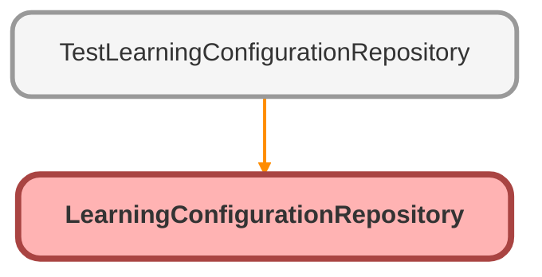

---
hide:
  - path
---

# LearningConfigurationRepository Class

## Class Diagram



<!-- Apex description -->

## Apex Code

```java
public with sharing class LearningConfigurationRepository {
    @AuraEnabled(cacheable=true)
    public static X360Learning_configuration__c getLearningConfiguration(){
        sObject rawLearningConfiguration = [
            SELECT
                Competitor_Field_Name__c,
                Tenant_Url__c
            FROM X360Learning_configuration__c
            WHERE Name = 'configuration'
            LIMIT 1
        ];
        return (X360Learning_configuration__c)rawLearningConfiguration;
    }

    @AuraEnabled
    public static void upsertLearningConfiguration(String competitorFieldName, String tenantUrl) {
        X360Learning_configuration__c learningConfiguration = new X360Learning_configuration__c(
            Name = 'configuration',
            Competitor_Field_Name__c = competitorFieldName,
            Tenant_Url__c = tenantUrl
        );
        upsert learningConfiguration Name;
    }
}
```

## Methods
### `getLearningConfiguration()`

`AURAENABLED`

#### Signature
```apex
public static X360Learning_configuration__c getLearningConfiguration()
```

#### Return Type
**[X360Learning_configuration__c](../objects/X360Learning_configuration__c.md)**

---

### `upsertLearningConfiguration(competitorFieldName, tenantUrl)`

`AURAENABLED`

#### Signature
```apex
public static void upsertLearningConfiguration(String competitorFieldName, String tenantUrl)
```

#### Parameters
| Name | Type | Description |
|------|------|-------------|
| competitorFieldName | String |  |
| tenantUrl | String |  |

#### Return Type
**void**