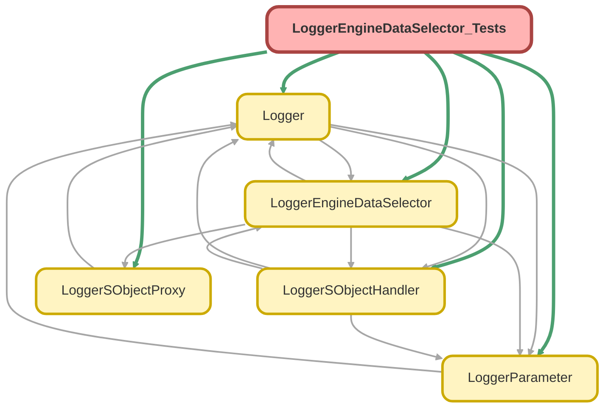

---
hide:
  - path
---

# LoggerEngineDataSelector_Tests Class

`SUPPRESSWARNINGS`
`ISTEST`

## Class Diagram



<!-- Apex description -->

## Apex Code

```java
//------------------------------------------------------------------------------------------------//
// This file is part of the Nebula Logger project, released under the MIT License.                //
// See LICENSE file or go to https://github.com/jongpie/NebulaLogger for full license details.    //
//------------------------------------------------------------------------------------------------//

@SuppressWarnings('PMD.ApexDoc, PMD.CyclomaticComplexity, PMD.ExcessiveParameterList, PMD.MethodNamingConventions')
@IsTest(IsParallel=true)
private class LoggerEngineDataSelector_Tests {
  @IsTest
  static void it_loads_mock_instance() {
    MockLoggerEngineDataSelector mockSelector = new MockLoggerEngineDataSelector();
    System.Assert.areNotEqual(mockSelector, LoggerEngineDataSelector.getInstance());

    LoggerEngineDataSelector.setMock(mockSelector);

    System.Assert.areEqual(mockSelector, LoggerEngineDataSelector.getInstance());
  }

  @IsTest
  static void it_returns_cached_auth_session_proxy() {
    List<Schema.AuthSession> sessions = [
      SELECT
        Id,
        LoginHistory.Application,
        LoginHistory.Browser,
        LoginHistory.Platform,
        LoginHistoryId,
        LoginType,
        LogoutUrl,
        ParentId,
        SessionSecurityLevel,
        SessionType,
        SourceIp
      FROM AuthSession
      WHERE UsersId = :System.UserInfo.getUserId() AND IsCurrent = TRUE
    ];
    LoggerSObjectProxy.AuthSession expectedAuthSessionProxy = sessions.isEmpty() ? null : new LoggerSObjectProxy.AuthSession(sessions.get(0));
    System.Assert.areEqual(1, System.Limits.getQueries());

    LoggerSObjectProxy.AuthSession returnedAuthSessionProxy = LoggerEngineDataSelector.getInstance().getCachedAuthSessionProxy();

    System.Assert.areEqual(2, System.Limits.getQueries());
    LoggerEngineDataSelector.getInstance().getCachedAuthSessionProxy();
    System.Assert.areEqual(2, System.Limits.getQueries(), 'Query results should have been cached');
    System.Assert.areEqual(expectedAuthSessionProxy, returnedAuthSessionProxy);
  }

  @IsTest
  static void it_returns_null_when_querying_auth_session_is_disabled() {
    LoggerParameter.setMock(new LoggerParameter__mdt(DeveloperName = 'QueryAuthSessionData', Value__c = String.valueOf(false)));
    System.Assert.isFalse(LoggerParameter.QUERY_AUTH_SESSION_DATA);

    LoggerSObjectProxy.AuthSession returnedAuthSessionProxy = LoggerEngineDataSelector.getInstance().getCachedAuthSessionProxy();

    System.Assert.areEqual(0, System.Limits.getQueries());
    System.Assert.isNull(returnedAuthSessionProxy);
  }

  @IsTest
  static void it_does_not_query_auth_session_when_disabled_via_logger_parameter() {
    MockLoggerEngineDataSelector mockSelector = new MockLoggerEngineDataSelector();
    LoggerEngineDataSelector.setMock(mockSelector);
    System.Assert.areEqual(mockSelector, LoggerEngineDataSelector.getInstance());
    System.Assert.areEqual(0, mockSelector.getCachedAuthSessionQueryCount());
    LoggerParameter.setMock(new LoggerParameter__mdt(DeveloperName = 'QueryAuthSessionData', Value__c = String.valueOf(false)));

    LoggerSObjectProxy.AuthSession returnedAuthSessionProxy = LoggerEngineDataSelector.getInstance().getCachedAuthSessionProxy();

    System.Assert.areEqual(0, mockSelector.getCachedAuthSessionQueryCount());
    System.Assert.isNull(returnedAuthSessionProxy);
  }

  @IsTest
  static void it_returns_cached_sobject_handlers() {
    List<LoggerSObjectHandler__mdt> expectedSObjectHandlers = [
      SELECT IsEnabled__c, SObjectHandlerApexClass__c, SObjectType__r.QualifiedApiName, SObjectTypeOverride__c
      FROM LoggerSObjectHandler__mdt
      WHERE IsEnabled__c = TRUE
    ];
    System.Assert.areEqual(0, System.Limits.getQueries());

    List<LoggerSObjectHandler__mdt> returnedSObjectHandlers = LoggerEngineDataSelector.getInstance().getCachedLoggerSObjectHandlers();

    // The specific query used for LoggerSObjectHandler__mdt shouldn't count towards the SOQL query limits,
    // so 0 queries are expected here
    System.Assert.areEqual(0, System.Limits.getQueries());
    LoggerEngineDataSelector.getInstance().getCachedLoggerSObjectHandlers();
    System.Assert.areEqual(0, System.Limits.getQueries(), 'Query results should have been cached');
    System.Assert.areEqual(expectedSObjectHandlers, returnedSObjectHandlers);
  }

  @IsTest
  static void it_returns_cached_organization() {
    Schema.Organization expectedOrganization = [
      SELECT
        Id,
        CreatedById,
        CreatedBy.Name,
        CreatedBy.Username,
        CreatedDate,
        InstanceName,
        IsSandbox,
        Name,
        NamespacePrefix,
        OrganizationType,
        TrialExpirationDate
      FROM Organization
    ];
    MockLoggerEngineDataSelector mockSelector = new MockLoggerEngineDataSelector();
    LoggerEngineDataSelector.setMock(mockSelector);
    System.Assert.areEqual(mockSelector, LoggerEngineDataSelector.getInstance());
    System.Assert.areEqual(0, mockSelector.getCachedOrganizationQueryCount());

    Schema.Organization returnedOrganization = LoggerEngineDataSelector.getInstance().getCachedOrganization();

    System.Assert.areEqual(1, mockSelector.getCachedOrganizationQueryCount());
    LoggerEngineDataSelector.getInstance().getCachedOrganization();
    System.Assert.areEqual(1, mockSelector.getCachedOrganizationQueryCount(), 'Query results should have been cached');
    System.Assert.areEqual(expectedOrganization, returnedOrganization);
  }

  @IsTest
  static void it_does_not_query_organization_when_disabled_via_logger_parameter() {
    MockLoggerEngineDataSelector mockSelector = new MockLoggerEngineDataSelector();
    System.Assert.areNotEqual(mockSelector, LoggerEngineDataSelector.getInstance());
    System.Assert.areEqual(0, mockSelector.getCachedOrganizationQueryCount());
    LoggerParameter.setMock(new LoggerParameter__mdt(DeveloperName = 'QueryOrganizationData', Value__c = String.valueOf(false)));

    Schema.Organization returnedOrganization = LoggerEngineDataSelector.getInstance().getCachedOrganization();

    System.Assert.areEqual(0, mockSelector.getCachedOrganizationQueryCount());
    System.Assert.isNull(returnedOrganization);
  }

  @IsTest
  static void it_returns_cached_tag_assignment_rules() {
    List<LogEntryTagRule__mdt> expectedTagAssignmentRules = [
      SELECT Id, SObjectField__r.QualifiedApiName, ComparisonType__c, ComparisonValue__c, Tags__c
      FROM LogEntryTagRule__mdt
      WHERE IsEnabled__c = TRUE AND SObjectType__r.DeveloperName = 'LogEntry'
    ];
    System.Assert.areEqual(1, System.Limits.getQueries());

    List<LogEntryTagRule__mdt> returnedTagAssignmentRules = LoggerEngineDataSelector.getInstance().getCachedTagAssignmentRules();

    System.Assert.areEqual(2, System.Limits.getQueries());
    LoggerEngineDataSelector.getInstance().getCachedTagAssignmentRules();
    System.Assert.areEqual(2, System.Limits.getQueries(), 'Query results should have been cached');
    System.Assert.areEqual(expectedTagAssignmentRules, returnedTagAssignmentRules);
  }

  @IsTest
  static void it_returns_cached_user() {
    Schema.User expectedUser = [
      SELECT
        FederationIdentifier,
        Id,
        Profile.Name,
        Profile.UserLicenseId,
        Profile.UserLicense.LicenseDefinitionKey,
        Profile.UserLicense.Name,
        Username,
        UserRole.Name
      FROM User
      WHERE Id = :System.UserInfo.getUserId()
    ];
    System.Assert.areEqual(1, System.Limits.getQueries());

    Schema.User returnedUser = LoggerEngineDataSelector.getInstance().getCachedUser();

    System.Assert.areEqual(2, System.Limits.getQueries());
    LoggerEngineDataSelector.getInstance().getCachedUser();
    System.Assert.areEqual(2, System.Limits.getQueries(), 'Query results should have been cached');
    System.Assert.areEqual(expectedUser, returnedUser);
  }

  @IsTest
  static void it_returns_null_when_querying_user_is_disabled() {
    LoggerParameter.setMock(new LoggerParameter__mdt(DeveloperName = 'QueryUserData', Value__c = String.valueOf(false)));
    System.Assert.isFalse(LoggerParameter.QUERY_USER_DATA);

    Schema.User returnedUser = LoggerEngineDataSelector.getInstance().getCachedUser();

    System.Assert.areEqual(0, System.Limits.getQueries());
    System.Assert.isNull(returnedUser);
  }

  private class MockLoggerEngineDataSelector extends LoggerEngineDataSelector {
    private Integer authSessionQueryCount = 0;
    private Integer organizationQueryCount = 0;

    public override LoggerSObjectProxy.AuthSession getCachedAuthSessionProxy() {
      Integer originalQueryCount = System.Limits.getQueries();
      LoggerSObjectProxy.AuthSession result = super.getCachedAuthSessionProxy();
      if (System.Limits.getQueries() != originalQueryCount) {
        authSessionQueryCount = System.Limits.getQueries() - originalQueryCount;
      }
      return result;
    }

    public Integer getCachedAuthSessionQueryCount() {
      return authSessionQueryCount;
    }

    public override Schema.Organization getCachedOrganization() {
      Integer originalQueryCount = System.Limits.getQueries();
      Schema.Organization result = super.getCachedOrganization();
      if (System.Limits.getQueries() != originalQueryCount) {
        organizationQueryCount = System.Limits.getQueries() - originalQueryCount;
      }
      return result;
    }

    public Integer getCachedOrganizationQueryCount() {
      return organizationQueryCount;
    }
  }
}
```

## Methods
### `it_loads_mock_instance()`

`ISTEST`

#### Signature
```apex
private static void it_loads_mock_instance()
```

#### Return Type
**void**

---

### `it_returns_cached_auth_session_proxy()`

`ISTEST`

#### Signature
```apex
private static void it_returns_cached_auth_session_proxy()
```

#### Return Type
**void**

---

### `it_returns_null_when_querying_auth_session_is_disabled()`

`ISTEST`

#### Signature
```apex
private static void it_returns_null_when_querying_auth_session_is_disabled()
```

#### Return Type
**void**

---

### `it_does_not_query_auth_session_when_disabled_via_logger_parameter()`

`ISTEST`

#### Signature
```apex
private static void it_does_not_query_auth_session_when_disabled_via_logger_parameter()
```

#### Return Type
**void**

---

### `it_returns_cached_sobject_handlers()`

`ISTEST`

#### Signature
```apex
private static void it_returns_cached_sobject_handlers()
```

#### Return Type
**void**

---

### `it_returns_cached_organization()`

`ISTEST`

#### Signature
```apex
private static void it_returns_cached_organization()
```

#### Return Type
**void**

---

### `it_does_not_query_organization_when_disabled_via_logger_parameter()`

`ISTEST`

#### Signature
```apex
private static void it_does_not_query_organization_when_disabled_via_logger_parameter()
```

#### Return Type
**void**

---

### `it_returns_cached_tag_assignment_rules()`

`ISTEST`

#### Signature
```apex
private static void it_returns_cached_tag_assignment_rules()
```

#### Return Type
**void**

---

### `it_returns_cached_user()`

`ISTEST`

#### Signature
```apex
private static void it_returns_cached_user()
```

#### Return Type
**void**

---

### `it_returns_null_when_querying_user_is_disabled()`

`ISTEST`

#### Signature
```apex
private static void it_returns_null_when_querying_user_is_disabled()
```

#### Return Type
**void**

## Classes
### MockLoggerEngineDataSelector Class

#### Fields
##### `authSessionQueryCount`

###### Signature
```apex
private authSessionQueryCount
```

###### Type
Integer

---

##### `organizationQueryCount`

###### Signature
```apex
private organizationQueryCount
```

###### Type
Integer

#### Methods
##### `getCachedAuthSessionProxy()`

###### Signature
```apex
public override LoggerSObjectProxy.AuthSession getCachedAuthSessionProxy()
```

###### Return Type
**LoggerSObjectProxy.AuthSession**

---

##### `getCachedAuthSessionQueryCount()`

###### Signature
```apex
public Integer getCachedAuthSessionQueryCount()
```

###### Return Type
**Integer**

---

##### `getCachedOrganization()`

###### Signature
```apex
public override Schema.Organization getCachedOrganization()
```

###### Return Type
**Schema.Organization**

---

##### `getCachedOrganizationQueryCount()`

###### Signature
```apex
public Integer getCachedOrganizationQueryCount()
```

###### Return Type
**Integer**