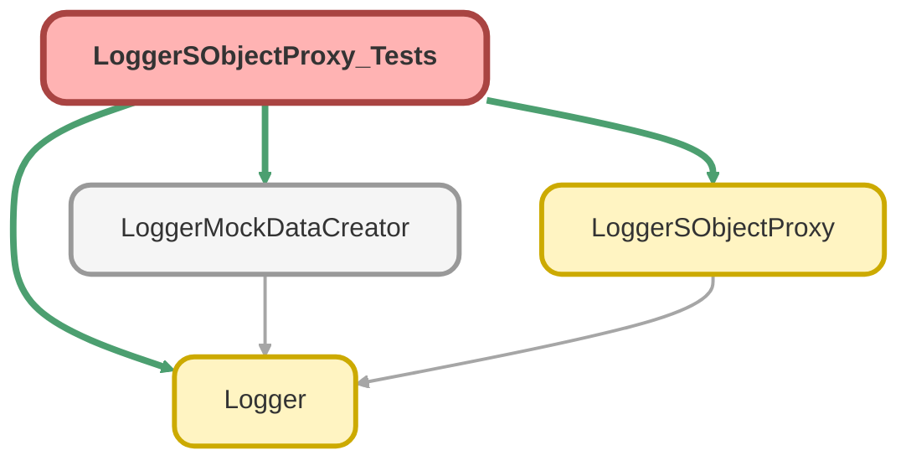

---
hide:
  - path
---

# LoggerSObjectProxy_Tests Class

`SUPPRESSWARNINGS`
`ISTEST`

## Class Diagram



<!-- Apex description -->

## Apex Code

```java
//------------------------------------------------------------------------------------------------//
// This file is part of the Nebula Logger project, released under the MIT License.                //
// See LICENSE file or go to https://github.com/jongpie/NebulaLogger for full license details.    //
//------------------------------------------------------------------------------------------------//

@SuppressWarnings('PMD.ApexDoc, PMD.MethodNamingConventions')
@IsTest(IsParallel=true)
private class LoggerSObjectProxy_Tests {
  private static final Boolean IS_EXPERIENCE_CLOUD_ENABLED = System.Type.forName('Schema.Network') != null;
  private static final Boolean IS_OMNISTUDIO_ENABLED = System.Type.forName('Schema.OmniProcess') != null;

  @IsTest
  static void it_converts_auth_session_record_to_proxy() {
    List<Schema.AuthSession> authSessionRecords = [
      SELECT
        Id,
        LoginHistory.Application,
        LoginHistory.Browser,
        LoginHistory.Platform,
        LoginHistory.UserId,
        LoginHistoryId,
        LoginType,
        LogoutUrl,
        ParentId,
        SessionSecurityLevel,
        SessionType,
        SourceIp,
        UsersId
      FROM AuthSession
      LIMIT 1
    ];
    if (authSessionRecords.isEmpty()) {
      // Since the Schema.AuthSession object cannot be mocked, the test can only run as an integration test
      // No need to fail the test if there isn't a Schema.AuthSession record available via querying
      return;
    }
    Schema.AuthSession authSessionRecord = authSessionRecords.get(0);

    LoggerSObjectProxy.AuthSession authSessionProxy = new LoggerSObjectProxy.AuthSession(authSessionRecord);

    System.Assert.areEqual(authSessionRecord.Id, authSessionProxy.Id);
    System.Assert.areEqual(authSessionRecord.LoginHistory.Application, authSessionProxy.LoginHistory.Application);
    System.Assert.areEqual(authSessionRecord.LoginHistory.Browser, authSessionProxy.LoginHistory.Browser);
    System.Assert.areEqual(authSessionRecord.LoginHistory.Platform, authSessionProxy.LoginHistory.Platform);
    System.Assert.areEqual(authSessionRecord.LoginHistory.UserId, authSessionProxy.LoginHistory.UserId);
    System.Assert.areEqual(authSessionRecord.LoginHistoryId, authSessionProxy.LoginHistoryId);
    System.Assert.areEqual(authSessionRecord.LoginType, authSessionProxy.LoginType);
    System.Assert.areEqual(authSessionRecord.LogoutUrl, authSessionProxy.LogoutUrl);
    System.Assert.areEqual(authSessionRecord.ParentId, authSessionProxy.ParentId);
    System.Assert.areEqual(authSessionRecord.SessionSecurityLevel, authSessionProxy.SessionSecurityLevel);
    System.Assert.areEqual(authSessionRecord.SessionType, authSessionProxy.SessionType);
    System.Assert.areEqual(authSessionRecord.SourceIp, authSessionProxy.SourceIp);
    System.Assert.areEqual(authSessionRecord.UsersId, authSessionProxy.UsersId);
  }

  @IsTest
  static void it_converts_login_history_record_to_proxy() {
    List<Schema.LoginHistory> loginHistoryRecords = [
      SELECT Application, Browser, Platform, UserId
      FROM LoginHistory
      LIMIT 1
    ];
    if (loginHistoryRecords.isEmpty()) {
      // Since the LoginHistory object cannot be mocked, the test can only run as an integration test
      // No need to fail the test if there isn't a LoginHistory record available via querying
      return;
    }
    Schema.LoginHistory loginHistoryRecord = loginHistoryRecords.get(0);

    LoggerSObjectProxy.LoginHistory loginHistoryProxy = new LoggerSObjectProxy.LoginHistory(loginHistoryRecord);

    System.Assert.areEqual(loginHistoryRecord.Application, loginHistoryProxy.Application);
    System.Assert.areEqual(loginHistoryRecord.Browser, loginHistoryProxy.Browser);
    System.Assert.areEqual(loginHistoryRecord.Platform, loginHistoryProxy.Platform);
    System.Assert.areEqual(loginHistoryRecord.UserId, loginHistoryProxy.UserId);
  }

  @IsTest
  static void it_converts_network_record_to_proxy() {
    // No need to fail the test if it's running in an org that does not have Experience Cloud enabled
    if (IS_EXPERIENCE_CLOUD_ENABLED == false) {
      return;
    }
    String idFieldName = 'Id';
    String nameFieldName = 'Name';
    String urlPathPrefixFieldName = 'UrlPathPrefix';
    SObject mockNetworkRecord = (SObject) (System.Type.forName('Schema.Network').newInstance());
    mockNetworkRecord.put(idFieldName, LoggerMockDataCreator.createId(mockNetworkRecord.getSObjectType()));
    mockNetworkRecord.put(nameFieldName, 'Mock Network Record');
    mockNetworkRecord.put(urlPathPrefixFieldName, 'this-is-called-a-prefix-even-though-it-comes-at-the-end-of-the-base-url');

    LoggerSObjectProxy.Network networkProxy = new LoggerSObjectProxy.Network(mockNetworkRecord);

    System.Assert.areEqual((Id) mockNetworkRecord.get(idFieldName), networkProxy.Id);
    System.Assert.areEqual((String) mockNetworkRecord.get(nameFieldName), networkProxy.Name);
    System.Assert.areEqual((String) mockNetworkRecord.get(urlPathPrefixFieldName), networkProxy.UrlPathPrefix);
  }

  @IsTest
  static void it_converts_omni_process_record_to_proxy() {
    // No need to fail the test if it's running in an org that does not have OmniStudio enabled
    if (IS_OMNISTUDIO_ENABLED == false) {
      return;
    }
    Schema.User currentUser = new Schema.User(Id = System.UserInfo.getUserId(), Username = System.UserInfo.getUsername());
    // String createdByFieldName = 'CreatedBy';
    String createdByIdFieldName = 'CreatedById';
    String createdDateFieldName = 'CreatedDate';
    String idFieldName = 'Id';
    // String lastModifiedByFieldName = 'LastModifiedBy';
    String lastModifiedByIdFieldName = 'LastModifiedById';
    String lastModifiedDateFieldName = 'LastModifiedDate';
    String omniProcessTypeFieldName = 'OmniProcessType';
    String uniqueFieldName = 'UniqueName';
    // Some audit fields, like CreatedById, can't be set on an SObject, so start with a Map
    Map<String, Object> mockOmniProcessUntyped = new Map<String, Object>{ 'attributes' => new Map<String, Object>{ 'type' => 'OmniProcess' } };
    mockOmniProcessUntyped.put(createdByIdFieldName, currentUser.Id);
    // mockOmniProcessUntyped.put(createdByFieldName, currentUser);
    mockOmniProcessUntyped.put(createdDateFieldName, System.now().addDays(-7));
    mockOmniProcessUntyped.put(lastModifiedByIdFieldName, currentUser.Id);
    // mockOmniProcessUntyped.put(lastModifiedByFieldName, currentUser);
    mockOmniProcessUntyped.put(lastModifiedDateFieldName, System.now().addDays(-1));
    mockOmniProcessUntyped.put(omniProcessTypeFieldName, 'Integration Procedure');
    mockOmniProcessUntyped.put(uniqueFieldName, 'Mock_OmniScript_English_1');
    SObject mockOmniProcessRecord = (SObject) System.JSON.deserialize(System.JSON.serialize(mockOmniProcessUntyped), SObject.class);
    mockOmniProcessRecord.put(idFieldName, LoggerMockDataCreator.createId(mockOmniProcessRecord.getSObjectType()));

    LoggerSObjectProxy.OmniProcess omniProcessProxy = new LoggerSObjectProxy.OmniProcess(mockOmniProcessRecord);

    // System.Assert.areEqual((Schema.User) mockOmniProcessRecord.get(createdByFieldName), omniProcessProxy.CreatedBy);
    System.Assert.areEqual((String) mockOmniProcessRecord.get(createdByIdFieldName), omniProcessProxy.CreatedById);
    System.Assert.areEqual((Datetime) mockOmniProcessRecord.get(createdDateFieldName), omniProcessProxy.CreatedDate);
    System.Assert.areEqual((Id) mockOmniProcessRecord.get(idFieldName), omniProcessProxy.Id);
    // System.Assert.areEqual((Schema.User) mockOmniProcessRecord.get(lastModifiedByFieldName), omniProcessProxy.LastModifiedBy);
    System.Assert.areEqual((String) mockOmniProcessRecord.get(lastModifiedByIdFieldName), omniProcessProxy.LastModifiedById);
    System.Assert.areEqual((Datetime) mockOmniProcessRecord.get(lastModifiedDateFieldName), omniProcessProxy.LastModifiedDate);
    System.Assert.areEqual((String) mockOmniProcessRecord.get(omniProcessTypeFieldName), omniProcessProxy.OmniProcessType);
    System.Assert.areEqual((String) mockOmniProcessRecord.get(uniqueFieldName), omniProcessProxy.UniqueName);
  }
}
```

## Fields
### `IS_EXPERIENCE_CLOUD_ENABLED`

#### Signature
```apex
private static final IS_EXPERIENCE_CLOUD_ENABLED
```

#### Type
Boolean

---

### `IS_OMNISTUDIO_ENABLED`

#### Signature
```apex
private static final IS_OMNISTUDIO_ENABLED
```

#### Type
Boolean

## Methods
### `it_converts_auth_session_record_to_proxy()`

`ISTEST`

#### Signature
```apex
private static void it_converts_auth_session_record_to_proxy()
```

#### Return Type
**void**

---

### `it_converts_login_history_record_to_proxy()`

`ISTEST`

#### Signature
```apex
private static void it_converts_login_history_record_to_proxy()
```

#### Return Type
**void**

---

### `it_converts_network_record_to_proxy()`

`ISTEST`

#### Signature
```apex
private static void it_converts_network_record_to_proxy()
```

#### Return Type
**void**

---

### `it_converts_omni_process_record_to_proxy()`

`ISTEST`

#### Signature
```apex
private static void it_converts_omni_process_record_to_proxy()
```

#### Return Type
**void**