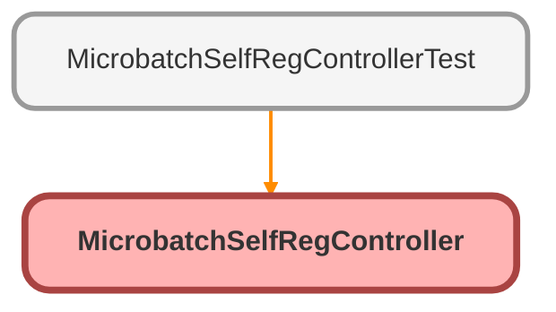

---
hide:
  - path
---

# MicrobatchSelfRegController Class

## Class Diagram



<!-- Apex description -->

## Apex Code

```java
public class MicrobatchSelfRegController {
    public String firstName {get; set;}
    public String lastName {get; set;}
    public String email {get; set;}
    public String communityNickname {get; set { communityNickname = value == null ? value : value.trim(); } }

    public MicrobatchSelfRegController() {
        String expid = ApexPages.currentPage().getParameters().get('expid');
        if (expId != null) {
            Site.setExperienceId(expId);
        }
    }

    public PageReference registerUser() {
        String userName = email;
        String accountName; // to be filled by customer
        String contactName; //to be filled by customer
        String profileId = null; //to be filled by customer
        String UUID;

        User u = new User();
        u.Username = userName;
        u.Email = email;
        u.FirstName = firstName;
        u.LastName = lastName;
        u.CommunityNickname = communityNickname;
        u.ProfileId = profileId;
        u.LocaleSidKey = 'en_US';
        u.TimeZoneSidKey = 'GMT';
        u.LanguageLocaleKey = 'en_US';
        u.EmailEncodingKey = 'UTF-8';

        Account acc = new Account();
        acc.Name = 'Account for ' + lastName;
        Contact c = new Contact();
        c.lastName = lastName;

        try {
            UUID =  Network.createExternalUserAsync(u, c,acc);
        } catch(Site.ExternalUserCreateException ex) {
            List<String> errors = ex.getDisplayMessages();
            for (String error : errors)  {
                ApexPages.addMessage(new ApexPages.Message(ApexPages.Severity.ERROR, error));
            }

            // This message is used for debugging. Do not display this in the UI to the end user.
            // It has the information around why the user creation failed.
            System.debug(ex.getMessage());
        }
        if (UUID != null) {
           PageReference page = System.Page.CommunitiesSelfRegConfirm;
           page.setRedirect(true);
           return page;
        }
        return null;
    }
}
```

## Properties
### `firstName`

#### Signature
```apex
public firstName
```

#### Type
String

---

### `lastName`

#### Signature
```apex
public lastName
```

#### Type
String

---

### `email`

#### Signature
```apex
public email
```

#### Type
String

---

### `communityNickname`

#### Signature
```apex
public communityNickname
```

#### Type
String

## Constructors
### `MicrobatchSelfRegController()`

#### Signature
```apex
public MicrobatchSelfRegController()
```

## Methods
### `registerUser()`

#### Signature
```apex
public PageReference registerUser()
```

#### Return Type
**PageReference**