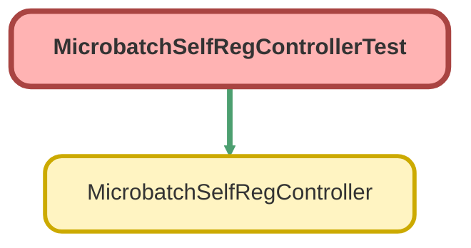

---
hide:
  - path
---

# MicrobatchSelfRegControllerTest Class

`ISTEST`

## Class Diagram



<!-- Apex description -->

## Apex Code

```java
@IsTest
 public with sharing class MicrobatchSelfRegControllerTest {
      @IsTest(SeeAllData=true)
     public static void testMicrobatchSelfRegController() {
         MicrobatchSelfRegController controller = new MicrobatchSelfRegController();
         controller.firstName = 'FirstName';
         controller.lastName = 'LastName';
         controller.email = 'test@force.com';
         controller.communityNickname = 'test';

         // registerUser will always return null when the page isn't accessed as a guest user
         System.assert(controller.registerUser() == null);
     }
 }
```

## Methods
### `testMicrobatchSelfRegController()`

`ISTEST`

#### Signature
```apex
public static void testMicrobatchSelfRegController()
```

#### Return Type
**void**