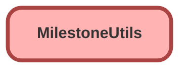

---
hide:
  - path
---

# MilestoneUtils Class

## Class Diagram



<!-- Apex description -->

## Apex Code

```java
public class MilestoneUtils {
    public static void completeMilestone(List<Id> caseIds, 
            String milestoneName, DateTime complDate) {  
    List<CaseMilestone> cmsToUpdate = [select Id, completionDate
            from CaseMilestone cm
            where caseId in :caseIds and cm.MilestoneType.Name=:milestoneName 
            and completionDate = null limit 1];
    if (cmsToUpdate.isEmpty() == false){
        for (CaseMilestone cm : cmsToUpdate){
            cm.completionDate = complDate;
            }
        update cmsToUpdate;
        }
    }
}
```

## Methods
### `completeMilestone(caseIds, milestoneName, complDate)`

#### Signature
```apex
public static void completeMilestone(List<Id> caseIds, String milestoneName, DateTime complDate)
```

#### Parameters
| Name | Type | Description |
|------|------|-------------|
| caseIds | List&lt;Id&gt; |  |
| milestoneName | String |  |
| complDate | DateTime |  |

#### Return Type
**void**