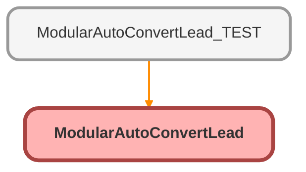

---
hide:
  - path
---

# ModularAutoConvertLead Class

## Class Diagram



<!-- Apex description -->

## Apex Code

```java
public with sharing class ModularAutoConvertLead {
  @InvocableMethod(
    label='Modular Auto Convert Lead'
    description='Returns lists of converted leads, contacts, and opportunities.  Opportunity creation is optional'
  )
  public static List<OutputVariables> convertLead(List<InputVariables> inputs) {
    final LeadStatus convStatus = [
      SELECT Id, MasterLabel
      FROM LeadStatus
      WHERE IsConverted = TRUE
      WITH SECURITY_ENFORCED
      LIMIT 1
    ];
    List<OutputVariables> outputs = new List<OutputVariables>();
    for (InputVariables input : inputs) {
      Id leadId = input.leadId;
      Boolean blockOpp = !input.createOpportunity;

      Database.LeadConvert lc = new Database.LeadConvert();
      lc.setLeadId(leadId);
      lc.setDoNotCreateOpportunity(blockOpp);
      lc.setConvertedStatus(convStatus.MasterLabel);

      OutputVariables output = new OutputVariables();
      try {
        Database.LeadConvertResult lcr = Database.convertLead(lc);
        Assert.isTrue(lcr.isSuccess());
        output.convertedLeadId = lcr.getLeadId();
        output.convertedContactId = lcr.getContactId();
        output.convertedAccountId = lcr.getAccountId();
        output.convertedOppId = (blockOpp) ? null : lcr.getOpportunityId();
      } catch (Exception e) {
        System.debug(
          'Could not convert lead with id ' +
            leadId +
            '. Reason: ' +
            e.getMessage()
        );
        output.errorMessage = e.getMessage();
      } finally {
        outputs.add(output);
      }
    }
    return outputs;
  }

  public class InputVariables {
    @InvocableVariable(label='Lead ID' description='Id of lead to convert')
    public Id leadId;
    @InvocableVariable(
      label='Create Opportunity'
      description='If true, a new opportunity is created'
    )
    public Boolean createOpportunity;
  }

  public class OutputVariables {
    @InvocableVariable(label='Converted Lead Id')
    public Id convertedLeadId;
    @InvocableVariable(label='Converted Contact Id')
    public Id convertedContactId;
    @InvocableVariable(label='Converted Account Id')
    public Id convertedAccountId;
    @InvocableVariable(label='Converted Opportunity Id')
    public Id convertedOppId;
    @InvocableVariable(label='Error Message')
    public String errorMessage;
  }
}
```

## Methods
### `convertLead(inputs)`

`INVOCABLEMETHOD`

#### Signature
```apex
public static List<OutputVariables> convertLead(List<InputVariables> inputs)
```

#### Parameters
| Name | Type | Description |
|------|------|-------------|
| inputs | List&lt;InputVariables&gt; |  |

#### Return Type
**List&lt;OutputVariables&gt;**

## Classes
### InputVariables Class

#### Fields
##### `leadId`

`INVOCABLEVARIABLE`

###### Signature
```apex
public leadId
```

###### Type
Id

---

##### `createOpportunity`

`INVOCABLEVARIABLE`

###### Signature
```apex
public createOpportunity
```

###### Type
Boolean

### OutputVariables Class

#### Fields
##### `convertedLeadId`

`INVOCABLEVARIABLE`

###### Signature
```apex
public convertedLeadId
```

###### Type
Id

---

##### `convertedContactId`

`INVOCABLEVARIABLE`

###### Signature
```apex
public convertedContactId
```

###### Type
Id

---

##### `convertedAccountId`

`INVOCABLEVARIABLE`

###### Signature
```apex
public convertedAccountId
```

###### Type
Id

---

##### `convertedOppId`

`INVOCABLEVARIABLE`

###### Signature
```apex
public convertedOppId
```

###### Type
Id

---

##### `errorMessage`

`INVOCABLEVARIABLE`

###### Signature
```apex
public errorMessage
```

###### Type
String