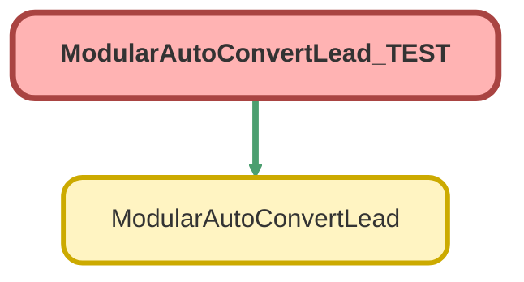

---
hide:
  - path
---

# ModularAutoConvertLead_TEST Class

`ISTEST`

## Class Diagram



<!-- Apex description -->

## Apex Code

```java
@isTest
private class ModularAutoConvertLead_TEST {
  @isTest
  static void testConvertLeadWithOpp() {
    // Get the test Lead record created in test setup
    Lead testLead = new Lead(
      FirstName = 'John',
      LastName = 'Doe',
      Company = 'Acme Inc.',
      NumberOfEmployees = 5,
      Business_Industry__c = 'Accounting',
      LeadSource = 'Organic Search'
    );

    insert testLead;

    // Call the convertLead method with createOpportunity set to true
    List<ModularAutoConvertLead.InputVariables> input = new List<ModularAutoConvertLead.InputVariables>();
    ModularAutoConvertLead.InputVariables inputVar = new ModularAutoConvertLead.InputVariables();
    inputVar.leadId = testLead.Id;
    inputVar.createOpportunity = true;
    input.add(inputVar);
    List<ModularAutoConvertLead.OutputVariables> output = new List<ModularAutoConvertLead.OutputVariables>();
    test.startTest();
    output = ModularAutoConvertLead.convertLead(input);
    test.stopTest();

    // Verify the conversion output
    Assert.areEqual(1, output.size(), 'One output variable is expected');
    ModularAutoConvertLead.OutputVariables convertedLead = output[0];
    Assert.isNotNull(
      convertedLead.convertedLeadId,
      'Converted lead ID should not be null'
    );
    Assert.isNotNull(
      convertedLead.convertedContactId,
      'Converted contact ID should not be null'
    );
    Assert.isNotNull(
      convertedLead.convertedAccountId,
      'Converted account ID should not be null'
    );
    Assert.isNotNull(
      convertedLead.convertedOppId,
      'Converted opportunity ID should not be null'
    );
    Assert.isNull(convertedLead.errorMessage, 'No error message is expected');
  }

  @isTest
  static void testConvertLeadFail() {
    Lead testLead = new Lead(
      FirstName = 'John',
      LastName = 'Doe',
      Company = 'Acme Inc.'
    );

    insert testLead;

    List<ModularAutoConvertLead.InputVariables> input = new List<ModularAutoConvertLead.InputVariables>();
    ModularAutoConvertLead.InputVariables inputVar = new ModularAutoConvertLead.InputVariables();
    inputVar.leadId = testLead.Id;
    inputVar.createOpportunity = true;
    input.add(inputVar);
    List<ModularAutoConvertLead.OutputVariables> output = new List<ModularAutoConvertLead.OutputVariables>();
    test.startTest();
    output = ModularAutoConvertLead.convertLead(input);
    test.stopTest();

    Assert.areEqual(1, output.size(), 'One output variable is expected');
    ModularAutoConvertLead.OutputVariables convertedLead = output[0];
    Assert.isNotNull(convertedLead.errorMessage, 'Error message is expected');
    Assert.isNull(
      convertedLead.convertedContactId,
      'Converted contact ID be null'
    );
    Assert.isNull(
      convertedLead.convertedAccountId,
      'Converted account ID should be null'
    );
    Assert.isNull(
      convertedLead.convertedOppId,
      'Converted opportunity ID should be null'
    );
  }
}
```

## Methods
### `testConvertLeadWithOpp()`

`ISTEST`

#### Signature
```apex
private static void testConvertLeadWithOpp()
```

#### Return Type
**void**

---

### `testConvertLeadFail()`

`ISTEST`

#### Signature
```apex
private static void testConvertLeadFail()
```

#### Return Type
**void**