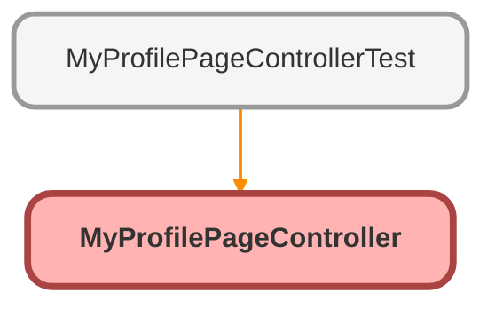

---
hide:
  - path
---

# MyProfilePageController Class

An apex class that keeps updates of a portal user in sync with its corresponding contact. 
Guest users are never able to access this page.

## Class Diagram



<!-- Apex description -->

## Apex Code

```java
/**
 * An apex class that keeps updates of a portal user in sync with its corresponding contact.
   Guest users are never able to access this page.
 */
public with sharing class MyProfilePageController {

    private User user;
    private boolean isEdit = false;

    public User getUser() {
        return user;
    }

    public MyProfilePageController() {
        user = [SELECT id, email, username, usertype, communitynickname, timezonesidkey, languagelocalekey, firstname, lastname, phone, title,
                street, city, country, postalcode, state, localesidkey, mobilephone, extension, fax, contact.email
                FROM User
                WHERE id = :UserInfo.getUserId()];
        // guest users should never be able to access this page
        if (user.usertype == 'GUEST') {
            throw new NoAccessException();
        }
    }

    public Boolean getIsEdit() {
        return isEdit;
    }

    public void edit() {
        isEdit=true;
    }

    public void save() {
        if (user.contact != null) {
            setContactFields(user.contact, user);
        }

        try {
            update user;
            if (user.contact != null) {
                update user.contact;
            }
            isEdit=false;
        } catch(DmlException e) {
            ApexPages.addMessages(e);
        }
    }

    public PageReference changePassword() {
        return Page.ChangePassword;
    }

    public void cancel() {
        isEdit=false;
        user = [SELECT id, email, username, communitynickname, timezonesidkey, languagelocalekey, firstname, lastname, phone, title,
                street, city, country, postalcode, state, localesidkey, mobilephone, extension, fax, contact.email
                FROM User
                WHERE id = :UserInfo.getUserId()];
    }

    public static void setContactFields(Contact c, User u) {
        c.title = u.title;
        c.firstname = u.firstname;
        c.lastname = u.lastname;
        c.email = u.email;
        c.phone = u.phone;
        c.mobilephone = u.mobilephone;
        c.fax = u.fax;
        c.mailingstreet = u.street;
        c.mailingcity = u.city;
        c.mailingstate = u.state;
        c.mailingpostalcode = u.postalcode;
        c.mailingcountry = u.country;
    }
}
```

## Fields
### `user`

#### Signature
```apex
private user
```

#### Type
[User](../objects/User.md)

---

### `isEdit`

#### Signature
```apex
private isEdit
```

#### Type
boolean

## Constructors
### `MyProfilePageController()`

#### Signature
```apex
public MyProfilePageController()
```

## Methods
### `getUser()`

#### Signature
```apex
public User getUser()
```

#### Return Type
**[User](../objects/User.md)**

---

### `getIsEdit()`

#### Signature
```apex
public Boolean getIsEdit()
```

#### Return Type
**Boolean**

---

### `edit()`

#### Signature
```apex
public void edit()
```

#### Return Type
**void**

---

### `save()`

#### Signature
```apex
public void save()
```

#### Return Type
**void**

---

### `changePassword()`

#### Signature
```apex
public PageReference changePassword()
```

#### Return Type
**PageReference**

---

### `cancel()`

#### Signature
```apex
public void cancel()
```

#### Return Type
**void**

---

### `setContactFields(c, u)`

#### Signature
```apex
public static void setContactFields(Contact c, User u)
```

#### Parameters
| Name | Type | Description |
|------|------|-------------|
| c | [Contact](../objects/Contact.md) |  |
| u | [User](../objects/User.md) |  |

#### Return Type
**void**