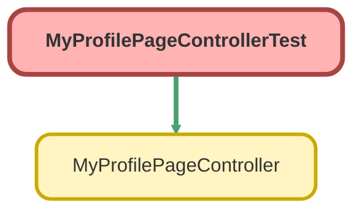

---
hide:
  - path
---

# MyProfilePageControllerTest Class

`ISTEST`

An apex class that keeps updates of a portal user in sync with its corresponding contact. 
Guest users are never able to access this page.

## Class Diagram



<!-- Apex description -->

## Apex Code

```java
/**
 * An apex class that keeps updates of a portal user in sync with its corresponding contact.
   Guest users are never able to access this page.
 */
@IsTest public with sharing class MyProfilePageControllerTest {
    @IsTest(SeeAllData=true) static void testSetContactFields() {
        User u = [select title, firstname, lastname, email, phone, mobilephone, fax, street, city, state, postalcode, country
                           FROM User WHERE id =: UserInfo.getUserId()];

        Contact c = new Contact();

        MyProfilePageController.setContactFields(c, u);
        System.assertEquals(c.firstname, u.firstname, 'firstname should have been set as the firstname of the user for the contact');
        System.assertEquals(c.lastname, u.lastname, 'lastname should have been set as the lastname of the user for the contact');
    }

    @IsTest(SeeAllData=true) static void testSave() {
        // Modify the test to query for a portal user that exists in your org
        List<User> existingPortalUsers = [SELECT id, profileId, userRoleId FROM User WHERE UserRoleId <> null AND UserType='CustomerSuccess'];

        if (existingPortalUsers.isEmpty()) {
            User currentUser = [select id, title, firstname, lastname, email, phone, mobilephone, fax, street, city, state, postalcode, country
                                FROM User WHERE id =: UserInfo.getUserId()];
            MyProfilePageController controller = new MyProfilePageController();
            System.assertEquals(currentUser.Id, controller.getUser().Id, 'Did not successfully load the current user');
            System.assert(controller.getIsEdit() == false, 'isEdit should default to false');
            controller.edit();
            System.assert(controller.getIsEdit() == true);
            controller.cancel();
            System.assert(controller.getIsEdit() == false);

            Contact c = new Contact();
            c.LastName = 'TestContact';
            insert c;

            c.title = currentUser.title;
            c.firstname = currentUser.firstname;
            c.lastname = currentUser.lastname;
            c.email = currentUser.email;
            c.phone = currentUser.phone;
            c.mobilephone = currentUser.mobilephone;
            c.fax = currentUser.fax;
            c.mailingstreet = currentUser.street;
            c.mailingcity = currentUser.city;
            c.mailingstate = currentUser.state;
            c.mailingpostalcode = currentUser.postalcode;
            c.mailingcountry = currentUser.country;
            controller.save();
            System.assert(Page.ChangePassword.getUrl().equals(controller.changePassword().getUrl()));
        } else {
            User existingPortalUser = existingPortalUsers[0];
            String randFax = Math.rint(Math.random() * 1000) + '5551234';

            System.runAs(existingPortalUser) {
                MyProfilePageController controller = new MyProfilePageController();
                System.assertEquals(existingPortalUser.Id, controller.getUser().Id, 'Did not successfully load the current user');
                System.assert(controller.getIsEdit() == false, 'isEdit should default to false');
                controller.edit();
                System.assert(controller.getIsEdit() == true);

                controller.cancel();
                System.assert(controller.getIsEdit() == false);

                controller.getUser().Fax = randFax;
                controller.save();
                System.assert(controller.getIsEdit() == false);
            }

            // verify that the user and contact were updated
            existingPortalUser = [Select id, fax, Contact.Fax from User where id =: existingPortalUser.Id];
            System.assert(existingPortalUser.fax == randFax);
            System.assert(existingPortalUser.Contact.fax == randFax);
        }
    }
}
```

## Methods
### `testSetContactFields()`

`ISTEST`

#### Signature
```apex
private static void testSetContactFields()
```

#### Return Type
**void**

---

### `testSave()`

`ISTEST`

#### Signature
```apex
private static void testSave()
```

#### Return Type
**void**