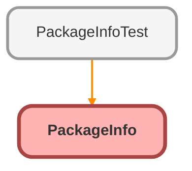

---
hide:
  - path
---

# PackageInfo Class

`RESTRESOURCE`

## Class Diagram



<!-- Apex description -->

## Apex Code

```java
@RestResource(urlMapping='/PackageInfo')
global class PackageInfo {
  global class Payload {
    public String organizationName;
    public String packageVersion;

    public Payload() {
      Organization myOrg = [Select o.Name From Organization o];
      this.organizationName = myOrg.Name;
      this.packageVersion = '1.11';
    }
  }

  @HttpGet
  global static Payload getInfo() {
    Payload payload = new Payload();
    return payload;
  }
}
```

## Methods
### `getInfo()`

`HTTPGET`

#### Signature
```apex
global static Payload getInfo()
```

#### Return Type
**Payload**

## Classes
### Payload Class

#### Fields
##### `organizationName`

###### Signature
```apex
public organizationName
```

###### Type
String

---

##### `packageVersion`

###### Signature
```apex
public packageVersion
```

###### Type
String

#### Constructors
##### `Payload()`

###### Signature
```apex
public Payload()
```