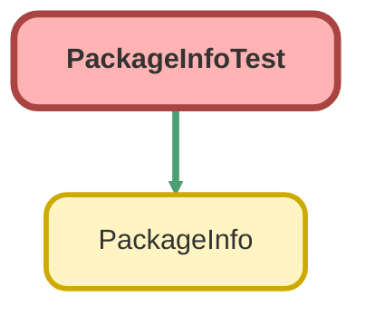

---
hide:
  - path
---

# PackageInfoTest Class

`ISTEST`

## Class Diagram



<!-- Apex description -->

## Apex Code

```java
@isTest
private class PackageInfoTest {
  @isTest static void getInfoTest() {
    Organization myOrg = [Select o.Name From Organization o];
    PackageInfo.Payload result = PackageInfo.getInfo();
    System.assertEquals(myOrg.Name, result.organizationName);
    System.assertEquals('1.11', result.packageVersion);
  }
}
```

## Methods
### `getInfoTest()`

`ISTEST`

#### Signature
```apex
private static void getInfoTest()
```

#### Return Type
**void**