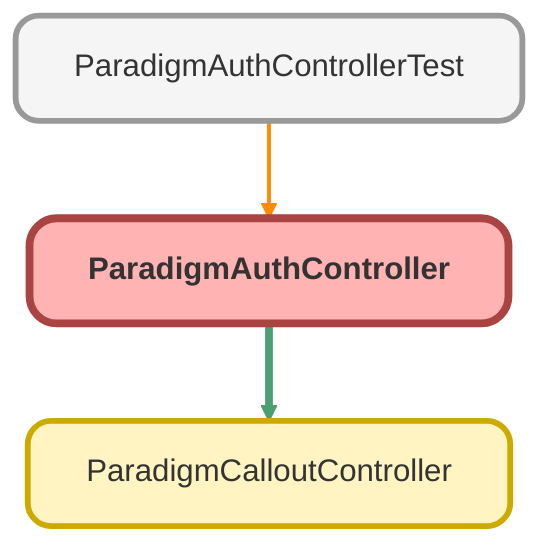

---
hide:
  - path
---

# ParadigmAuthController Class

## Class Diagram



<!-- Apex description -->

## Apex Code

```java
public with sharing class ParadigmAuthController {

    @AuraEnabled(cacheable=false)
    public static String getAuthToken(String propId) {

        Paradigm_Endpoint__mdt credential = [SELECT Auth_Endpoint__c,
                                                    Username__c,
                                                    Password__c,
                                                    isActive__c
                                            FROM Paradigm_Endpoint__mdt
                                            WHERE isActive__c = true
                                            LIMIT 1 ];

        String username = !Test.isRunningTest() ?  credential.Username__c : 'test';
        String password = !Test.isRunningTest() ?  credential.Password__c : 'test';
        String url = !Test.isRunningTest() ?  credential.Auth_Endpoint__c : 'https://api.paradigmtest.com/v1/auth/token';

        HttpRequest authRequest = new HttpRequest();
        authRequest.setEndpoint(url);
        authRequest.setMethod('POST');

        AuthRequest requestBody = new AuthRequest();
        requestBody.username = username;
        requestBody.password = password;
        String requestBodyJson = JSON.serialize(requestBody);
        authRequest.setHeader('Content-Type', 'application/json');
        authRequest.setBody(requestBodyJson);

        Http authHttp = new Http();
        HttpResponse authResponse = authHttp.send(authRequest);
        Map<String, Object> authResponseMap = (Map<String, Object>) JSON.deserializeUntyped(authResponse.getBody());

        AuthTokenResult result = new AuthTokenResult();

        if (authResponse.getStatusCode() == 200) {
            result.accessToken = (String) authResponseMap.get('accessToken');
            result.expiration = (String) authResponseMap.get('expiration');
            result.errorMessage = null;
            // ParadigmCalloutController.sendToParadigm(result.accessToken, propId);
        } else {
            Proposal__c prop = [SELECT Id, Errors__c FROM Proposal__c WHERE Id = :propId];
            prop.Errors__c = 'Error: ' + authResponse.getStatusCode() + ': \n' + authResponse.getStatus() + ' - ' + authResponse.getBody();
            update prop;
            result.errorMessage = 'Error: ' + authResponse.getStatusCode() + ': \n' + authResponse.getStatus() + ' - ' + authResponse.getBody();
            result.accessToken = null;
            result.expiration = null;
        }
        System.debug('result: ' + result);
        return JSON.serialize(result);
    }

    public class AuthTokenResult {
        @AuraEnabled
        public String accessToken { get; set; }
        @AuraEnabled
        public String expiration { get; set; }
        @AuraEnabled
        public String errorMessage { get; set; }
    }

    public class AuthRequest {
        public String username;
        public String password;
    }
}
```

## Methods
### `getAuthToken(propId)`

`AURAENABLED`

#### Signature
```apex
public static String getAuthToken(String propId)
```

#### Parameters
| Name | Type | Description |
|------|------|-------------|
| propId | String |  |

#### Return Type
**String**

## Classes
### AuthTokenResult Class

#### Properties
##### `accessToken`

`AURAENABLED`

###### Signature
```apex
public accessToken
```

###### Type
String

---

##### `expiration`

`AURAENABLED`

###### Signature
```apex
public expiration
```

###### Type
String

---

##### `errorMessage`

`AURAENABLED`

###### Signature
```apex
public errorMessage
```

###### Type
String

### AuthRequest Class

#### Fields
##### `username`

###### Signature
```apex
public username
```

###### Type
String

---

##### `password`

###### Signature
```apex
public password
```

###### Type
String