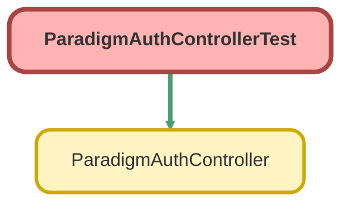

---
hide:
  - path
---

# ParadigmAuthControllerTest Class

`ISTEST`

## Class Diagram



<!-- Apex description -->

## Apex Code

```java
@isTest
private class ParadigmAuthControllerTest {

    @isTest
    private static void testGetAuthToken() {

        Proposal__c testProposal = new Proposal__c();
        insert testProposal;
        Test.startTest();
        Test.setMock(HttpCalloutMock.class, new ParadigmAuthControllerMock());
        String result = ParadigmAuthController.getAuthToken(testProposal.Id);
        Test.stopTest();
    }

    private class ParadigmAuthControllerMock implements HttpCalloutMock {
        public HTTPResponse respond(HTTPRequest req) {
            HttpResponse res = new HttpResponse();
            res.setStatusCode(200);
            res.setBody('{"accessToken":"TestAccessToken","expiration":"TestExpiration","errorMessage":null}');
            return res;
        }
    }
}
```

## Methods
### `testGetAuthToken()`

`ISTEST`

#### Signature
```apex
private static void testGetAuthToken()
```

#### Return Type
**void**

## Classes
### ParadigmAuthControllerMock Class

**Implements**

HttpCalloutMock

#### Methods
##### `respond(req)`

###### Signature
```apex
public HTTPResponse respond(HTTPRequest req)
```

###### Parameters
| Name | Type | Description |
|------|------|-------------|
| req | HTTPRequest |  |

###### Return Type
**HTTPResponse**