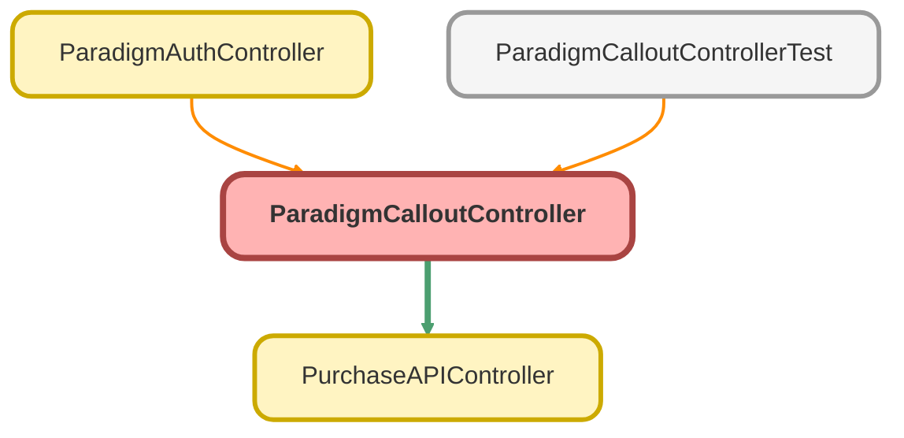

---
hide:
  - path
---

# ParadigmCalloutController Class

## Class Diagram



<!-- Apex description -->

## Apex Code

```java
public with sharing class ParadigmCalloutController {

    // private static String PARADIGM_ENDPOINT = 'https://secure.myubiquity.rocks/api/v2.5/purchase';

    @AuraEnabled(cacheable=false)
    public static ParadigmResponse sendToParadigm(String accessToken, String propId){
        try {
            Paradigm_Endpoint__mdt url = [SELECT Purchase_URL__c  FROM Paradigm_Endpoint__mdt WHERE isActive__c = true LIMIT 1 ];
            String PARADIGM_ENDPOINT = !Test.isRunningTest() ? url.Purchase_URL__c : 'https://test.myubiquity.rocks/api/v2.5/purchase';

            String payload = PurchaseAPIController.getProposal(propId);
            System.debug('PAYLOAD IS: ' + payload);

            HttpRequest request = new HttpRequest();
            request.setEndpoint(PARADIGM_ENDPOINT);
            request.setMethod('POST');
            request.setHeader('Authorization', 'Bearer ' + accessToken);
            request.setHeader('Content-Type', 'application/json');
            request.setBody(payload);

            HttpResponse response = new Http().send(request);

            return processResponse(response, propId);
        } catch (Exception ex) {
            handleException(ex, propId);
            return new ParadigmResponse();
        }
    }

    private static ParadigmResponse processResponse(HttpResponse response, String propId) {
        ParadigmResponse result = new ParadigmResponse();

        if (response.getStatusCode() == 200) {
            Map<String, Object> responseMap = (Map<String, Object>) JSON.deserializeUntyped(response.getBody());
            result.planId = (Integer) responseMap.get('planId');
            result.purchaseLink = (String) responseMap.get('purchaseLink');
            result.errorFields =  null;
            updateProposalLink(propId, result.purchaseLink, result.planId);
        } else {
            System.debug('ERROR RESPONSE: ' + response.getStatusCode() + ' ' + response.getStatus() + ' ' + response.getBody());
            String errorMessage = response.getStatusCode() + ' ' + response.getStatus() + ' ' + response.getBody();

            result.errorFields = errorMessage;
            result.planId = null;
            result.purchaseLink = null;
            updateProposalErrors(propId, errorMessage);
        }

        System.debug('result LINK: ' + result);
        return result;
    }

    private static void updateProposalLink(String propId, String link, Integer planId){
        try {
            Proposal__c prop = [SELECT Id, Paradigm_Purchase_Link__c, Plan_ID__c FROM Proposal__c WHERE Id = :propId LIMIT 1];
            prop.Paradigm_Purchase_Link__c = link;
            prop.Plan_ID__c = String.valueOf(planId);
            update prop;
        } catch (Exception ex) {
            handleException(ex, propId);
        }
    }

    private static void updateProposalErrors(String propId, String errors){
        try {
            Proposal__c prop = [SELECT Id, Errors__c FROM Proposal__c WHERE Id = :propId LIMIT 1];
            prop.Errors__c = errors;
            update prop;
        } catch (Exception ex) {
            handleException(ex, propId);
        }
    }

    private static void handleException(Exception ex, String propId) {
        System.debug('Exception occurred: ' + ex.getMessage());
        // Log or handle the exception as needed
    }

    public class ParadigmResponse {
        @AuraEnabled
        public Integer planId { get; set; }
        @AuraEnabled
        public String purchaseLink { get; set; }
        @AuraEnabled
        public String errorFields { get; set; }
    }

}
```

## Methods
### `sendToParadigm(accessToken, propId)`

`AURAENABLED`

#### Signature
```apex
public static ParadigmResponse sendToParadigm(String accessToken, String propId)
```

#### Parameters
| Name | Type | Description |
|------|------|-------------|
| accessToken | String |  |
| propId | String |  |

#### Return Type
**ParadigmResponse**

---

### `processResponse(response, propId)`

#### Signature
```apex
private static ParadigmResponse processResponse(HttpResponse response, String propId)
```

#### Parameters
| Name | Type | Description |
|------|------|-------------|
| response | HttpResponse |  |
| propId | String |  |

#### Return Type
**ParadigmResponse**

---

### `updateProposalLink(propId, link, planId)`

#### Signature
```apex
private static void updateProposalLink(String propId, String link, Integer planId)
```

#### Parameters
| Name | Type | Description |
|------|------|-------------|
| propId | String |  |
| link | String |  |
| planId | Integer |  |

#### Return Type
**void**

---

### `updateProposalErrors(propId, errors)`

#### Signature
```apex
private static void updateProposalErrors(String propId, String errors)
```

#### Parameters
| Name | Type | Description |
|------|------|-------------|
| propId | String |  |
| errors | String |  |

#### Return Type
**void**

---

### `handleException(ex, propId)`

#### Signature
```apex
private static void handleException(Exception ex, String propId)
```

#### Parameters
| Name | Type | Description |
|------|------|-------------|
| ex | Exception |  |
| propId | String |  |

#### Return Type
**void**

## Classes
### ParadigmResponse Class

#### Properties
##### `planId`

`AURAENABLED`

###### Signature
```apex
public planId
```

###### Type
Integer

---

##### `purchaseLink`

`AURAENABLED`

###### Signature
```apex
public purchaseLink
```

###### Type
String

---

##### `errorFields`

`AURAENABLED`

###### Signature
```apex
public errorFields
```

###### Type
String