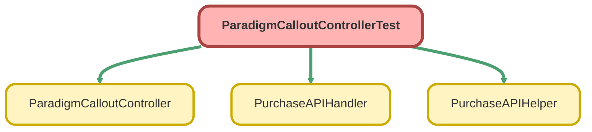

---
hide:
  - path
---

# ParadigmCalloutControllerTest Class

`ISTEST`

## Class Diagram



<!-- Apex description -->

## Apex Code

```java
@isTest
private class ParadigmCalloutControllerTest {

    @TestSetup
    static void setup(){
        Database.DMLOptions dml = new Database.DMLOptions();
        dml.DuplicateRuleHeader.AllowSave = true;

        Opportunity opp = new Opportunity();
        opp.Name = 'Test Opportunity';
        opp.StageName = 'Proposal';
        opp.Eligibility_Age__c = '18';
        opp.Custodian__c = 'Schwab Trust';
        opp.Desired_Plan_Start_Date__c = Date.today();
        opp.Safe_Harbor__c = '3.5% QACA Match';
        opp.AutoEnrollment__c = 'QACA';
        opp.Service_Option__c = 'Custom(k)';
        opp.Plan_Entry_Frequency__c = 'Quarterly'; //Immediate, Monthly, Quarterly, Semi-Annually
        opp.Plan_Eligibility__c = 'Immediate';
        opp.Auto_Enrollment_Deferral_Escalation_Rate__c = '3% Flat Deferral Rate';
        opp.CloseDate = Date.today();
        insert opp;


        Proposal__c prop = new Proposal__c();
        prop.Opportunity__c = opp.id;
        prop.Eligibility_Age__c = '18';
        prop.Discretionary_Match__c = 'Yes';
        prop.Safe_Harbor__c = '3.5% QACA Match';
        prop.Auto_Enrollment__c = 'QACA';
        prop.Profit_Sharing__c = 'Pro Rata';
        prop.Service_Option__c = 'Custom(k)';
        prop.Plan_Entry_Frequency__c = 'Quarterly'; //Immediate, Monthly, Quarterly, Semi-Annually
        prop.Plan_Eligibility__c = 'Immediate';
        prop.Deferral_Change_Frequency__c = 'Quarterly';
        prop.Auto_Enrollment_Deferral_Escalation_Rate__c = '3% Flat Deferral Rate';
        prop.Roth_Contributions__c = 'Yes';
        prop.Grandfather_Date__c = Date.today();
        prop.Company_State__c = 'California';
        prop.Proposal_Notes__c = 'Test Notes';


        insert prop;

        Account acc = new Account();
        acc.Name = 'Test Account';
        acc.Employer_Identification_Number_EIN__c = '123456789';
        Database.insert(acc, dml);


        Contact testContact = new Contact();
        testContact.FirstName = 'TestContactFirstName';
        testContact.LastName = 'TestContactLastName';
        testContact.AccountId = acc.id;
        testContact.Email = 'test@mail.com';
        testContact.Phone = '1234567890';
        testContact.MailingStreet = '123 Test Street';
        testContact.MailingCity = 'Test City';
        testContact.MailingState = 'California';
        testContact.MailingPostalCode = '12345';
        Database.insert(testContact, dml);


        Associated_Contact__c assSponsor = new Associated_Contact__c();
        assSponsor.Opportunity__c = opp.id;
        assSponsor.Contact__c = testContact.id;
        assSponsor.Contact_Role__c = 'Plan Sponsor & Trustee';
        insert assSponsor;

        Contact conSponsor = new Contact();
        conSponsor.FirstName = 'TestContactFirstName2';
        conSponsor.LastName = 'TestContactLastName2';
        conSponsor.CRD_Number__c = '1234567';
        conSponsor.CRD_Number__c = '1234567';
        conSponsor.AccountId = acc.id;
        conSponsor.Email = 'test@mail.com';
        conSponsor.Phone = '1234567810';
        conSponsor.MailingStreet = '123 Test Street';
        conSponsor.MailingCity = 'City';
        conSponsor.MailingState = 'California';
        conSponsor.MailingPostalCode = '12345';
        Database.insert(conSponsor, dml);


        Associated_Contact__c assAdvisor = new Associated_Contact__c();
        assAdvisor.Opportunity__c = opp.id;
        assAdvisor.Contact__c = conSponsor.id;
        assAdvisor.Contact_Role__c = 'Financial Advisor';
        insert assAdvisor;

        Contact advisorCon = new Contact();
        advisorCon.FirstName = 'TestContactFirstName2';
        advisorCon.LastName = 'TestContactLastName2';
        advisorCon.CRD_Number__c = '1234567';
        advisorCon.CRD_Number__c = '1234567';
        advisorCon.AccountId = acc.id;
        advisorCon.Email = 'test@mail.com';
        advisorCon.Phone = '1234567810';
        advisorCon.MailingStreet = '123 Test Street';
        advisorCon.MailingCity = 'City';
        advisorCon.MailingState = 'California';
        advisorCon.MailingPostalCode = '12345';
        Database.insert(advisorCon, dml);


        Associated_Contact__c assTPA = new Associated_Contact__c();
        assTPA.Opportunity__c = opp.id;
        assTPA.Contact__c = advisorCon.id;
        assTPA.Contact_Role__c = 'TPA - Operational Support';
        insert assTPA;
    }

    @isTest
    static void testSendToParadigm() {

        Proposal__c testProposal = [SELECT id FROM Proposal__c WHERE Grandfather_Date__c = TODAY  LIMIT 1];

        Test.startTest();
        Test.setMock(HttpCalloutMock.class, new ParadigmCalloutMock());
        ParadigmCalloutController.ParadigmResponse result = ParadigmCalloutController.sendToParadigm('dummyAccessToken', testProposal.id);
        Test.stopTest();

    }
    @isTest
    static void testSendToParadigmError() {

        Proposal__c testProposal = [SELECT id FROM Proposal__c WHERE Grandfather_Date__c = TODAY  LIMIT 1];


        Test.startTest();
        Test.setMock(HttpCalloutMock.class, new ParadigmCalloutMockError());
        ParadigmCalloutController.ParadigmResponse result = ParadigmCalloutController.sendToParadigm('dummyAccessToken', testProposal.id);
        Test.stopTest();

    }

    @isTest
    private static void testPurchaseAPIHelper() {
        List<Proposal__c> propList = new List<Proposal__c>();
        List<String> planEligibilityValues = new List<String>{'Immediate', 'One Month', 'Two Months', 'Three Months', '6 Months', '1 Year (1000 Hours)', '90 Day', '1 Year'};
        List<String> planEntryFrequencyValues = new List<String>{'Immediate', 'Monthly', 'Quarterly', 'Semi-Annually'};
        List<String> autoEnrollmentDeferralEscalationRateValues = new List<String>{'None', '3% Auto-Escalate', '3% Flat Deferral Rate', '10% Flat Deferral Rate'};

        Test.startTest();
        for(String planEligibility : planEligibilityValues){
            PurchaseAPIHelper.convertPlanEligibility(planEligibility);
        }
        for(String planEntryFrequency : planEntryFrequencyValues){
            PurchaseAPIHelper.convertPlanEntryFrequency(planEntryFrequency);
        }

        for(String autoEnrollmentDeferralEscalationRate : autoEnrollmentDeferralEscalationRateValues){
            PurchaseAPIHandler.getEnrollmentRate(autoEnrollmentDeferralEscalationRate);
        }
        Test.stopTest();

    }

    private class ParadigmCalloutMock implements HttpCalloutMock {
        public HttpResponse respond(HttpRequest req) {
            HttpResponse res = new HttpResponse();
            res.setHeader('Content-Type', 'application/json');
            res.setStatusCode(200);
            res.setBody('{"planId": 12345, "purchaseLink": "dummyPurchaseLink"}');
            return res;
        }
    }

    private class ParadigmCalloutMockError implements HttpCalloutMock {
        public HttpResponse respond(HttpRequest req) {
            HttpResponse res = new HttpResponse();
            res.setHeader('Content-Type', 'application/json');
            res.setStatusCode(500);
            res.setBody('{"errorFields": "Some error fields"}');
            return res;
        }
    }
}
```

## Methods
### `setup()`

`TESTSETUP`

#### Signature
```apex
private static void setup()
```

#### Return Type
**void**

---

### `testSendToParadigm()`

`ISTEST`

#### Signature
```apex
private static void testSendToParadigm()
```

#### Return Type
**void**

---

### `testSendToParadigmError()`

`ISTEST`

#### Signature
```apex
private static void testSendToParadigmError()
```

#### Return Type
**void**

---

### `testPurchaseAPIHelper()`

`ISTEST`

#### Signature
```apex
private static void testPurchaseAPIHelper()
```

#### Return Type
**void**

## Classes
### ParadigmCalloutMock Class

**Implements**

HttpCalloutMock

#### Methods
##### `respond(req)`

###### Signature
```apex
public HttpResponse respond(HttpRequest req)
```

###### Parameters
| Name | Type | Description |
|------|------|-------------|
| req | HttpRequest |  |

###### Return Type
**HttpResponse**

### ParadigmCalloutMockError Class

**Implements**

HttpCalloutMock

#### Methods
##### `respond(req)`

###### Signature
```apex
public HttpResponse respond(HttpRequest req)
```

###### Parameters
| Name | Type | Description |
|------|------|-------------|
| req | HttpRequest |  |

###### Return Type
**HttpResponse**