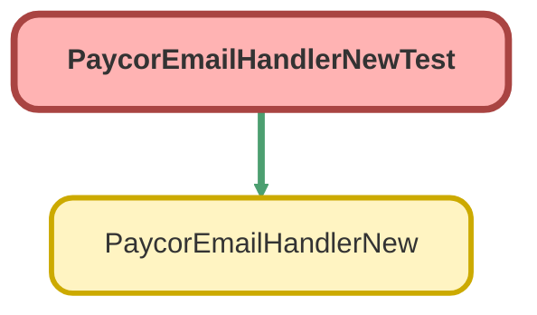

---
hide:
  - path
---

# PaycorEmailHandlerNewTest Class

`ISTEST`

## Class Diagram



<!-- Apex description -->

## Apex Code

```java
@isTest
private class PaycorEmailHandlerNewTest{

@isTest
static void testfail3() {
   Messaging.InboundEmail email  = new Messaging.InboundEmail() ;
   Messaging.InboundEnvelope env = new Messaging.InboundEnvelope();

   email.plainTextBody=
         'Alliance:Ubiquity' + '\n' +
         'Paycor has referred a new lead' + '\n' +
         'Company Name: TEST COMPANY' + '\n' +
         'Company FEIN: 12345678' + '\n' +
         'Address:4444 OLD TEST RD, NEW ORLEANS, Louisiana, 70000' + '\n' +
         'Website: https://www.google.com' + '\n' +
         'Employees: 100' + '\n' +
         'Active # of Employees In Relationship: 50' + '\n' +
         'Paycor Client ID: 123456' + '\n' +
         'Comments: Please reach out to Test User' + '\n' +
         '===========================================================' + '\n' +
         'Referred By' + '\n' +
         'Referred by name: Test User' + '\n' +
         'Referred by email: test@paycor.com' + '\n' +
         'Referred by phone: (513) 111-11111' + '\n' +
         'Referred by mobile:' + '\n' +
         '===========================================================' + '\n' +
         'Contact Information' + '\n' +
         'Contact Name: Test Contact' + '\n' +
         'Contact Email: mail@gmail.com' + '\n' +
         'Contact Phone: (123) 232-2323' + '\n' +
         'Contact Title: CEO';
   email.htmlBody =
         '<p></img></p>' + '\n' +
         '<p> </p>' + '\n' +
         '<h1><span style="font-size: 16px;">Alliance: Ubiquity</span></h1>' +'\n' +
         '<h1><span style="font-size: 18px;"><strong><span style="font-family: times new roman,times,serif;">Paycor has referred a new lead </span></strong></span></h1>' + '\n' +
         '<p> </p>' + '\n' +
         '<p><span style="font-size: 14px;"><span style="font-family: times new roman,times,serif;"></span></span></p>' + '\n' +
         '<p><span style="font-size: 14px;"><span style="font-family: times new roman,times,serif;">Company Name: TEST COMPANY</span></span></p>' + '\n' +
         '<p><span style="font-size: 14px;"><span style="font-family: times new roman,times,serif;">Company FEIN: 12345678</span></span></p>' + '\n' +
         '<p><span style="font-size: 14px;"><span style="font-family: times new roman,times,serif;">Address:4444 OLD TEST RD, NEW ORLEANS, Louisiana, 70000</span></span></p>' + '\n' +
         '<p><span style="font-size: 14px;"><span style="font-family: times new roman,times,serif;">Website: </span></span></p>' + '\n' +
         '<p><span style="font-size: 14px;"><span style="font-family: times new roman,times,serif;">Employees: 100</span></span></p>' + '\n' +
         '<p><span style="font-size: 14px;"><span style="font-family: times new roman,times,serif;">Active # of Employees In Relationship: 50</span></span></p>' + '\n' +
         '<p><span style="font-size: 14px;"><span style="font-family: times new roman,times,serif;">Paycor Client ID:  123456</span></span></p>' + '\n' +
         '<p><span style="font-size: 14px;"><span style="font-family: times new roman,times,serif;">Comments: Please reach out to Test User</span></span></p>' + '\n' +
         '<p>=========================================================</p>' + '\n' +
         '<p><strong>Referred By</strong></p>' + '\n' +
         '<p><span style="font-size: 14px;"><span style="font-family: times new roman,times,serif;"></span></span></p>' + '\n' +
         '<p><span style="font-size: 14px;"><span style="font-family: times new roman,times,serif;">Referred by name:  Test User</span></span></p>' + '\n' +
         '<p><span style="font-size: 14px;"><span style="font-family: times new roman,times,serif;">Referred by email: test@paycor.com</span></span></p>' + '\n' +
         '<p><span style="font-size: 14px;"><span style="font-family: times new roman,times,serif;">Referred by phone: 343434343</span></span></p>' + '\n' +
         '<p><span style="font-size: 14px;"><span style="font-family: times new roman,times,serif;">Referred by mobile: 121212121</span></span></p>' + '\n' +
         '<p>=============================================================</p>' + '\n' +
         '<p><strong>Contact Information</strong></p>' + '\n' +
         '<p><span style="font-size: 14px;"><span style="font-family: times new roman,times,serif;"></span></span></p>' + '\n' +
         '<p><span style="font-size: 14px;"><span style="font-family: times new roman,times,serif;"></span></span></p>' + '\n' +
         '<p><span style="font-size: 14px;"><span style="font-family: times new roman,times,serif;"></span></span></p>' + '\n' +
         '<p><span style="font-size: 14px;"><span style="font-family: times new roman,times,serif;">Contact Name: Test Contact</span></span></p>' + '\n' +
         '<p><span style="font-size: 14px;"><span style="font-family: times new roman,times,serif;">Contact Email: mail@gmail.com</span></span></p>' + '\n' +
         '<p><span style="font-size: 14px;"><span style="font-family: times new roman,times,serif;">Contact Phone: (123) 232-2323</span></span></p>' + '\n' +
         '<p><span style="font-size: 14px;"><span style="font-family: times new roman,times,serif;">Contact Title: CEO </span></span></p>' + '\n' +
         '<p> </p>' + '\n' +
         '<p> </p>' + '\n' +
         '<p> </p>' + '\n' +
         '<p><span style="font-size: 12px;"><span style="font-family: times new roman,times,serif;"></span></span></p>' + '\n' +
         '<p><span style="font-size: 12px;"><span style="font-family: times new roman,times,serif;">This message, including any attachments, may contain information which is confidential and privileged. Unless you are the addressee (or authorized to receive for the addressee), you may not read, use, copy or disclose to anyone the message, its attachments, or any information contained therein. If you have received the message in error, please advise the sender by reply e-mail and delete the message and any attachments.</span></span></p>';

         env.fromAddress = 'test@test.com';
         PaycorEmailHandlerNew handler = new PaycorEmailHandlerNew();
         handler.handleInboundEmail(email, env);
   }
}
```

## Methods
### `testfail3()`

`ISTEST`

#### Signature
```apex
private static void testfail3()
```

#### Return Type
**void**