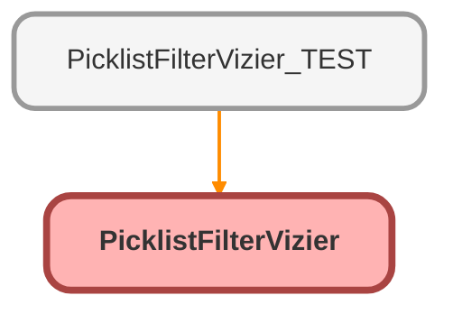

---
hide:
  - path
---

# PicklistFilterVizier Class

## Class Diagram



<!-- Apex description -->

## Apex Code

```java
public with sharing class PicklistFilterVizier {
    @AuraEnabled(cacheable=true)
    public static List <Picklist_Filter__mdt> fetchObjectPicklistFilters(String inputRecord) {

        List<Picklist_Filter__mdt> requestedPicklistFilters = new List<Picklist_Filter__mdt>();
        List<Picklist_Filter__mdt> allPicklistFilters = Picklist_Filter__mdt.getAll().values();

IF (inputRecord != '') {

        for(Integer i = 0; i < allPicklistFilters.size(); i++){
            if(allPicklistFilters[i].Filtered_Object__c == inputRecord){
                requestedPicklistFilters.add(allPicklistFilters[i]);
            }
        }
    } else {

        requestedPicklistFilters.addAll(allPicklistFilters);
    }
        return requestedPicklistFilters;
        }
}
```

## Methods
### `fetchObjectPicklistFilters(inputRecord)`

`AURAENABLED`

#### Signature
```apex
public static List<Picklist_Filter__mdt> fetchObjectPicklistFilters(String inputRecord)
```

#### Parameters
| Name | Type | Description |
|------|------|-------------|
| inputRecord | String |  |

#### Return Type
**List&lt;Picklist_Filter__mdt&gt;**