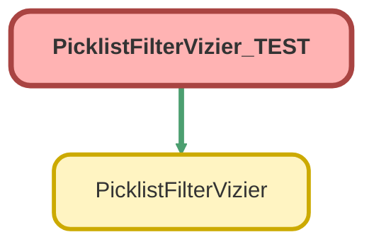

---
hide:
  - path
---

# PicklistFilterVizier_TEST Class

`ISTEST`

## Class Diagram



<!-- Apex description -->

## Apex Code

```java
@isTest
private class PicklistFilterVizier_TEST {

    @isTest
    private static void checkPicklistFilterCase() {
        test.startTest();
        List<Picklist_Filter__mdt> picklistFilterResults = PicklistFilterVizier.fetchObjectPicklistFilters('Case');
        test.stopTest();
        Picklist_Filter__mdt singleResult = picklistFilterResults.get(0);
        system.assert(singleResult != null, 'Should return something, good job.');
        system.assert(singleResult.Filtered_Object__c == 'Case', 'Specifically, it should return a record with the case object.');
    }

    @isTest
    private static void checkPicklistFilterNull() {
        test.startTest();
        List<Picklist_Filter__mdt> picklistFilterResults = PicklistFilterVizier.fetchObjectPicklistFilters('');
        test.stopTest();
        Picklist_Filter__mdt singleResult = picklistFilterResults.get(0);
        system.assert(singleResult != null, 'Should return something, good job.');
    }
}
```

## Methods
### `checkPicklistFilterCase()`

`ISTEST`

#### Signature
```apex
private static void checkPicklistFilterCase()
```

#### Return Type
**void**

---

### `checkPicklistFilterNull()`

`ISTEST`

#### Signature
```apex
private static void checkPicklistFilterNull()
```

#### Return Type
**void**