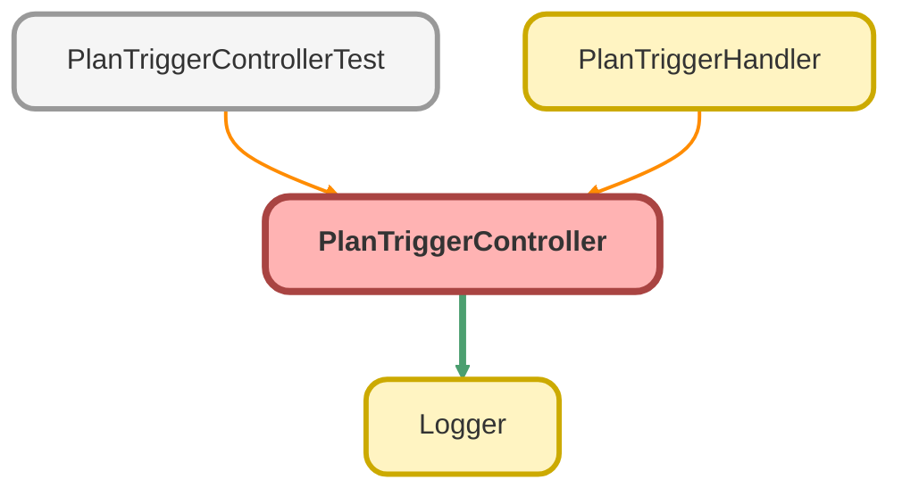

---
hide:
  - path
---

# PlanTriggerController Class

## Class Diagram



<!-- Apex description -->

## Apex Code

```java
public without sharing class PlanTriggerController {
  public static void createdPlanUpdateAccounts(List<Plan__c> plans) {
    Set<Id> accountIds = new Set<Id>();
    for (Plan__c plan : plans) {
      accountIds.add(plan.Account__c);
    }

    List<Account> accounts = [
      SELECT Id, Custodian__c, Fund_List__c, Service_Option__c, Safe_Harbor_Formula__c, Plan_Status__c
      FROM Account
      WHERE Id IN :accountIds
    ];

    for (Account account : accounts) {
      for (Plan__c plan : plans) {
        if (plan.Account__c == account.Id) {
          account.Custodian__c = plan.Custodian__c;
          account.Fund_List__c = plan.Fund_List__c;
          account.Service_Option__c = plan.Service_Option__c;
          account.Safe_Harbor_Formula__c = plan.Safe_Harbor__c;
          account.Plan_Status__c = plan.Status__c;
        }
      }
    }
    try {
      Database.update(accounts);
    } catch (Exception e) {
      Logger.error('Error updating accounts from PlanTriggerController insert', accounts, e);
    }
    Logger.saveLog();
  }

  public static void afterUpdatePlan(Map<Id, Plan__c> plans) {
    List<Account> accountsToUpdate = new List<Account>();

    Set<Id> accountIds = new Set<Id>();
    for (Plan__c plan : plans.values()) {
      if (plan.Account__c != null) {
        accountIds.add(plan.Account__c);
      }
    }

    List<Plan__c> latestPlans = getLatestPlans(accountIds);
    accountsToUpdate.addAll(accsNeedPlanSync(latestPlans));
    if (!accountsToUpdate.isEmpty()) {
      try {
        Database.update(accountsToUpdate);
      } catch (Exception e) {
        Logger.error('Error updating accounts from PlanTriggerController update', accountsToUpdate, e);
      }
    }
    Logger.saveLog();
  }

  private static List<Plan__c> getLatestPlans(Set<Id> accountIds) {
    Map<Id, Plan__c> accPlanMap = new Map<Id, Plan__c>();
    for (Plan__c plan : [
      SELECT
        Id,
        Status__c,
        Custodian__c,
        Fund_List__c,
        Service_Option__c,
        Safe_Harbor__c,
        Annual_Recurring_Revenue__c,
        CreatedDate,
        Account__r.Id,
        Account__r.Custodian__c,
        Account__r.Fund_List__c,
        Account__r.Service_Option__c,
        Account__r.Safe_Harbor_Formula__c,
        Account__r.Plan_Status__c,
        Account__r.Plan_Value__c,
        Account__r.CreatedDate
      FROM Plan__c
      WHERE Account__c IN :accountIds
      ORDER BY CreatedDate DESC
    ]) {
      if (accPlanMap.containsKey(plan.Account__c) && plan.Status__c == 'Active') {
        Plan__c altPlan = accPlanMap.get(plan.Account__c);
        if (altPlan.Status__c != 'Active') {
          accPlanMap.put(plan.Account__c, plan);
        }
      } else if (!accPlanMap.containsKey(plan.Account__c)) {
        accPlanMap.put(plan.Account__c, plan);
      }
    }
    return accPlanMap.values();
  }

  private static List<Account> accsNeedPlanSync(List<Plan__c> plans) {
    List<Account> accounts2Update = new List<Account>();
    for (Plan__c plan : plans) {
      String planValue = getPlanValue(plan.Annual_Recurring_Revenue__c);
      if (
        plan.Account__r.Custodian__c != plan.Custodian__c ||
        plan.Account__r.Fund_List__c != plan.Fund_List__c ||
        plan.Account__r.Service_Option__c != plan.Service_Option__c ||
        plan.Account__r.Safe_Harbor_Formula__c != plan.Safe_Harbor__c ||
        plan.Account__r.Plan_Status__c != plan.Status__c ||
        plan.Account__r.Plan_Value__c != planValue
      ) {
        accounts2Update.add(
          new Account(
            Id = plan.Account__c,
            Custodian__c = plan.Custodian__c,
            Fund_List__c = plan.Fund_List__c,
            Service_Option__c = plan.Service_Option__c,
            Safe_Harbor_Formula__c = plan.Safe_Harbor__c,
            Plan_Status__c = plan.Status__c,
            Plan_Value__c = planValue
          )
        );
      }
    }
    return accounts2Update;
  }

  private static String getPlanValue(Decimal yrRevenue) {
    final Integer minPlat = 10000;
    final Integer minGold = 6000;
    final Integer minSilver = 2000;
    if (yrRevenue >= minPlat) {
      return 'Platinum';
    } else if (yrRevenue >= minGold) {
      return 'Gold';
    } else if (yrRevenue >= minSilver) {
      return 'Silver';
    } else if (yrRevenue > 0) {
      return 'Bronze';
    } else {
      return null;
    }
  }
}
```

## Methods
### `createdPlanUpdateAccounts(plans)`

#### Signature
```apex
public static void createdPlanUpdateAccounts(List<Plan__c> plans)
```

#### Parameters
| Name | Type | Description |
|------|------|-------------|
| plans | List&lt;Plan__c&gt; |  |

#### Return Type
**void**

---

### `afterUpdatePlan(plans)`

#### Signature
```apex
public static void afterUpdatePlan(Map<Id,Plan__c> plans)
```

#### Parameters
| Name | Type | Description |
|------|------|-------------|
| plans | Map&lt;Id,Plan__c&gt; |  |

#### Return Type
**void**

---

### `getLatestPlans(accountIds)`

#### Signature
```apex
private static List<Plan__c> getLatestPlans(Set<Id> accountIds)
```

#### Parameters
| Name | Type | Description |
|------|------|-------------|
| accountIds | Set&lt;Id&gt; |  |

#### Return Type
**List&lt;Plan__c&gt;**

---

### `accsNeedPlanSync(plans)`

#### Signature
```apex
private static List<Account> accsNeedPlanSync(List<Plan__c> plans)
```

#### Parameters
| Name | Type | Description |
|------|------|-------------|
| plans | List&lt;Plan__c&gt; |  |

#### Return Type
**List&lt;Account&gt;**

---

### `getPlanValue(yrRevenue)`

#### Signature
```apex
private static String getPlanValue(Decimal yrRevenue)
```

#### Parameters
| Name | Type | Description |
|------|------|-------------|
| yrRevenue | Decimal |  |

#### Return Type
**String**