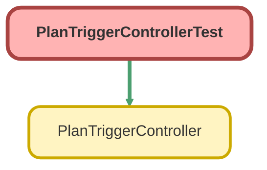

---
hide:
  - path
---

# PlanTriggerControllerTest Class

`ISTEST`

## Class Diagram



<!-- Apex description -->

## Apex Code

```java
@isTest
public with sharing class PlanTriggerControllerTest {
  @TestSetup
  static void makeData() {
    List<Account> accounts = new List<Account>();
    for (Integer i = 0; i < 4; i++) {
      Account a = new Account(Name = 'Test Account Name ' + i);
      accounts.add(a);
    }
    insert accounts;

    List<Plan__c> plans = new List<Plan__c>();
    for (Integer i = 0; i < 4; i++) {
      Plan__c p = new Plan__c(Name = 'Test Plan Name ' + i, Account__c = accounts[i].Id);
      p.Name = 'Plan Name ' + i;
      if (i < 2) {
        p.Status__c = 'Inactive';
      } else {
        p.Status__c = 'Active';
      }
      p.Custodian__c = 'Schwab Trust';
      p.Fund_List__c = 'Prudent';
      p.Service_Option__c = 'Partner';
      plans.add(p);
    }
    insert plans;
  }

  @isTest
  public static void createdPlanUpdateAccountsTest() {
    Account a = new Account(Name = 'Test Insert');
    insert a;
    Test.startTest();
    List<Plan__c> plans = new List<Plan__c>();
    Plan__c p = new Plan__c();
    p.Name = 'Test Insert';
    p.Account__c = a.Id;
    p.Custodian__c = 'MG Trust Company, LLC.';
    p.Fund_List__c = 'Prudent';
    p.Service_Option__c = 'Custom(k)';
    p.Status__c = 'Active';
    insert p;
    Test.stopTest();
    Account updatedAcc = [SELECT Id, Custodian__c, Service_Option__c FROM Account WHERE Name = 'Test Insert' LIMIT 1];
    System.assertEquals(updatedAcc.Custodian__c, 'MG Trust Company, LLC.', 'Account\'s custodian should match the plan\'s, MG Trust Company, LLC');
    System.AssertEquals(updatedAcc.Service_Option__c, 'Custom(k)', 'Account\'s service option should match the plan\'s, Custom(k)');
  }

  @isTest
  public static void updatePlansUpdateAccountsTest() {
    List<Account> accounts = [
      SELECT
        Id,
        Name,
        Custodian__c,
        Fund_List__c,
        Service_Option__c,
        Safe_Harbor_Formula__c,
        Plan_Status__c,
        (
          SELECT Id, Name, Status__c
          FROM Plans__r
        )
      FROM Account
      WHERE Name LIKE 'Test Account Name%'
    ];
    Test.startTest();
    List<Plan__c> plans = new List<Plan__c>();
    for (Account a : accounts) {
      for (Plan__c p : a.Plans__r) {
        p.Status__c = 'Active';
        plans.add(p);
      }
    }
    update plans;
    Test.stopTest();
    Account acc = [SELECT Id, Plan_Status__c FROM Account WHERE Name = 'Test Account Name 0'];
    System.assertEquals(acc.Plan_Status__c, 'Active', 'The plan status should be the same as the account plan status');
  }

  @isTest
  public static void updatePlansPlanValueTest() {
    List<Account> accounts = [
      SELECT
        Id,
        Name,
        Custodian__c,
        Fund_List__c,
        Service_Option__c,
        Safe_Harbor_Formula__c,
        Plan_Status__c,
        (
          SELECT Id, Name, Status__c
          FROM Plans__r
        )
      FROM Account
      WHERE Name LIKE 'Test Account Name%'
    ];
    Test.startTest();
    List<Plan__c> plans = new List<Plan__c>();
    Integer i = 0;
    for (Account a : accounts) {
      for (Plan__c p : a.Plans__r) {
        p.Monthly_Admin_Fee__c = 333.33 * i + 1;
        plans.add(p);
      }
      i++;
    }
    update plans;
    Test.stopTest();
    List<Account> accounts2 = [
      SELECT Id, Plan_Value__c
      FROM Account
      WHERE Name LIKE 'Test Account Name%'
      ORDER BY Name ASC
    ];
    System.assertEquals(accounts2[0].Plan_Value__c, 'Bronze', 'Account 0 should have a plan value of "Bronze"');
    System.assertEquals(accounts2[1].Plan_Value__c, 'Silver', 'Account 1 should have a plan value of "Silver"');
    System.AssertEquals(accounts2[2].Plan_Value__c, 'Gold', 'Account 2 should have a plan value of "Gold"');
    System.AssertEquals(accounts2[3].Plan_Value__c, 'Platinum', 'Account 3 should have a plan value of "Platinum"');
  }
}
```

## Methods
### `makeData()`

`TESTSETUP`

#### Signature
```apex
private static void makeData()
```

#### Return Type
**void**

---

### `createdPlanUpdateAccountsTest()`

`ISTEST`

#### Signature
```apex
public static void createdPlanUpdateAccountsTest()
```

#### Return Type
**void**

---

### `updatePlansUpdateAccountsTest()`

`ISTEST`

#### Signature
```apex
public static void updatePlansUpdateAccountsTest()
```

#### Return Type
**void**

---

### `updatePlansPlanValueTest()`

`ISTEST`

#### Signature
```apex
public static void updatePlansPlanValueTest()
```

#### Return Type
**void**