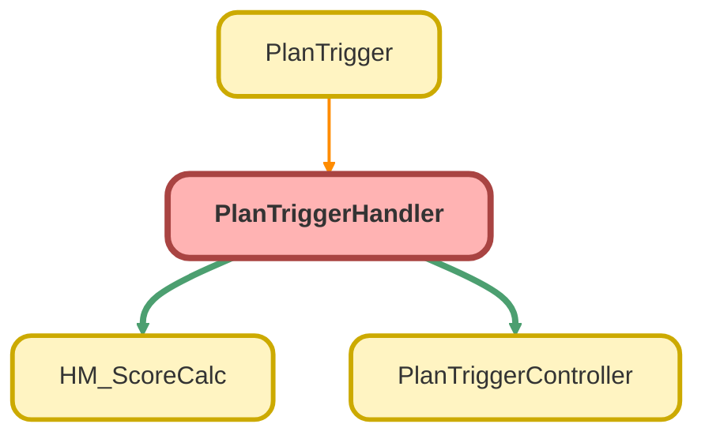

---
hide:
  - path
---

# PlanTriggerHandler Class

## Class Diagram



<!-- Apex description -->

## Apex Code

```java
public with sharing class PlanTriggerHandler {

    public void onAfterInsert(List<Plan__c> plans){
        PlanTriggerController.createdPlanUpdateAccounts(plans);
    }
    public void onAfterUpdate(Map<Id, Plan__c> plansIdPlanMap){
        PlanTriggerController.afterUpdatePlan(plansIdPlanMap);
    }
    // public void onBeforeInsert(){}
    // public void onBeforeUpdate(Map<Id, Plan__c> plansIdPlanMap){
    //     HM_ScoreCalc.calcScores(plansIdPlanMap);
    // }
    // public void onBeforeDelete(){}
    // public void onAfterDelete(){}
}
```

## Methods
### `onAfterInsert(plans)`

#### Signature
```apex
public void onAfterInsert(List<Plan__c> plans)
```

#### Parameters
| Name | Type | Description |
|------|------|-------------|
| plans | List&lt;Plan__c&gt; |  |

#### Return Type
**void**

---

### `onAfterUpdate(plansIdPlanMap)`

#### Signature
```apex
public void onAfterUpdate(Map<Id,Plan__c> plansIdPlanMap)
```

#### Parameters
| Name | Type | Description |
|------|------|-------------|
| plansIdPlanMap | Map&lt;Id,Plan__c&gt; |  |

#### Return Type
**void**