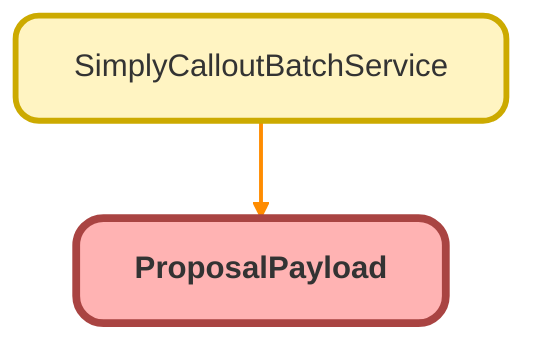

---
hide:
  - path
---

# ProposalPayload Class

## Class Diagram



<!-- Apex description -->

## Apex Code

```java
public class ProposalPayload {
    public Client client;
    public Opportunity opportunity;
    public Advisor advisor;
    public TPA tpa;

    public class Client {
        public String name;
        public String localPhone;
        public String mailingState;
        public Decimal mailingFullZip;
        public String taxId;
    }

    public class Opportunity {
        public Date contractEffectiveDate;
        public Decimal activeLivesCount;
        public String stage;
        public String closedReason;
    }

    public class Advisor {
        public String npn;
        public String firmCrd;
        public String role;
        public String firmName;
        public Decimal firmNpn;
    }

    public class TPA {
        public String firmName;
        public String taxId;
    }
}
```

## Fields
### `client`

#### Signature
```apex
public client
```

#### Type
Client

---

### `opportunity`

#### Signature
```apex
public opportunity
```

#### Type
[Opportunity](../objects/Opportunity.md)

---

### `advisor`

#### Signature
```apex
public advisor
```

#### Type
Advisor

---

### `tpa`

#### Signature
```apex
public tpa
```

#### Type
TPA

## Classes
### Client Class

#### Fields
##### `name`

###### Signature
```apex
public name
```

###### Type
String

---

##### `localPhone`

###### Signature
```apex
public localPhone
```

###### Type
String

---

##### `mailingState`

###### Signature
```apex
public mailingState
```

###### Type
String

---

##### `mailingFullZip`

###### Signature
```apex
public mailingFullZip
```

###### Type
Decimal

---

##### `taxId`

###### Signature
```apex
public taxId
```

###### Type
String

### Opportunity Class

#### Fields
##### `contractEffectiveDate`

###### Signature
```apex
public contractEffectiveDate
```

###### Type
Date

---

##### `activeLivesCount`

###### Signature
```apex
public activeLivesCount
```

###### Type
Decimal

---

##### `stage`

###### Signature
```apex
public stage
```

###### Type
String

---

##### `closedReason`

###### Signature
```apex
public closedReason
```

###### Type
String

### Advisor Class

#### Fields
##### `npn`

###### Signature
```apex
public npn
```

###### Type
String

---

##### `firmCrd`

###### Signature
```apex
public firmCrd
```

###### Type
String

---

##### `role`

###### Signature
```apex
public role
```

###### Type
String

---

##### `firmName`

###### Signature
```apex
public firmName
```

###### Type
String

---

##### `firmNpn`

###### Signature
```apex
public firmNpn
```

###### Type
Decimal

### TPA Class

#### Fields
##### `firmName`

###### Signature
```apex
public firmName
```

###### Type
String

---

##### `taxId`

###### Signature
```apex
public taxId
```

###### Type
String