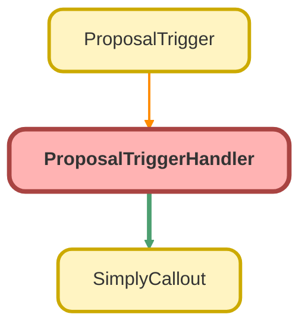

---
hide:
  - path
---

# ProposalTriggerHandler Class

## Class Diagram



<!-- Apex description -->

## Apex Code

```java
public with sharing class ProposalTriggerHandler {

    public static void checkProposals(Map<Id, Proposal__c> newMap, Map<Id, Proposal__c> oldMap) {
        Set<Id> simplyProps = new Set<Id>();

        for (Id propId : newMap.keySet()) {


            Proposal__c oldProposal       = oldMap.get(propId);
            Proposal__c newProposal       = newMap.get(propId);

            Boolean isBatch               = System.isBatch();
            Boolean isFuture              = System.isFuture();
            Boolean isQueueable           = System.isQueueable();

            Boolean isOldRecordQueued     = oldProposal.Queued__c;
            Boolean isNewRecordQueued     = newProposal.Queued__c;
            Boolean isNewRecordTypeId     = newProposal.RecordTypeId == '0121G000000RlheQAC';

            Boolean isNewRecordForceQueue = newProposal.Force_Queue__c;

            Boolean hasOpportunityId      = oldProposal.Principal_Opportunity_Id__c != null;

            Boolean isNewerThanLaunchDate = newProposal.CreatedDate >= Date.valueOf('2022-07-15 10:00:00');

            Boolean isManualCallout       = newProposal.Manual_Callout__c;
            Boolean wasManualCallout      = oldProposal.Manual_Callout__c;
            Boolean isCommittedStage      = newProposal.Principal_Opportunity_Stage__c == 'Committed';

            Boolean hasStageChanged       = oldProposal.Principal_Opportunity_Stage__c != newProposal.Principal_Opportunity_Stage__c;
            Boolean isStageNotNull        = newProposal.Principal_Opportunity_Stage__c != null;


            if( !simplyProps.contains(propId) && !isBatch && !isFuture && !isQueueable
                &&
                ( !isOldRecordQueued && !isNewRecordQueued && isNewRecordTypeId )
                &&
                ( isNewRecordForceQueue || ( hasOpportunityId || ( ( isNewerThanLaunchDate || ( isManualCallout && !wasManualCallout || isCommittedStage ) ) && ( hasStageChanged && isStageNotNull ) ) ) )
            ) {
                    newProposal.Queued__c = true;
                    newProposal.Force_Queue__c = false;
                    simplyProps.add(propId);
            }
        }
        System.debug('!!! simplyProps: '+ simplyProps);
        processRecords(simplyProps);
    }

    public static void processRecords(Set<Id> simplyProps) {

        if (simplyProps.size() > 0) {
            List<ProposalsBatch__c> existingProposals = [SELECT Id, Proposal__c, Callout_Failed__c FROM ProposalsBatch__c WHERE Proposal__c IN :simplyProps];
            System.debug('!!! existingProposals: '+ existingProposals);

            Map<Id, ProposalsBatch__c> proposalMap = new Map<Id, ProposalsBatch__c>();
            System.debug('!!! proposalMap: '+ proposalMap);

            for (ProposalsBatch__c existingRecord : existingProposals) {
                proposalMap.put(existingRecord.Proposal__c, existingRecord);
            }

            List<ProposalsBatch__c> proposalsForUpsert = new List<ProposalsBatch__c>();

            for (Id propId : simplyProps) {

                if (proposalMap.containsKey(propId)) {
                    
                    ProposalsBatch__c existingRecord = proposalMap.get(propId);
                    existingRecord.Callout_Failed__c = false;
                    proposalsForUpsert.add(existingRecord);
                    System.debug('!!! existingRecord: '+ existingRecord);
                } else {
                    ProposalsBatch__c newProposal = new ProposalsBatch__c();
                    newProposal.ProposalId__c = propId;
                    newProposal.Proposal__c = Id.valueOf(propId);
                    proposalsForUpsert.add(newProposal);
                }
            }
            System.debug('!!! proposalsForUpsert: '+ proposalsForUpsert);
            Database.upsert(proposalsForUpsert, false);
        }
    }


    // ProposalsBatch__c 

    // if (simplyProps.size() > 0) {
    //     // processRecords(simplyProps);
    //     List<ProposalsBatch__c> proposalsForUpdate = new List<ProposalsBatch__c>();
    //     for (Id propId : simplyProps) {
    //         ProposalsBatch__c pr = new ProposalsBatch__c();
    //         pr.proposalId__c = propId;
    //         // pr.Name = 'Proposal ' + propId;
    //         // pr.SetupOwnerId = UserInfo.getUserId();
    //         proposalsForUpdate.add(pr);
    //     }
    //     System.debug('TRIGGER ********** proposalsForUpdate ' + proposalsForUpdate.size());
    //     System.debug('TRIGGER **********  CUSTOM SETTING proposalsForUpdate ' + proposalsForUpdate);
    //     insert proposalsForUpdate;
    // }


    // public static void processRecords(List<Id> propIds) {
    //     Integer chunkSize = 10; // Set the desired chunk size
    //     for (Integer i = 0; i < propIds.size(); i += chunkSize) {
    //         List<Id> chunk = new List<Id>();
    //         for (Integer j = i; j < Math.min(i + chunkSize, propIds.size()); j++) {
    //             chunk.add(propIds[j]);
               
    //         }
    //         System.debug('==========ProposalTriggerHandler processsRecords line 67 --> chunk ' + chunk.size());
    //         System.enqueueJob(new SimplyCallout(chunk));
    //     }
    // }
}
```

## Methods
### `checkProposals(newMap, oldMap)`

#### Signature
```apex
public static void checkProposals(Map<Id,Proposal__c> newMap, Map<Id,Proposal__c> oldMap)
```

#### Parameters
| Name | Type | Description |
|------|------|-------------|
| newMap | Map&lt;Id,Proposal__c&gt; |  |
| oldMap | Map&lt;Id,Proposal__c&gt; |  |

#### Return Type
**void**

---

### `processRecords(simplyProps)`

#### Signature
```apex
public static void processRecords(Set<Id> simplyProps)
```

#### Parameters
| Name | Type | Description |
|------|------|-------------|
| simplyProps | Set&lt;Id&gt; |  |

#### Return Type
**void**