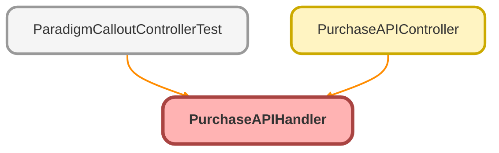

---
hide:
  - path
---

# PurchaseAPIHandler Class

## Class Diagram



<!-- Apex description -->

## Apex Code

```java
public with sharing class PurchaseAPIHandler {

   //  Define product code
//    public static String getProductCode(String serviceOption, String custodian, String assetManager) {
//         List<Product_Code__mdt> productCodeMdt = [SELECT Id, Label, Custodian__c, Service_Option__c, X3_38_Asset_Manager__c
//                                                   FROM Product_Code__mdt
//                                                   WHERE Service_Option__c = :serviceOption AND
//                                                   Custodian__c = :custodian AND
//                                                   X3_38_Asset_Manager__c = :assetManager
//                                                   LIMIT 1];
//         return !productCodeMdt.isEmpty() ? productCodeMdt[0].Label : null;
//     }
//    public static String getProductCode(String serviceOption) {
//         List<ProductCode__mdt> productCodeMdt = [SELECT Id, Label, Service_Option__c
//                                                   FROM ProductCode__mdt
//                                                   WHERE Service_Option__c = :serviceOption
//                                                   LIMIT 1];
//         return !productCodeMdt.isEmpty() ? productCodeMdt[0].Label : null;
//     }
    // Portfolio code
    // public static String getPortfolioCode(String fundList, String custodian, String assetManager){
    //     // define Custodian and fund list VALUES in MDT
    //     List<Portfolio_Code__mdt> portfolioCodeMdt = [SELECT Id, Label, Custodian__c, Fund_List__c
    //                                                     FROM Portfolio_Code__mdt
    //                                                     WHERE Fund_List__c = :fundList AND
    //                                                     Custodian__c = :custodian AND
    //                                                     X3_38_Asset_Manager__c = :assetManager
    //                                                     LIMIT 1];
    //     return !portfolioCodeMdt.isEmpty() ? portfolioCodeMdt[0].Label : null;
    // }

    //  Merge Sources List
    public static List<AddSources__mdt> getSources(String rothContributions, String safeHarbor, String discretionaryMatch, String discretionaryMatchFormula, String profitSharing){

        List<AddSources__mdt> resultSourcesList = new List<AddSources__mdt>();

        // Employee Pretax Contribution - id 1
        List<AddSources__mdt> requiredSources = [SELECT Id, Label, SourceId__c, SourceType__c, ContributorType__c, isRequired__c
                                                FROM AddSources__mdt
                                                WHERE isRequired__c = true];
        resultSourcesList.addAll(requiredSources);

        // Employee Roth Contribution - id 2
        if(rothContributions != null && rothContributions != 'No'){
            List<AddSources__mdt> rothSources = [SELECT Id, Label, SourceId__c, SourceType__c, ContributorType__c, Roth_Contributions__c
                                                 FROM AddSources__mdt
                                                 WHERE Roth_Contributions__c = :rothContributions];
            resultSourcesList.addAll(rothSources);
        }

        //	Employer Profit Sharing Contributions - id 10
        if(profitSharing != null && profitSharing != 'No'){
            List<AddSources__mdt> profitSharingSources = [SELECT Id, Label, SourceId__c, SourceType__c, ContributorType__c, Profit_Sharing__c
                                                          FROM AddSources__mdt
                                                          WHERE Profit_Sharing__c = true];
            resultSourcesList.addAll(profitSharingSources);
        }

        // Safe Harbor - id: 4-8, 22, 1001-1006
        if(safeHarbor != null){
            List<AddSources__mdt> safeHarborSources = [SELECT Id, Label, SourceId__c, SourceType__c, ContributorType__c, Safe_Harbor__c
                                                       FROM AddSources__mdt
                                                       WHERE Safe_Harbor__c = :safeHarbor];
            resultSourcesList.addAll(safeHarborSources);
        }

        // Discretionary Match - id: 1009 - 1019
        if(discretionaryMatch != null && discretionaryMatch == 'Yes'){
            List<AddSources__mdt> discretionaryMatchSources = [SELECT Id, Label, SourceId__c, SourceType__c, ContributorType__c, Discretionary_Match__c
                                                               FROM AddSources__mdt
                                                               WHERE Discretionary_Match__c = :discretionaryMatch
                                                               AND Discretionary_Match_Formula__c = :discretionaryMatchFormula];
            resultSourcesList.addAll(discretionaryMatchSources);
        }

        return resultSourcesList;
    }


    public static Integer getVesting(String vesting){
        List<Vesting_Id__mdt> vestingMdtList = [SELECT Id, Label, Profit_Sharing_Match_Vesting_Schedule__c, Id__c
                                                FROM Vesting_Id__mdt
                                                WHERE Profit_Sharing_Match_Vesting_Schedule__c = :vesting
                                                LIMIT 1];
        return !vestingMdtList.isEmpty() ? Integer.valueOf(vestingMdtList[0].Id__c) : null;
    }

    //  Define Enrollment Rate
    public static Map<String, String> getEnrollmentRate(String enrollmentRate) {
        Map<String, String> enrollmentRateMap = new Map<String, String>();
    
        if (enrollmentRate == null || enrollmentRate == 'None') {
            // Set default values when enrollmentRate is null
            enrollmentRateMap.put('autoDeferralType', null);
            enrollmentRateMap.put('minimumAutoDeferralPercentage', null);
            enrollmentRateMap.put('maximumAutoDeferralPercentage', null);
            enrollmentRateMap.put('yearlyAutoDeferralPercentageIncrease', null);
        } else {
            String autoDeferralType = enrollmentRate.contains('Escalate') ? 'ESCALATING' : (enrollmentRate.contains('Flat') ? 'FLAT' : null);
            Integer minimumAutoDeferralPercentage = 0;
            try {
                minimumAutoDeferralPercentage = Integer.valueOf(enrollmentRate.split(' ')[0].replace('%', ''));
            } catch (Exception e) {
                minimumAutoDeferralPercentage = 0;
            }

            if ('ESCALATING'.equals(autoDeferralType)) {
                enrollmentRateMap.put('autoDeferralType', autoDeferralType);
                enrollmentRateMap.put('minimumAutoDeferralPercentage', String.valueOf(minimumAutoDeferralPercentage));
                enrollmentRateMap.put('maximumAutoDeferralPercentage', '10');
                enrollmentRateMap.put('yearlyAutoDeferralPercentageIncrease', '1');
            } else if ('FLAT'.equals(autoDeferralType)) {
                enrollmentRateMap.put('autoDeferralType', autoDeferralType);
                enrollmentRateMap.put('minimumAutoDeferralPercentage', String.valueOf(minimumAutoDeferralPercentage));
                enrollmentRateMap.put('maximumAutoDeferralPercentage', String.valueOf(minimumAutoDeferralPercentage));
                enrollmentRateMap.put('yearlyAutoDeferralPercentageIncrease', '0');
            } else {
                // Set default values when autoDeferralType is not recognized
                enrollmentRateMap.put('autoDeferralType', null);
                enrollmentRateMap.put('minimumAutoDeferralPercentage', null);
                enrollmentRateMap.put('maximumAutoDeferralPercentage', null);
                enrollmentRateMap.put('yearlyAutoDeferralPercentageIncrease', null);
            }
        }
        return enrollmentRateMap;
    }

// 006Dw00000OEeKYIA1
    public static Map<String, List<Associated_Contact__c>> getAssociatedContacts(String oppId){
        Map<String, List<Associated_Contact__c>> associatedContactsMap = new Map<String, List<Associated_Contact__c>>();
        List<Associated_Contact__c> associatedContacts = [SELECT Id, Name,
                                                                 Contact__c,
                                                                 Opportunity__c,
                                                                 Contact_Role__c,
                                                                 Primary__c,
                                                                 Contact__r.Name,
                                                                 Contact__r.NPN_Number__c,
                                                                 Contact__r.CRD_Number__c,
                                                                 Contact__r.Role__c,
                                                                 Contact__r.FirstName,
                                                                 Contact__r.LastName,
                                                                 Contact__r.Email,
                                                                 Contact__r.Opt_Out_Reason__c,
                                                                 Contact__r.Phone,
                                                                 Contact__r.Account.Employer_Identification_Number_EIN__c
                                                        FROM Associated_Contact__c
                                                        WHERE Opportunity__c = :oppId AND Contact_Role__c != null];
        if(!associatedContacts.isEmpty()){
            for(Associated_Contact__c associatedContact : associatedContacts){
                String role = associatedContact.Contact_Role__c;

                // Check for Financial Advisor
                if(role.contains('Financial Advisor')){
                    addContactToMap(associatedContactsMap, 'Advisors', associatedContact);
                }

                // Check for TPA
                if(role.contains('TPA')){
                    addContactToMap(associatedContactsMap, 'TPA', associatedContact);
                }

                // Check for Trustee
                if(role.contains('Trustee')){
                    addContactToMap(associatedContactsMap, 'Trustees', associatedContact);
                }
            }
        }
        return associatedContactsMap;
    }

    public static void addContactToMap(Map<String, List<Associated_Contact__c>> associatedContactsMap, String key, Associated_Contact__c contact){
        if(!associatedContactsMap.containsKey(key)){
            associatedContactsMap.put(key, new List<Associated_Contact__c>{contact});
        } else {
            associatedContactsMap.get(key).add(contact);
        }
    }

    public static List<Associated_Contact__c> getAssociatedAdvisors(Map<String, List<Associated_Contact__c>> associatedContactsMap){
        //temporary fix with empty list!!!!!!!!!!
        List<Associated_Contact__c> advisorsList = new List<Associated_Contact__c>();
        return advisorsList;

        // List<Associated_Contact__c> advisorsList = associatedContactsMap.containsKey('Advisors') ? associatedContactsMap.get('Advisors') : new List<Associated_Contact__c>();
        // List<Associated_Contact__c> validatedAdvisors = new List<Associated_Contact__c>();
        // for(Associated_Contact__c con : advisorsList){
        //     if(con.Contact__r.NPN_Number__c != null || con.Contact__r.CRD_Number__c !=null){
        //         validatedAdvisors.add(con);
        //     }
        // }
        // Boolean hasPrimary = false;
        // if(validatedAdvisors.size() > 0){
        //     for(Associated_Contact__c con :validatedAdvisors){
        //         if(con.Primary__c){
        //             hasPrimary = true;
        //             break;
        //         }
        //     }
        //     if(validatedAdvisors.size() > 0 && !hasPrimary){
        //         validatedAdvisors[0].Primary__c = true;
        //     }
        // }
        // return validatedAdvisors;
    }

    public static List<Associated_Contact__c> getAssociatedTPA(Map<String, List<Associated_Contact__c>> associatedContactsMap){
        //temporary fix with empty list !!!!!!!!!!
        List<Associated_Contact__c> tpaList = new List<Associated_Contact__c>();
        return tpaList;

        //List<Associated_Contact__c> tpaList = associatedContactsMap.containsKey('TPA') ? associatedContactsMap.get('TPA') : new List<Associated_Contact__c>();
        // List<Associated_Contact__c> validatedTPA = new List<Associated_Contact__c>();
        // for(Associated_Contact__c con : tpaList){
        //     if(con.Contact__r.Account.Employer_Identification_Number_EIN__c != null){
        //         validatedTPA.add(con);
        //     }
        // }
        // return validatedTPA;
    }

    public static List<Associated_Contact__c> getAssociatedTrustees(Map<String, List<Associated_Contact__c>> associatedContactsMap){
        return associatedContactsMap.containsKey('Trustees') ? associatedContactsMap.get('Trustees') : new List<Associated_Contact__c>();
    }
}
```

## Methods
### `getSources(rothContributions, safeHarbor, discretionaryMatch, discretionaryMatchFormula, profitSharing)`

#### Signature
```apex
public static List<AddSources__mdt> getSources(String rothContributions, String safeHarbor, String discretionaryMatch, String discretionaryMatchFormula, String profitSharing)
```

#### Parameters
| Name | Type | Description |
|------|------|-------------|
| rothContributions | String |  |
| safeHarbor | String |  |
| discretionaryMatch | String |  |
| discretionaryMatchFormula | String |  |
| profitSharing | String |  |

#### Return Type
**List&lt;AddSources__mdt&gt;**

---

### `getVesting(vesting)`

#### Signature
```apex
public static Integer getVesting(String vesting)
```

#### Parameters
| Name | Type | Description |
|------|------|-------------|
| vesting | String |  |

#### Return Type
**Integer**

---

### `getEnrollmentRate(enrollmentRate)`

#### Signature
```apex
public static Map<String,String> getEnrollmentRate(String enrollmentRate)
```

#### Parameters
| Name | Type | Description |
|------|------|-------------|
| enrollmentRate | String |  |

#### Return Type
**Map&lt;String,String&gt;**

---

### `getAssociatedContacts(oppId)`

#### Signature
```apex
public static Map<String,List<Associated_Contact__c>> getAssociatedContacts(String oppId)
```

#### Parameters
| Name | Type | Description |
|------|------|-------------|
| oppId | String |  |

#### Return Type
**Map&lt;String,List&lt;Associated_Contact__c&gt;&gt;**

---

### `addContactToMap(associatedContactsMap, key, contact)`

#### Signature
```apex
public static void addContactToMap(Map<String,List<Associated_Contact__c>> associatedContactsMap, String key, Associated_Contact__c contact)
```

#### Parameters
| Name | Type | Description |
|------|------|-------------|
| associatedContactsMap | Map&lt;String,List&lt;Associated_Contact__c&gt;&gt; |  |
| key | String |  |
| contact | [Associated_Contact__c](../objects/Associated_Contact__c.md) |  |

#### Return Type
**void**

---

### `getAssociatedAdvisors(associatedContactsMap)`

#### Signature
```apex
public static List<Associated_Contact__c> getAssociatedAdvisors(Map<String,List<Associated_Contact__c>> associatedContactsMap)
```

#### Parameters
| Name | Type | Description |
|------|------|-------------|
| associatedContactsMap | Map&lt;String,List&lt;Associated_Contact__c&gt;&gt; |  |

#### Return Type
**List&lt;Associated_Contact__c&gt;**

---

### `getAssociatedTPA(associatedContactsMap)`

#### Signature
```apex
public static List<Associated_Contact__c> getAssociatedTPA(Map<String,List<Associated_Contact__c>> associatedContactsMap)
```

#### Parameters
| Name | Type | Description |
|------|------|-------------|
| associatedContactsMap | Map&lt;String,List&lt;Associated_Contact__c&gt;&gt; |  |

#### Return Type
**List&lt;Associated_Contact__c&gt;**

---

### `getAssociatedTrustees(associatedContactsMap)`

#### Signature
```apex
public static List<Associated_Contact__c> getAssociatedTrustees(Map<String,List<Associated_Contact__c>> associatedContactsMap)
```

#### Parameters
| Name | Type | Description |
|------|------|-------------|
| associatedContactsMap | Map&lt;String,List&lt;Associated_Contact__c&gt;&gt; |  |

#### Return Type
**List&lt;Associated_Contact__c&gt;**