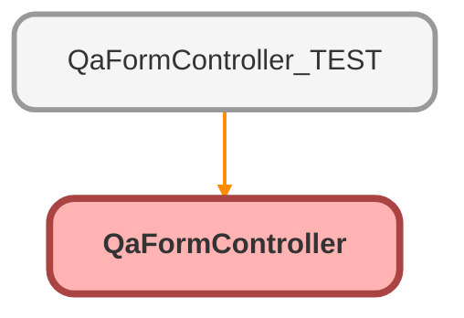

---
hide:
  - path
---

# QaFormController Class

## Class Diagram



<!-- Apex description -->

## Apex Code

```java
public with sharing class QaFormController {
	@AuraEnabled
	public static void updateQaQuestions(List<Qa_Question__c> questionRecords) {
		try {
			Database.update(questionRecords, true, accessLevel.USER_MODE);
		} catch (Exception e) {
			System.debug('The following exception has occurred: ' + e.getMessage());
			throw new AuraHandledException('Something went wrong: ' + e.getMessage());
		}
	}

	@AuraEnabled(cacheable=true)
	public static list<Id> getQuestionIds(Id qaRecordId) {
		List<Id> questionIds = new List<Id>();
		for (QA_Question__c q : [
			SELECT Id
			FROM QA_Question__c
			WHERE Quality_Assurance_QA__c = :qaRecordId
			WITH USER_MODE
			ORDER BY Order__c ASC
		]) {
			questionIds.add(q.Id);
		}
		return questionIds;
	}

	@AuraEnabled(cacheable=true)
	public static list<QA_Question_Info__c> getQuestionInfo(Id qaRecordId) {
		Id qaDesignId = [
			SELECT Id, QA_Design_Version__c
			FROM Quality_Assurance_QA__c
			WHERE Id = :qaRecordId
			WITH USER_MODE
			LIMIT 1
		]
		.QA_Design_Version__c;
		List<QA_Question_Info__c> questionInfoRecords = [
			SELECT Id, Question_Prompt__c, Score_Value__c, Pass_Fail__c
			FROM QA_Question_Info__c
			WHERE QA_Design__c = :qaDesignId
			WITH USER_MODE
			ORDER BY Order__c ASC
		];
		return questionInfoRecords;
	}
}
```

## Methods
### `updateQaQuestions(questionRecords)`

`AURAENABLED`

#### Signature
```apex
public static void updateQaQuestions(List<Qa_Question__c> questionRecords)
```

#### Parameters
| Name | Type | Description |
|------|------|-------------|
| questionRecords | List&lt;Qa_Question__c&gt; |  |

#### Return Type
**void**

---

### `getQuestionIds(qaRecordId)`

`AURAENABLED`

#### Signature
```apex
public static list<Id> getQuestionIds(Id qaRecordId)
```

#### Parameters
| Name | Type | Description |
|------|------|-------------|
| qaRecordId | Id |  |

#### Return Type
**list&lt;Id&gt;**

---

### `getQuestionInfo(qaRecordId)`

`AURAENABLED`

#### Signature
```apex
public static list<QA_Question_Info__c> getQuestionInfo(Id qaRecordId)
```

#### Parameters
| Name | Type | Description |
|------|------|-------------|
| qaRecordId | Id |  |

#### Return Type
**list&lt;QA_Question_Info__c&gt;**