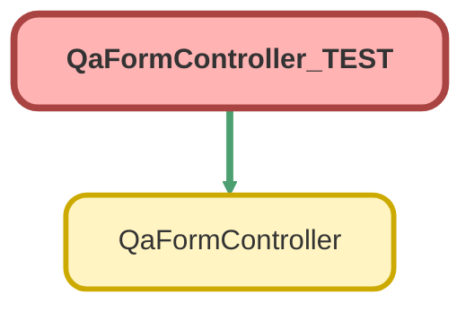

---
hide:
  - path
---

# QaFormController_TEST Class

`ISTEST`

## Class Diagram



<!-- Apex description -->

## Apex Code

```java
@isTest
private class QaFormController_TEST {

    @testSetup static void setup() {
        QA_Design__c inactiveQaDesign = new QA_Design__c(
            Name = 'testDesign',
            Department__c = 'Payroll',
            QA_Type__c = 'Case'
        );
        insert inactiveQaDesign;

        Id qaDesignId = [SELECT Id FROM QA_Design__c WHERE Name = 'testDesign' LIMIT 1].Id;

        QA_Design_Version__c inactiveQaVersion = new QA_Design_Version__c(
            Name = 'testDesignVersion',
            QA_Design__c = qaDesignId,
            Version__c = 1,
            isActive__c = false
        );
        insert inactiveQaVersion;

        Id qaVersionId = [SELECT Id FROM QA_Design_Version__c WHERE name = 'testDesignVersion' LIMIT 1].Id;

        List <QA_Question_Info__c> testInfos = new List <QA_Question_Info__c>();
        for (Integer i = 0; i < 5; i++) {
            testInfos.add(new QA_Question_Info__c(
                Question_Prompt__c = 'testPrompt' + i,
                Help_Text__c = 'helpText' + i,
                Order__c = 1 + i,
                Score_Value__c = 20,
                Type__c = 'Checkbox',
                QA_Design__c = qaVersionId
            ));
        }
        insert testInfos;

        QA_Design_Version__c activeQaDesign = [SELECT Id, isActive__c, Activation_Date__c FROM QA_Design_Version__c WHERE Id = :qaVersionId LIMIT 1];
        activeQaDesign.isActive__c = true;
        activeQaDesign.Activation_Date__c = Date.today();

        update activeQaDesign;

        Quality_Assurance_QA__c testQA = new Quality_Assurance_QA__c(
            QA_Design_Version__c = qaVersionId,
            recordTypeId = [SELECT Id FROM RecordType WHERE SobjectType = 'Quality_Assurance_QA__c' AND DeveloperName = 'Dynamic_QA_Form' LIMIT 1].Id,
            Department_Dyn__c = 'Payroll',
            QA_Type_Dyn__c = 'Case'
        );

        insert testQA;
    }

    @isTest
    static void testGetQuestionIds() {
        Id qaDesignId = [SELECT Id FROM QA_Design_Version__c WHERE name = 'testDesignVersion' LIMIT 1].Id;
        Id qaFormId = [SELECT Id FROM Quality_Assurance_QA__c WHERE QA_Design_Version__c = :qaDesignId LIMIT 1].Id;
        Test.startTest();
        List <Id> questionIds = QaFormController.getQuestionIds(qaFormId);
        Test.stopTest();
        System.assertEquals(5, questionIds.size(), 'There should be 5 questions in the list');
    }

    @isTest
    static void testUpdateQaQuestions() {
        Id qaDesignId = [SELECT Id FROM QA_Design_Version__c WHERE name = 'testDesignVersion' LIMIT 1].Id;
        Id qaFormId = [SELECT Id FROM Quality_Assurance_QA__c WHERE QA_Design_Version__c = :qaDesignId  LIMIT 1].Id;
        List <QA_Question__c> qaQuestions = [SELECT Id FROM QA_Question__c WHERE Quality_Assurance_QA__c = :qaFormId];
        for (QA_Question__c q : qaQuestions) {
            q.Result__c = 'true';
        }
        Test.startTest();
        QaFormController.updateQaQuestions(qaQuestions);
        Test.stopTest();
        
        List <QA_Question__c> updatedQuestions = [SELECT Id, Result__c FROM QA_Question__c WHERE Quality_Assurance_QA__c = :qaFormId];
        for (QA_Question__c q : updatedQuestions) {
            System.assert(q.Result__c == 'true', 'Should be updated to "true"');
        }
    }

    @isTest
    static void testGetQuestionInfo() {
        Id qaDesignId = [SELECT Id FROM QA_Design_Version__c WHERE name = 'testDesignVersion' LIMIT 1].Id;
        Id qaFormId = [SELECT Id FROM Quality_Assurance_QA__c WHERE QA_Design_Version__c = :qaDesignId LIMIT 1].Id;
        Test.startTest();
        List <QA_Question_Info__c> qaQuestionInfo = QaFormController.getQuestionInfo(qaFormId);
        Test.stopTest();
        System.assertEquals(5, qaQuestionInfo.size(), 'Should return 5 qa info records');
    }
}
```

## Methods
### `setup()`

`TESTSETUP`

#### Signature
```apex
private static void setup()
```

#### Return Type
**void**

---

### `testGetQuestionIds()`

`ISTEST`

#### Signature
```apex
private static void testGetQuestionIds()
```

#### Return Type
**void**

---

### `testUpdateQaQuestions()`

`ISTEST`

#### Signature
```apex
private static void testUpdateQaQuestions()
```

#### Return Type
**void**

---

### `testGetQuestionInfo()`

`ISTEST`

#### Signature
```apex
private static void testGetQuestionInfo()
```

#### Return Type
**void**