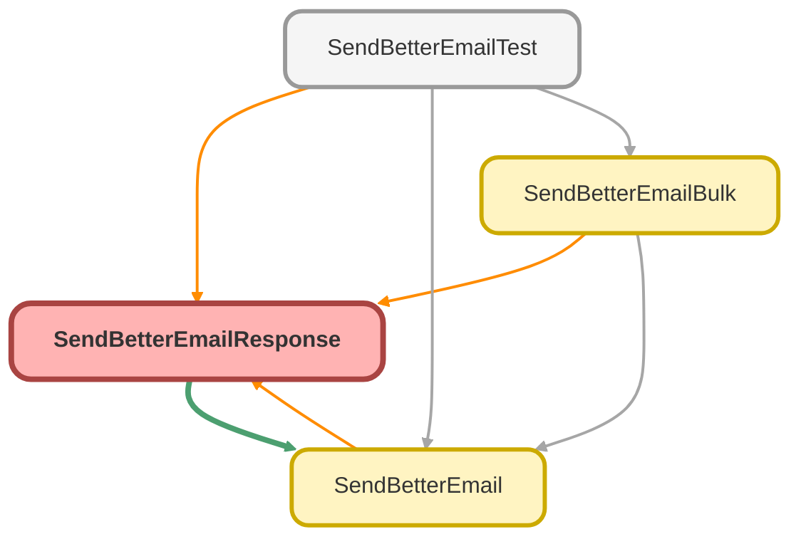

---
hide:
  - path
---

# SendBetterEmailResponse Class

## Class Diagram



<!-- Apex description -->

## Apex Code

```java
public inherited sharing class SendBetterEmailResponse {
    @invocableVariable
    @AuraEnabled
    public Boolean isSuccess;

    @invocableVariable
    @AuraEnabled
    public String templateUsed;

    @invocableVariable
    @AuraEnabled
    public List<String> taskIds;

    @invocableVariable
    @AuraEnabled
    public String errors;

    @invocableVariable
    @AuraEnabled
    public List<String> taskErrors;

    public Integer index; // variable that assigns internal Id

    public SendBetterEmailResponse() {
        taskIds = new List<String>();
        taskErrors = new List<String>();
    }
}
```

## Fields
### `isSuccess`

`INVOCABLEVARIABLE`
`AURAENABLED`

#### Signature
```apex
public isSuccess
```

#### Type
Boolean

---

### `templateUsed`

`INVOCABLEVARIABLE`
`AURAENABLED`

#### Signature
```apex
public templateUsed
```

#### Type
String

---

### `taskIds`

`INVOCABLEVARIABLE`
`AURAENABLED`

#### Signature
```apex
public taskIds
```

#### Type
List&lt;String&gt;

---

### `errors`

`INVOCABLEVARIABLE`
`AURAENABLED`

#### Signature
```apex
public errors
```

#### Type
String

---

### `taskErrors`

`INVOCABLEVARIABLE`
`AURAENABLED`

#### Signature
```apex
public taskErrors
```

#### Type
List&lt;String&gt;

---

### `index`

#### Signature
```apex
public index
```

#### Type
Integer

## Constructors
### `SendBetterEmailResponse()`

#### Signature
```apex
public SendBetterEmailResponse()
```