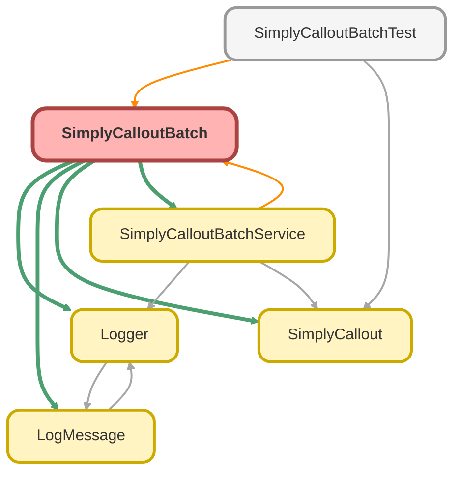

---
hide:
  - path
---

# SimplyCalloutBatch Class

**Implements**

Database.Batchable&lt;sObject&gt;, 
Database.AllowsCallouts, 
Schedulable, 
Database.Stateful

## Class Diagram



<!-- Apex description -->

## Apex Code

```java
public with sharing class SimplyCalloutBatch implements Database.Batchable<sObject>, Database.AllowsCallouts, Schedulable, Database.Stateful {

	private String originalTransactionId;

    public Database.QueryLocator start(Database.BatchableContext bc) {
		this.originalTransactionId = Logger.getTransactionId();
        SimplyCalloutBatchControl__c batchControl = SimplyCalloutBatchService.getOrCreateBatchControl();
		Logger.info('Starting SimplyCalloutBatch execution ' + this.originalTransactionId);

        if (batchControl.IsBatchRunning__c) {
			String txId = Logger.getTransactionId();
			Logger.warn('Skipping execution because batch is already running: ' + txId);
			Logger.saveLog();
			return Database.getQueryLocator('SELECT id from Proposal__c WHERE id = null');
		}
		batchControl.IsBatchRunning__c = true;
		update batchControl;

        Set<Id> proposalIdSet = new Set<Id>();
		List<ProposalsBatch__c> proposalsForUpdateList = [SELECT ProposalId__c FROM ProposalsBatch__c WHERE Callout_Failed__c = FALSE];
		for (ProposalsBatch__c proposalForUpdate : proposalsForUpdateList) {
			Id recordId = Id.valueOf(proposalForUpdate.ProposalId__c);
			proposalIdSet.add(recordId);
		}

		Logger.debug('Found ' + proposalIdSet.size() + ' proposals to process');
		Logger.saveLog();

		String query =
			'SELECT Id, Name, Client_Company_Name__c, ' +
			'Contact_Phone_Number__c,' +
			'Company_State__c,' +
			'Company_EIN__c,' +
			'Company_Zip_Code__c,' +
			'Plan_Effective_Date__c,' +
			'Number_of_Employees__c,' +
			'Advisor_NPN__c,' +
			'Advisor_CRD__c,' +
			'Firm_Name__c,' +
			'TPA_Firm_Name__c,' +
			'TPA_EIN__c,' +
			'Principal_Opportunity_Id__c,' +
			'Principal_Opportunity_Stage__c,' +
			'Principal_Opportunity_Closed_Lost_Reason__c,' +
			'Company_Zip_Postal_Code__c,' +
			'Financial_Professional_Role__c,' +
			'Insurance_Agency_NPN__c ' +
			'FROM Proposal__c ' +
			'WHERE Id IN : proposalIdSet';
		return Database.getQueryLocator(query);
	}

	public void execute(Database.BatchableContext bc, List<Proposal__c> proposalList) {
		Logger.setParentLogTransactionId(this.originalTransactionId);
		Logger.debug('Executing batch for ' + proposalList.size() + ' proposals');

		List<Messaging.SingleEmailMessage> emailsToSend = new List<Messaging.SingleEmailMessage>();
		List<Proposal__c> proposalsToUpdate = new List<Proposal__c>();

		List<String> proccesedProposals = new List<String>();
		List<String> failedProposals = new List<String>();
		Map<Id, List<String>> failedProposalsMap = new Map<Id, List<String>>();

		String authKey;
		HttpResponse authResponse = SimplyCalloutBatchService.getSimplyAuthToken();

		Map<String, Object> results = (Map<String, Object>) JSON.deserializeUntyped(authResponse.getBody());
		authKey = (String) results.get('access_token');

		if (authResponse.getStatusCode() == 200) {
			Logger.info('Authentication successful');
			for (Proposal__c proposal : proposalList) {
				String jsonS = SimplyCalloutBatchService.getSimplyPayload(proposal);
				HttpResponse response = SimplyCalloutBatchService.sendSimplyCallout(jsonS, proposal, authKey);
				if (response.getStatusCode() == 200 || response.getStatusCode() == 201) {
					Proposal__c proposalForUpdate = SimplyCalloutBatchService.updateProposal(response, proposal);
					proposalsToUpdate.add(proposalForUpdate);
				} else {
					Logger.debug('JSON SENT: ' + jsonS);
					Logger.error(new LogMessage('SendSimplyCallout failed for proposal {0}, ' +
												'\n response status code: {1}' +
												'\n Response body: {2}',
												proposal.Id, response.getStatusCode(), response.getBody()).getMessage());
					Messaging.SingleEmailMessage errEmail = SimplyCalloutBatchService.sendErrorEmail(response, proposal);
					emailsToSend.add(errEmail);
					failedProposals.add(proposal.Id);
					failedProposalsMap.put(proposal.Id, new List<String>{ response.getBody(), String.valueOf(response.getStatusCode()) });
				}
			}

			List<Database.SaveResult> srpPoposalsToUpdate = Database.update(proposalsToUpdate, false);
			for (Database.SaveResult sr : srpPoposalsToUpdate) {
				if (sr.isSuccess()) {
					proccesedProposals.add(sr.getId());
				}
			}
			SimplyCalloutBatchService.proccessProposalBatch(proccesedProposals, failedProposals, failedProposalsMap);
		} else {
			// Messaging.sendEmail(emailsToSend);
			Logger.error(new LogMessage('Authentication failed, response status code: {0}' +
			'\n Response body: {1}',
			authResponse.getStatusCode(), authResponse.getBody()).getMessage());
		}
		Logger.saveLog();
	}

	public void finish(Database.BatchableContext bc) {
        SimplyCalloutBatchControl__c batchControl = [SELECT IsBatchRunning__c FROM SimplyCalloutBatchControl__c LIMIT 1];
        batchControl.IsBatchRunning__c = false;
        update batchControl;
	}

    public static void start(Integer mins) {
		string jobName = 'Simply Batch job - ';
		if (mins == 7) 
			Database.executeBatch(new SimplyCalloutBatch(), 5);
		else {
			jobName = jobName += mins + ' - ' + DateTime.now().format();
			String sch = '0 ' + String.valueOf(mins) + ' 5-18 ? * MON-FRI *';
			System.schedule(jobName, sch, new SimplyCalloutBatch());
		}
	}
	public void execute(SchedulableContext SC) {
		Database.executeBatch(new SimplyCalloutBatch(), 5);
	}
}

// SimplyCalloutBatch.start(0);
// SimplyCalloutBatch.start(15);
// SimplyCalloutBatch.start(30);
// SimplyCalloutBatch.start(45);
```

## Fields
### `originalTransactionId`

#### Signature
```apex
private originalTransactionId
```

#### Type
String

## Methods
### `start(bc)`

#### Signature
```apex
public Database.QueryLocator start(Database.BatchableContext bc)
```

#### Parameters
| Name | Type | Description |
|------|------|-------------|
| bc | Database.BatchableContext |  |

#### Return Type
**Database.QueryLocator**

---

### `execute(bc, proposalList)`

#### Signature
```apex
public void execute(Database.BatchableContext bc, List<Proposal__c> proposalList)
```

#### Parameters
| Name | Type | Description |
|------|------|-------------|
| bc | Database.BatchableContext |  |
| proposalList | List&lt;Proposal__c&gt; |  |

#### Return Type
**void**

---

### `finish(bc)`

#### Signature
```apex
public void finish(Database.BatchableContext bc)
```

#### Parameters
| Name | Type | Description |
|------|------|-------------|
| bc | Database.BatchableContext |  |

#### Return Type
**void**

---

### `start(mins)`

#### Signature
```apex
public static void start(Integer mins)
```

#### Parameters
| Name | Type | Description |
|------|------|-------------|
| mins | Integer |  |

#### Return Type
**void**

---

### `execute(SC)`

#### Signature
```apex
public void execute(SchedulableContext SC)
```

#### Parameters
| Name | Type | Description |
|------|------|-------------|
| SC | SchedulableContext |  |

#### Return Type
**void**