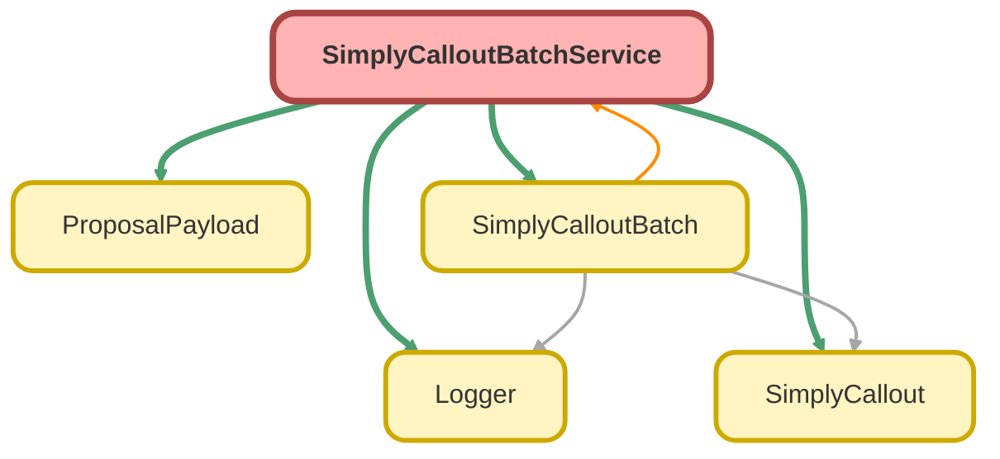

---
hide:
  - path
---

# SimplyCalloutBatchService Class

## Class Diagram



<!-- Apex description -->

## Apex Code

```java
public with sharing class SimplyCalloutBatchService {

	private static final String SANDBOX_AUTH_TYPE = 'Test_Auth';
	private static final String PRODUCTION_AUTH_TYPE = 'Production_Auth';
	private static final String POST = 'POST';
	private static final String PUT = 'PUT';

	private static Simply_URL__mdt getSimplyCredentials() {
		Boolean isSandbox = [SELECT IsSandbox FROM Organization LIMIT 1].IsSandbox;
		String authType = isSandbox ? SANDBOX_AUTH_TYPE : PRODUCTION_AUTH_TYPE;

		return [
			SELECT AUTH_URL_ADDRESS__c, Token__c, URL_ADDRESS__c 
			FROM Simply_URL__mdt
			WHERE DeveloperName = :authType
			LIMIT 1
		];
	}

    public static SimplyCalloutBatchControl__c getOrCreateBatchControl() {
        // Custom Setting
		SimplyCalloutBatchControl__c batchControl;
        try {
            batchControl = [SELECT IsBatchRunning__c FROM SimplyCalloutBatchControl__c LIMIT 1];
        } catch (QueryException e) {
            batchControl = new SimplyCalloutBatchControl__c(IsBatchRunning__c = false);
            insert batchControl;
        }
        return batchControl;
    }

	public static HttpResponse getSimplyAuthToken() {
		try {
			Simply_URL__mdt credentials = getSimplyCredentials();
			Http authHttp = new Http();
			HttpRequest authRequest = new HttpRequest();
			authRequest.setEndpoint(credentials.AUTH_URL_ADDRESS__c);
			authRequest.setMethod(POST);
			authRequest.setHeader('Authorization', 'Basic ' + credentials.Token__c);
			authRequest.setHeader('Content-Type', 'application/x-www-form-urlencoded');
			authRequest.setBody('grant_type=client_credentials&scope=api://ubiquity.service/opportunity.create');
			HttpResponse authResponse = authHttp.send(authRequest);
			return authResponse;
		} catch(Exception e) {
			Logger.error('Error getting auth token: ' + e.getMessage());
			Logger.error('Stack trace: ' + e.getStackTraceString());
			Logger.saveLog();
			throw e;
		}
	}

	public static httpResponse sendSimplyCallout(String jsonS, Proposal__c p, String authKey) {
		try {
			Simply_URL__mdt credentials = getSimplyCredentials();
			Http http = new Http();
			HttpRequest request = new HttpRequest();
			//If Proposal does not contain an Opportunity Id from Principal, insert as new Opportunity
			if (p.Principal_Opportunity_Id__c == null) {
				request.setMethod(POST);
				request.setEndpoint(credentials.URL_ADDRESS__c);
				Logger.info('Sending POST request to: ' + credentials.URL_ADDRESS__c);
			}
			//If Proposal contains an Opportunity Id from Principal, update existing Opportunity
			else {
				request.setMethod(PUT);
				request.setEndpoint(credentials.URL_ADDRESS__c + '/' + p.Principal_Opportunity_Id__c);
				Logger.info('Sending PUT request to: ' + credentials.URL_ADDRESS__c + '/' + p.Principal_Opportunity_Id__c);
			}
			request.setHeader('Authorization', 'Bearer ' + authKey);
			request.setHeader('Content-Type', 'application/json');
			request.setBody(jsonS);
			request.setTimeout(120000);

			httpResponse response = http.send(request);
			Logger.saveLog();

			return response;
		} catch(Exception e) {
			Logger.error('Error sending callout: ' + e.getMessage());
			Logger.error('Stack trace: ' + e.getStackTraceString());
			Logger.saveLog();
			throw e;
		}
	}

	public static Proposal__c updateProposal(httpResponse response, Proposal__c proposal) {
		String body = String.valueOf(response.getBody().replace('"', ''));
		if (body != null && body != '') {
			List<String> bodyRows = body.split(',');
			for (String bodyRow : bodyRows) {
				if (bodyRow.contains(':')) {
					List<String> rowContents = bodyRow.split(':');
					String label = rowContents.size() > 0 ? rowContents[0].trim() : bodyRow;
					String value = rowContents.size() > 1 ? rowContents[1].trim() : bodyRow;
					String value2 = rowContents.size() > 2 ? rowContents[2].trim() : bodyRow;

					switch on label {
						when 'salesforceId' {
							if (value.startsWith('006')) {
								proposal.Principal_Opportunity_Id__c = value;
								proposal.Queued__c = false;
							} else if (value.startsWith('001')) {
								proposal.Principal_Account_Id__c = value;
								proposal.Queued__c = false;
							}
						}
					}
				}
			}
		}
		return proposal;
	}

	public static void proccessProposalBatch(List<String> proccesedIds, List<String> failedIds, Map<Id, List<String>> failedMap) {
		List<ProposalsBatch__c> proccesedProposalIds = [SELECT Id FROM ProposalsBatch__c WHERE ProposalId__c IN :proccesedIds];
		Logger.info('Deleting ' + proccesedProposalIds.size() + ' processed proposals');
		Logger.info('Successfully processed proposals: ' +  proccesedIds);
		delete proccesedProposalIds;

		List<ProposalsBatch__c> failedProposals = [
			SELECT Id, ProposalId__c, Callout_Failed__c, Failed_Reason__c, Failed_Message__c
			FROM ProposalsBatch__c
			WHERE ProposalId__c IN :failedIds
		];

		for (ProposalsBatch__c failedProposal : failedProposals) {
			if (failedMap.containsKey(failedProposal.ProposalId__c)) {
				List<String> errorDetails = failedMap.get(failedProposal.ProposalId__c);
				failedProposal.Callout_Failed__c = true;
				failedProposal.Proposal__c = Id.valueOf(failedProposal.ProposalId__c);
				failedProposal.Failed_Message__c = errorDetails[0];
				failedProposal.Failed_Reason__c = errorDetails[1];
			}
		}

		if(!failedProposals.isEmpty()) {
		Logger.warn('Updating ' + failedProposals.size() + ' failed proposals');
		Logger.saveLog();
		}
		update failedProposals;
	}

	public static String getSimplyPayload(Proposal__c proposal) {
		ProposalPayload payload = new ProposalPayload();

		// Client Details
		payload.client = new ProposalPayload.Client();
		payload.client.name = proposal.Client_Company_Name__c;
		payload.client.localPhone = proposal.Contact_Phone_Number__c;
		payload.client.mailingState = proposal.Company_State__c;
		payload.client.mailingFullZip = proposal.Company_Zip_Postal_Code__c;
		payload.client.taxId = proposal.Company_EIN__c;

		// Opportunity Details
		payload.opportunity = new ProposalPayload.Opportunity();
		payload.opportunity.contractEffectiveDate = proposal.Plan_Effective_Date__c;
		payload.opportunity.activeLivesCount = proposal.Number_of_Employees__c;
		payload.opportunity.stage = proposal.Principal_Opportunity_Stage__c;
		payload.opportunity.closedReason = proposal.Principal_Opportunity_Closed_Lost_Reason__c;

		// Advisor Details
		if (proposal.Advisor_NPN__c != null || proposal.Advisor_CRD__c != null) {
			payload.advisor = new ProposalPayload.Advisor();
			payload.advisor.npn = proposal.Advisor_NPN__c;
			payload.advisor.firmCrd = proposal.Advisor_CRD__c;

			// Map roles to readable names
			if (proposal.Financial_Professional_Role__c != null) {
				if (proposal.Financial_Professional_Role__c == 'RR') {
					payload.advisor.role = 'Registered Rep';
				} else if (proposal.Financial_Professional_Role__c == 'IA') {
					payload.advisor.role = 'Insurance Agent';
				} else {
					payload.advisor.role = proposal.Financial_Professional_Role__c;
				}
			}

			payload.advisor.firmName = proposal.Firm_Name__c;
			payload.advisor.firmNpn = proposal.Insurance_Agency_NPN__c;
		}

		// TPA Details
		if (proposal.TPA_EIN__c != null) {
			payload.tpa = new ProposalPayload.TPA();
			payload.tpa.firmName = proposal.TPA_Firm_Name__c;
			payload.tpa.taxId = proposal.TPA_EIN__c;
		}
		return JSON.serialize(payload);
	}

	public static Messaging.SingleEmailMessage sendErrorEmail(HttpResponse response, Proposal__c proposal) {
		Messaging.SingleEmailMessage mail = new Messaging.SingleEmailMessage();
		mail.setToAddresses(new List<String> {'dlriswsrssalesandmarketingoncall@exchange.principal.com'});
		//mail.setToAddresses(new List<String>{ 'mchapa@myubiquity.com' });
		mail.setreplyto('mchapa@myubiquity.com');
		mail.setSenderDisplayName('Proposal Sync Confirmation');
		mail.setSubject('Error - UBQT to PRINCIPAL API Request Unsuccessful');
		mail.setPlainTextBody(response.getBody() + '\n' + getSimplyPayload(proposal));
		return mail;
	}
}
```

## Fields
### `SANDBOX_AUTH_TYPE`

#### Signature
```apex
private static final SANDBOX_AUTH_TYPE
```

#### Type
String

---

### `PRODUCTION_AUTH_TYPE`

#### Signature
```apex
private static final PRODUCTION_AUTH_TYPE
```

#### Type
String

---

### `POST`

#### Signature
```apex
private static final POST
```

#### Type
String

---

### `PUT`

#### Signature
```apex
private static final PUT
```

#### Type
String

## Methods
### `getSimplyCredentials()`

#### Signature
```apex
private static Simply_URL__mdt getSimplyCredentials()
```

#### Return Type
**[Simply_URL__mdt](../objects/Simply_URL__mdt.md)**

---

### `getOrCreateBatchControl()`

#### Signature
```apex
public static SimplyCalloutBatchControl__c getOrCreateBatchControl()
```

#### Return Type
**[SimplyCalloutBatchControl__c](../objects/SimplyCalloutBatchControl__c.md)**

---

### `getSimplyAuthToken()`

#### Signature
```apex
public static HttpResponse getSimplyAuthToken()
```

#### Return Type
**HttpResponse**

---

### `sendSimplyCallout(jsonS, p, authKey)`

#### Signature
```apex
public static httpResponse sendSimplyCallout(String jsonS, Proposal__c p, String authKey)
```

#### Parameters
| Name | Type | Description |
|------|------|-------------|
| jsonS | String |  |
| p | [Proposal__c](../objects/Proposal__c.md) |  |
| authKey | String |  |

#### Return Type
**httpResponse**

---

### `updateProposal(response, proposal)`

#### Signature
```apex
public static Proposal__c updateProposal(httpResponse response, Proposal__c proposal)
```

#### Parameters
| Name | Type | Description |
|------|------|-------------|
| response | httpResponse |  |
| proposal | [Proposal__c](../objects/Proposal__c.md) |  |

#### Return Type
**[Proposal__c](../objects/Proposal__c.md)**

---

### `proccessProposalBatch(proccesedIds, failedIds, failedMap)`

#### Signature
```apex
public static void proccessProposalBatch(List<String> proccesedIds, List<String> failedIds, Map<Id,List<String>> failedMap)
```

#### Parameters
| Name | Type | Description |
|------|------|-------------|
| proccesedIds | List&lt;String&gt; |  |
| failedIds | List&lt;String&gt; |  |
| failedMap | Map&lt;Id,List&lt;String&gt;&gt; |  |

#### Return Type
**void**

---

### `getSimplyPayload(proposal)`

#### Signature
```apex
public static String getSimplyPayload(Proposal__c proposal)
```

#### Parameters
| Name | Type | Description |
|------|------|-------------|
| proposal | [Proposal__c](../objects/Proposal__c.md) |  |

#### Return Type
**String**

---

### `sendErrorEmail(response, proposal)`

#### Signature
```apex
public static Messaging.SingleEmailMessage sendErrorEmail(HttpResponse response, Proposal__c proposal)
```

#### Parameters
| Name | Type | Description |
|------|------|-------------|
| response | HttpResponse |  |
| proposal | [Proposal__c](../objects/Proposal__c.md) |  |

#### Return Type
**Messaging.SingleEmailMessage**