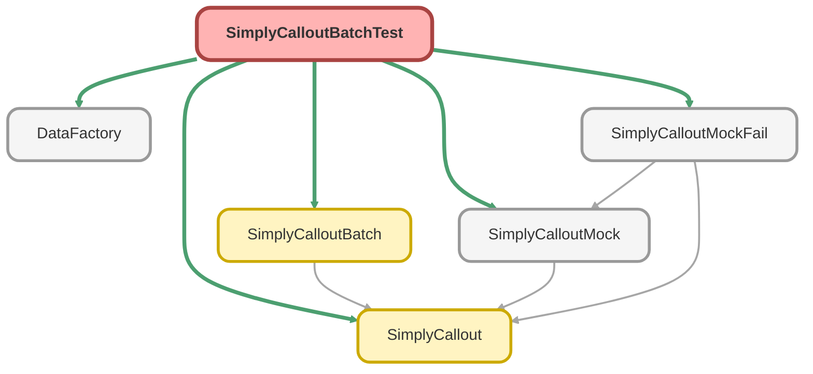

---
hide:
  - path
---

# SimplyCalloutBatchTest Class

`ISTEST`

## Class Diagram



<!-- Apex description -->

## Apex Code

```java
@isTest
public with sharing class SimplyCalloutBatchTest {
	@TestSetup
	static void makeData() {

		Simply_Version__c version;
		try{
			version = [SELECT Id, New_Version__c FROM Simply_Version__c LIMIT 1];
			version.New_Version__c = true;
			update version;
		}  catch (QueryException e) {
            version = new Simply_Version__c(New_Version__c = true);
            insert version;
		}
		Account acc = DataFactory.createAccount();
		Opportunity opp = DataFactory.createOpportunity(acc);
		List<Proposal__c> propLst = DataFactory.createProposals(20, opp);
	}


	@isTest
	public static void testProposalTriggerNew() {
		List<Proposal__c> proposalList = [
			SELECT
				Id,
				Client_Company_Name__c,
				Contact_Phone_Number__c,
				Company_State__c,
				Company_EIN__c,
				Company_Zip_Code__c,
				Plan_Effective_Date__c,
				Number_of_Employees__c,
				Advisor_NPN__c,
				Advisor_CRD__c,
				Firm_Name__c,
				TPA_Firm_Name__c,
				TPA_EIN__c,
				Principal_Opportunity_Id__c,
				Principal_Opportunity_Stage__c,
				Principal_Opportunity_Closed_Lost_Reason__c,
				Company_Zip_Postal_Code__c,
				Financial_Professional_Role__c,
				Insurance_Agency_NPN__c,
				Manual_Callout__c,
				Principal_Id__c
			FROM Proposal__c
			WHERE Advisor_CRD__c = '55555'
		];
		System.debug('proposalList: ' + proposalList);
		for (Proposal__c p : proposalList) {
			System.debug('p.Principal_Id__c: ' + p.Principal_Id__c);
			if (String.valueOf(p.Principal_Id__c).startsWith('0')) {
				p.Financial_Professional_Role__c = 'IAR';
				p.Principal_Opportunity_Stage__c = 'Committed';
				p.Manual_Callout__c = true;
			} else if (String.valueOf(p.Principal_Id__c).startsWith('1')) {
				p.External_Response__c = '{"errors":[1],"client":{"errors":[1],';
				p.Financial_Professional_Role__c = 'RR';
				p.Principal_Opportunity_Stage__c = 'Committed';
			} else if (String.valueOf(p.Principal_Id__c).startsWith('3')) {
				p.Financial_Professional_Role__c = 'RR';
				p.Principal_Opportunity_Stage__c = 'Committed';
			}
		}
		update proposalList;

		Test.setMock(HttpCalloutMock.class, new SimplyCalloutMock());
        Test.startTest();
        Database.executeBatch(new SimplyCalloutBatch());
        Test.stopTest();
	}

	@isTest
	public static void testProposalTriggerFailure() {
		Proposal__c testProp = new Proposal__c();

		testProp.Advisor_CRD__c = '12345';
		testProp.Plan_Effective_Date__c = Date.today();
		testProp.Principal_Opportunity_Stage__c = 'Presentation';
		testProp.Financial_Professional_Role__c = 'IAR';
		testProp.Client_Company_Name__c = 'Client Company 13';
		testProp.Firm_Name__c = 'Advisory Firm 00';
		testProp.Principal_Opportunity_Closed_Lost_Reason__c = 'Unknown';
		testProp.Insurance_Agency_NPN__c = 44444;
		testProp.Contact_Phone_Number__c = '(555)099-4455';
		testProp.Number_of_Employees__c = 5;
		testProp.TPA_Firm_Name__c = 'TPA Firm 01';
		testProp.Company_Zip_Postal_Code__c = 12345;
		testProp.Company_State__c = 'California';
		testProp.Advisor_NPN__c = '12345';
		testProp.TPA_EIN__c = '222222222';
		testProp.Company_EIN__c = '111111111';
		testProp.Principal_Id__c = '1234567891';
		insert testProp;

		testProp.Principal_Opportunity_Stage__c = 'Committed';
		testProp.Financial_Professional_Role__c = 'IA';
		update testProp;
		Test.setMock(HttpCalloutMock.class, new SimplyCalloutMockFail());
		Test.startTest();
        Database.executeBatch(new SimplyCalloutBatch());
        Test.stopTest();

	}

	@isTest
	public static void testSchedulerTest() {
		Proposal__c testProp = new Proposal__c();

		testProp.Advisor_CRD__c = '12345';
		testProp.Plan_Effective_Date__c = Date.today();
		testProp.Principal_Opportunity_Stage__c = 'Presentation';
		testProp.Financial_Professional_Role__c = 'IAR';
		testProp.Client_Company_Name__c = 'Client Company 13';
		testProp.Firm_Name__c = 'Advisory Firm 00';
		testProp.Principal_Opportunity_Closed_Lost_Reason__c = 'Unknown';
		testProp.Insurance_Agency_NPN__c = 44444;
		testProp.Contact_Phone_Number__c = '(555)099-4455';
		testProp.Number_of_Employees__c = 5;
		testProp.TPA_Firm_Name__c = 'TPA Firm 01';
		testProp.Company_Zip_Postal_Code__c = 12345;
		testProp.Company_State__c = 'California';
		testProp.Advisor_NPN__c = '12345';
		testProp.TPA_EIN__c = '222222222';
		testProp.Company_EIN__c = '111111111';
		testProp.Principal_Id__c = '1234567891';
		insert testProp;

		testProp.Principal_Opportunity_Stage__c = 'Committed';
		testProp.Financial_Professional_Role__c = 'IA';
		update testProp;
		Test.setMock(HttpCalloutMock.class, new SimplyCalloutMockFail());
		Test.startTest();
		SimplyCalloutBatch.start(7);
		SimplyCalloutBatch.start(0);
		Test.stopTest();
	}

}
```

## Methods
### `makeData()`

`TESTSETUP`

#### Signature
```apex
private static void makeData()
```

#### Return Type
**void**

---

### `testProposalTriggerNew()`

`ISTEST`

#### Signature
```apex
public static void testProposalTriggerNew()
```

#### Return Type
**void**

---

### `testProposalTriggerFailure()`

`ISTEST`

#### Signature
```apex
public static void testProposalTriggerFailure()
```

#### Return Type
**void**

---

### `testSchedulerTest()`

`ISTEST`

#### Signature
```apex
public static void testSchedulerTest()
```

#### Return Type
**void**