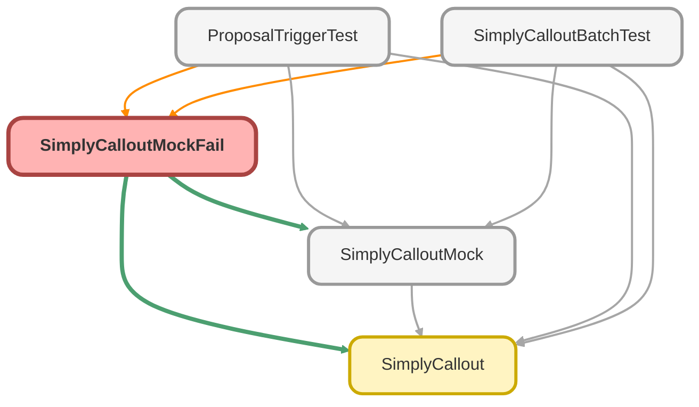

---
hide:
  - path
---

# SimplyCalloutMockFail Class

`ISTEST`

**Implements**

HttpCalloutMock

## Class Diagram



<!-- Apex description -->

## Apex Code

```java
@isTest
global class SimplyCalloutMockFail implements HttpCalloutMock {
    
	global HttpResponse respond(HttpRequest req) {     
        HttpResponse response = new HttpResponse();
        response.setBody('{"success":0,"failure":1, "salesforceId":"006", "salesforceId":"001"}');
        response.setStatusCode(500);
        return response;
    }

}
```

## Methods
### `respond(req)`

#### Signature
```apex
global HttpResponse respond(HttpRequest req)
```

#### Parameters
| Name | Type | Description |
|------|------|-------------|
| req | HttpRequest |  |

#### Return Type
**HttpResponse**