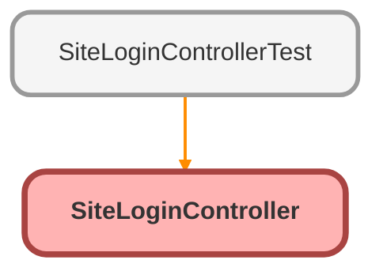

---
hide:
  - path
---

# SiteLoginController Class

An apex page controller that exposes the site login functionality

## Class Diagram



<!-- Apex description -->

## Apex Code

```java
/**
 * An apex page controller that exposes the site login functionality
 */
global with sharing class SiteLoginController {
    global String username {get; set;}
    global String password {get; set;}

    global PageReference login() {
        String startUrl = System.currentPageReference().getParameters().get('startURL');
        return Site.login(username, password, startUrl);
    }
    
   	global SiteLoginController () {}
}
```

## Properties
### `username`

#### Signature
```apex
global username
```

#### Type
String

---

### `password`

#### Signature
```apex
global password
```

#### Type
String

## Constructors
### `SiteLoginController()`

#### Signature
```apex
global SiteLoginController()
```

## Methods
### `login()`

#### Signature
```apex
global PageReference login()
```

#### Return Type
**PageReference**