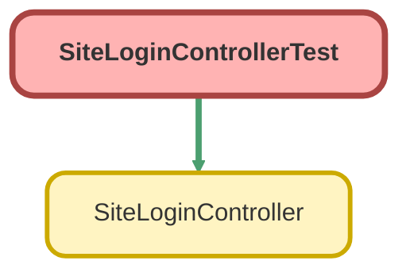

---
hide:
  - path
---

# SiteLoginControllerTest Class

`ISTEST`

An apex page controller that exposes the site login functionality

## Class Diagram



<!-- Apex description -->

## Apex Code

```java
/**
 * An apex page controller that exposes the site login functionality
 */
@IsTest global with sharing class SiteLoginControllerTest {
    @IsTest(SeeAllData=true) global static void testSiteLoginController () {
        // Instantiate a new controller with all parameters in the page
        SiteLoginController controller = new SiteLoginController ();
        controller.username = 'test@salesforce.com';
        controller.password = '123456'; 
                
        System.assertEquals(controller.login(),null);                           
    }    
}
```

## Methods
### `testSiteLoginController()`

`ISTEST`

#### Signature
```apex
global static void testSiteLoginController()
```

#### Return Type
**void**