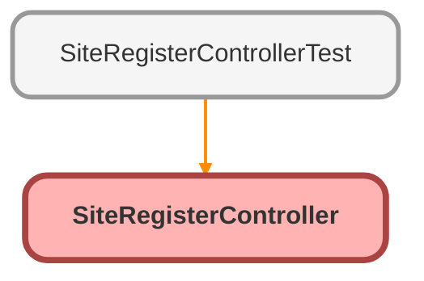

---
hide:
  - path
---

# SiteRegisterController Class

An apex class that creates a portal user

## Class Diagram



<!-- Apex description -->

## Apex Code

```java
/**
 * An apex class that creates a portal user
 */
public with sharing class SiteRegisterController {
    // PORTAL_ACCOUNT_ID is the account on which the contact will be created on and then enabled as a portal user.
    // you need to add the account owner into the role hierarchy before this will work - please see Customer Portal Setup help for more information.       
    private static Id PORTAL_ACCOUNT_ID = '001x000xxx35tPN';
    
    public SiteRegisterController () {
    }

    public String username {get; set;}
    public String email {get; set;}
    public String password {get; set {password = value == null ? value : value.trim(); } }
    public String confirmPassword {get; set { confirmPassword = value == null ? value : value.trim(); } }
    public String communityNickname {get; set { communityNickname = value == null ? value : value.trim(); } }
      
    private boolean isValidPassword() {
        return password == confirmPassword;
    }
    
    public PageReference registerUser() {
        // it's okay if password is null - we'll send the user a random password in that case
        if (!isValidPassword()) {
        	ApexPages.Message msg = new ApexPages.Message(ApexPages.Severity.ERROR, Label.site.passwords_dont_match);
        	ApexPages.addMessage(msg);
            return null;
        }    
        User u = new User();
        u.Username = username;
        u.Email = email;
        u.CommunityNickname = communityNickname;
        
        String accountId = PORTAL_ACCOUNT_ID;

        // lastName is a required field on user, but if it isn't specified, we'll default it to the username
        String userId = Site.createPortalUser(u, accountId, password);
        if (userId != null) { 
            if (password != null && password.length() > 1) {
                return Site.login(username, password, null);
            }
            else {
                PageReference page = System.Page.SiteRegisterConfirm;
                page.setRedirect(true);
                return page;
            }
        }
        return null;
    }
}
```

## Fields
### `PORTAL_ACCOUNT_ID`

#### Signature
```apex
private static PORTAL_ACCOUNT_ID
```

#### Type
Id

## Properties
### `username`

#### Signature
```apex
public username
```

#### Type
String

---

### `email`

#### Signature
```apex
public email
```

#### Type
String

---

### `password`

#### Signature
```apex
public password
```

#### Type
String

---

### `confirmPassword`

#### Signature
```apex
public confirmPassword
```

#### Type
String

---

### `communityNickname`

#### Signature
```apex
public communityNickname
```

#### Type
String

## Constructors
### `SiteRegisterController()`

#### Signature
```apex
public SiteRegisterController()
```

## Methods
### `isValidPassword()`

#### Signature
```apex
private boolean isValidPassword()
```

#### Return Type
**boolean**

---

### `registerUser()`

#### Signature
```apex
public PageReference registerUser()
```

#### Return Type
**PageReference**