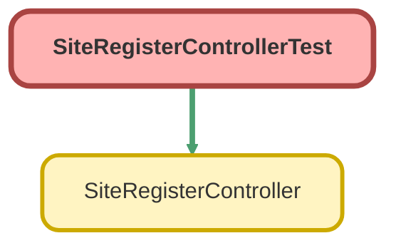

---
hide:
  - path
---

# SiteRegisterControllerTest Class

`ISTEST`

Class containing tests for SiteRegisterController

## Class Diagram



<!-- Apex description -->

## Apex Code

```java
/**
 * Class containing tests for SiteRegisterController
 */
@IsTest public with sharing class SiteRegisterControllerTest {
    @IsTest(SeeAllData=true) static void testRegistration() {
        SiteRegisterController controller = new SiteRegisterController();
        controller.username = 'test@force.com';
        controller.email = 'test@force.com';
        controller.communityNickname = 'test';
        // registerUser will always return null when the page isn't accessed as a guest user
        System.assert(controller.registerUser() == null);    
        
        controller.password = 'abcd1234';
        controller.confirmPassword = 'abcd123';
        System.assert(controller.registerUser() == null);  
    }
}
```

## Methods
### `testRegistration()`

`ISTEST`

#### Signature
```apex
private static void testRegistration()
```

#### Return Type
**void**