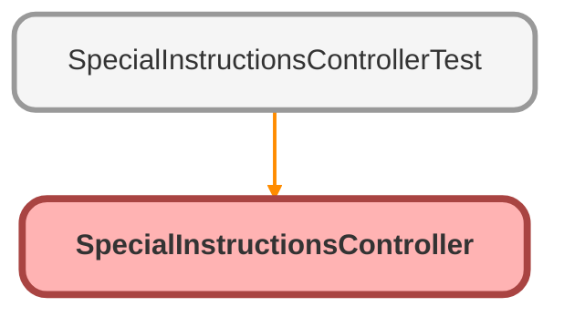

---
hide:
  - path
---

# SpecialInstructionsController Class

## Class Diagram



<!-- Apex description -->

## Apex Code

```java
public class SpecialInstructionsController {

    @AuraEnabled
    public static List<Associated_Contact__c> hasSi(String recId) {
        //Grab Plan Id from Case being viewed by user
        List<Case> cList = [SELECT Plan__c FROM Case WHERE Id = :recId LIMIT 1];
        Case c 		  	 = cList[0];
        String planId 	 = c.Plan__c;
        
        //Query for Associated Contact that includes Special Instructions. If found, return to Lightning Component
        List<Associated_Contact__c> listAC = [SELECT Id, Contact__c, Full_Name__c, Special_Instructions__c FROM Associated_Contact__c WHERE Plan__c = :planId  AND Special_Instructions__c = true LIMIT 1];
        if(listAC.size() > 0){
            return listAC;
            }
        else{
            return listAC;
        }
    }
}
```

## Methods
### `hasSi(recId)`

`AURAENABLED`

#### Signature
```apex
public static List<Associated_Contact__c> hasSi(String recId)
```

#### Parameters
| Name | Type | Description |
|------|------|-------------|
| recId | String |  |

#### Return Type
**List&lt;Associated_Contact__c&gt;**