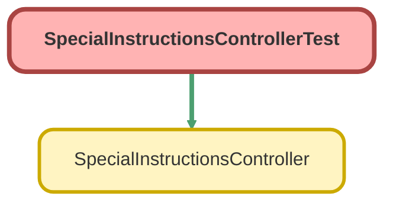

---
hide:
  - path
---

# SpecialInstructionsControllerTest Class

`ISTEST`

## Class Diagram



<!-- Apex description -->

## Apex Code

```java
@isTest
public class SpecialInstructionsControllerTest {
    
	static testMethod void testSpecialInstructions() {
        Account acct = new Account(Name='Test');
        acct.NumberOfEmployees = 5;
        insert acct;
        
        Account ejAcct = new Account(Name='Edward Jones - Home Office');
        acct.NumberOfEmployees = 100;
        insert ejAcct;

        Contact cont = new Contact(LastName='TestCont');
        cont.AccountId = acct.Id;
        insert cont;
        
        Contact cont2 = new Contact(LastName='TestCont2');
        cont2.AccountId = ejAcct.Id;
        insert cont2;
        
        Plan__c pln = new Plan__c();
        insert pln;
        
        Plan__c pln2 = new Plan__c();
        insert pln2;
        
        String acctId 	= acct.Id;
        String recId  	= cont.Id;
        String planId 	= pln.Id;
        String ejAcctId = ejAcct.Id;
        String recId2  	= cont2.Id;
        String planId2 	= pln2.Id;
        
        Associated_Contact__c assCon = new Associated_Contact__c();
        assCon.Contact__c = recId;
        assCon.Account__c = acctId;
        assCon.Plan__c    = planId;
        insert assCon;
       
        Associated_Contact__c assCon2 = new Associated_Contact__c();
        assCon2.Contact__c = recId2;
        assCon2.Account__c = ejAcctId;
        assCon2.Plan__c    = planId2;
        insert assCon2;
        
        Case cTrue = new Case();
        cTrue.Plan__c = PlanId2;
        insert cTrue;
        
        Case cFalse = new Case();
        cFalse.Plan__c = PlanId;
        insert cFalse;
               
        List<Associated_Contact__c> falseResult = SpecialInstructionsController.hasSi(cFalse.Id);
        List<Associated_Contact__c> trueResult  = SpecialInstructionsController.hasSi(cTrue.Id);         

    }
}
```

## Methods
### `testSpecialInstructions()`

#### Signature
```apex
private static testMethod void testSpecialInstructions()
```

#### Return Type
**void**