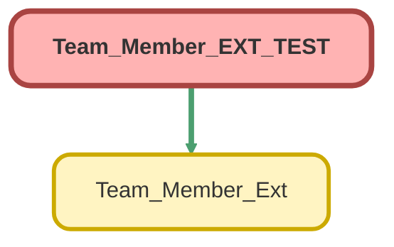

---
hide:
  - path
---

# Team_Member_EXT_TEST Class

`ISTEST`

## Class Diagram



<!-- Apex description -->

## Apex Code

```java
@isTest
private class Team_Member_EXT_TEST {

    @isTest
    static void verifyStatusUpdate() {
        // Create test case
        List<Case> cases = new List<Case>();
        cases.add(new Case(Subject = 'Test Subject'));
        
        //create standard controller
        ApexPages.StandardSetController caseController = new ApexPages.StandardSetController(cases);

        caseController.setSelected(cases);

        Team_Member_Ext ext = new Team_Member_Ext(caseController);

        ext.setField('Status');
        ext.setFieldValue('Assigned');

        System.debug('Field: ' + ext.getField());
        System.debug('Field Value: ' + ext.getFieldValue());

        Test.startTest();
        ext.updateSelections();
        Test.stopTest();

        System.debug(cases);
        System.debug(caseController.getSelected());

        System.assert(cases[0].Status == 'Assigned', 'Case status should be "Assigned"');
    }

    @isTest
    static void verifyTeamMemberUpdate() {
        // Create test case
        List<Case> cases = new List<Case>();
        cases.add(new Case(Subject = 'Test Subject'));
        
        //create standard controller
        ApexPages.StandardSetController caseController = new ApexPages.StandardSetController(cases);

        caseController.setSelected(cases);

        Team_Member_Ext ext = new Team_Member_Ext(caseController);

        ext.setField('Team_Member__c');
        ext.setFieldValue(':^)');

        System.debug('Field: ' + ext.getField());
        System.debug('Field Value: ' + ext.getFieldValue());

        Test.startTest();
        ext.updateSelections();
        Test.stopTest();

        System.debug(cases);

        System.assert(cases[0].Team_Member__c == ':^)', 'Case team member should be ":^)"');
    }
}
```

## Methods
### `verifyStatusUpdate()`

`ISTEST`

#### Signature
```apex
private static void verifyStatusUpdate()
```

#### Return Type
**void**

---

### `verifyTeamMemberUpdate()`

`ISTEST`

#### Signature
```apex
private static void verifyTeamMemberUpdate()
```

#### Return Type
**void**