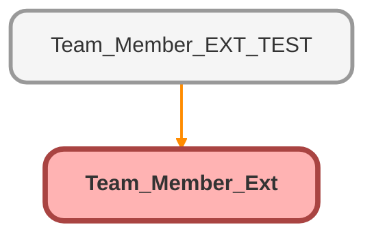

---
hide:
  - path
---

# Team_Member_Ext Class

## Class Diagram



<!-- Apex description -->

## Apex Code

```java
public with sharing class Team_Member_Ext {

    public List<Case> caseRecords{get;set;}
    String field;
    String fieldValue;

    public String getField() {
        return field;
    }

    public void setField(String n) {
        field = n;
    }

    public String getFieldValue() {
        return fieldValue;
    }

    public void setFieldValue(String n) {
        fieldValue = n;
    }

    public Team_Member_Ext(ApexPages.StandardSetController controller) {
        caseRecords = (List<Case>)controller.getSelected();
    }

    public PageReference updateSelections() {
        if (field == 'Team_Member__c') {
            for (Case c : caseRecords) {
                c.Team_Member__c = fieldValue;
                System.debug('Updated team member to ' + fieldValue + ' for ' + c.Id);
            }
        } else if (field == 'Status') {
            for (Case c : caseRecords) {
                c.Status = fieldValue;
                System.debug('Updated status to ' + fieldValue + ' for ' + c.Id);
            }
        }
        return null;
    }
}
```

## Fields
### `field`

#### Signature
```apex
private field
```

#### Type
String

---

### `fieldValue`

#### Signature
```apex
private fieldValue
```

#### Type
String

## Properties
### `caseRecords`

#### Signature
```apex
public caseRecords
```

#### Type
List&lt;Case&gt;

## Constructors
### `Team_Member_Ext(controller)`

#### Signature
```apex
public Team_Member_Ext(ApexPages.StandardSetController controller)
```

#### Parameters
| Name | Type | Description |
|------|------|-------------|
| controller | ApexPages.StandardSetController |  |

## Methods
### `getField()`

#### Signature
```apex
public String getField()
```

#### Return Type
**String**

---

### `setField(n)`

#### Signature
```apex
public void setField(String n)
```

#### Parameters
| Name | Type | Description |
|------|------|-------------|
| n | String |  |

#### Return Type
**void**

---

### `getFieldValue()`

#### Signature
```apex
public String getFieldValue()
```

#### Return Type
**String**

---

### `setFieldValue(n)`

#### Signature
```apex
public void setFieldValue(String n)
```

#### Parameters
| Name | Type | Description |
|------|------|-------------|
| n | String |  |

#### Return Type
**void**

---

### `updateSelections()`

#### Signature
```apex
public PageReference updateSelections()
```

#### Return Type
**PageReference**