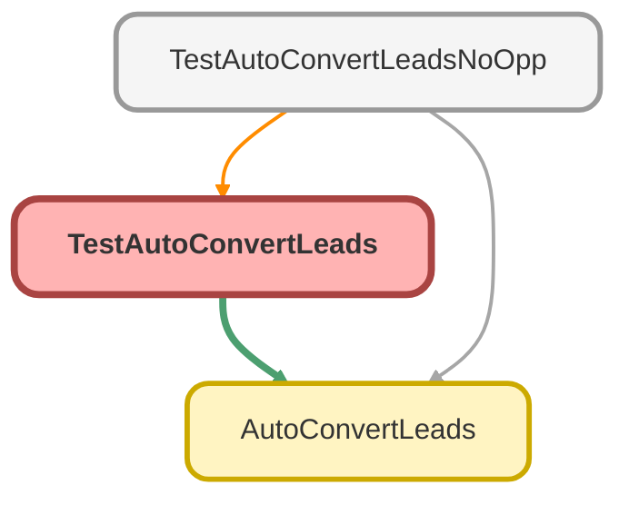

---
hide:
  - path
---

# TestAutoConvertLeads Class

`ISTEST`

## Class Diagram



<!-- Apex description -->

## Apex Code

```java
@isTest 
      public class TestAutoConvertLeads{
      static testMethod void createnewlead() {
      User userToCreate = [Select id from user where profile.name='System Administrator' Limit 1];
      
      Test.startTest();    
      Lead leadToCreate =new Lead();
      List<id> Ids= New List<Id>();
      leadToCreate.ownerid= userToCreate.id;
      leadToCreate.LastName ='Gupta';
      leadToCreate.Company='Salesforce';
      leadToCreate.Rating='';
      leadToCreate.Status='Open';
      leadToCreate.Method_of_First_Contact__c='Phone';
      leadToCreate.LeadSource='Organic Search';
      leadToCreate.LeadSourceDetail__c='Website';
      leadToCreate.NumberOfEmployees= 5;
      leadToCreate.Business_Industry__c= 'Accounting';
      leadToCreate.Lead_Origin__c= 'Ubiquity Generated';
      leadToCreate.Product_Type__c= 'Upgrade';
      leadToCreate.Plan_Type__c= 'New Plan';
      leadToCreate.Lead_Origin__c= 'Ubiquity Generated';
      leadToCreate.PostalCode= '92562';
	  leadToCreate.Business_Unit__c= 'Ubiquity';
      leadToCreate.Participant_Fee_Payment__c= 'Employee';
      insert leadToCreate; 
      
      Ids.add(leadToCreate.id);
      AutoConvertLeads.LeadAssign(Ids);
      
      Test.stopTest();
   }
}
```

## Methods
### `createnewlead()`

#### Signature
```apex
private static testMethod void createnewlead()
```

#### Return Type
**void**