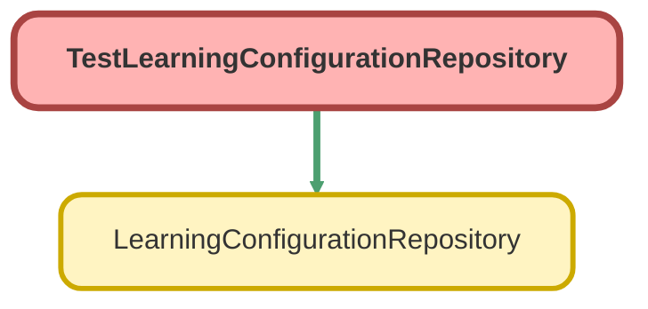

---
hide:
  - path
---

# TestLearningConfigurationRepository Class

`ISTEST`

## Class Diagram



<!-- Apex description -->

## Apex Code

```java
@isTest
public class TestLearningConfigurationRepository {
    @isTest
    static void testGetLearningConfiguration() {
        String competitorFieldName = 'Competitor';
        String tenantUrl = 'team.360mooc.com';
        LearningConfigurationRepository.upsertLearningConfiguration(competitorFieldName, tenantUrl);

        X360Learning_configuration__c learningConfiguration = LearningConfigurationRepository.getLearningConfiguration();

        System.assertEquals(competitorFieldName, learningConfiguration.Competitor_Field_Name__c);
        System.assertEquals(tenantUrl, learningConfiguration.Tenant_Url__c);
    }
}
```

## Methods
### `testGetLearningConfiguration()`

`ISTEST`

#### Signature
```apex
private static void testGetLearningConfiguration()
```

#### Return Type
**void**