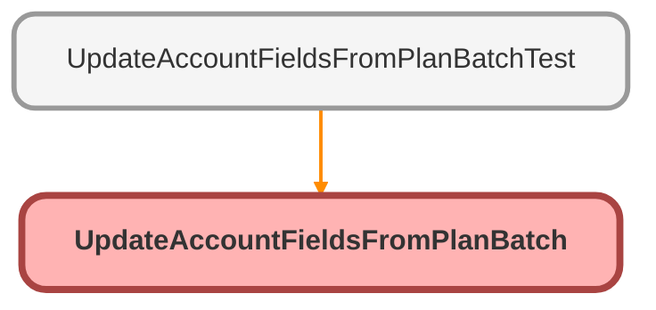

---
hide:
  - path
---

# UpdateAccountFieldsFromPlanBatch Class

**Implements**

Database.Batchable&lt;sObject&gt;

## Class Diagram



<!-- Apex description -->

## Apex Code

```java
public class UpdateAccountFieldsFromPlanBatch implements Database.Batchable<sObject> {

    public Database.QueryLocator start(Database.BatchableContext context) {
        return Database.getQueryLocator([
            SELECT Id, 
                    Custodian__c, 
                    Fund_List__c, 
                    Service_Option__c, 
                    Safe_Harbor_Formula__c, 
                    Plan_Status__c,
                        (SELECT Id,
                                Status__c,
                                Custodian__c,
                                Fund_List__c,
                                Service_Option__c,
                                Safe_Harbor__c,
                                CreatedDate
                         FROM Plans__r
                         ORDER BY CreatedDate DESC)
            FROM Account
        ]);
    }

    public void execute(Database.BatchableContext context, List<Account> scope) {
        for (Account acc : scope) {
            if (!acc.Plans__r.isEmpty()) {
                // Check if there is an active plan associated with the account
                Boolean hasActivePlan = false;
                Plan__c latestActivePlan;
                List<Plan__c> activePlans = new List<Plan__c>();
                for (Plan__c plan : acc.Plans__r) {
                    if (plan.Status__c == 'Active') {
                        hasActivePlan = true;
                        activePlans.add(plan);
                    }
                }
                // If there are multiple active plans, use the latest one
                if (activePlans.size() > 0) {
                    latestActivePlan = activePlans[0];
                    for (Plan__c plan : activePlans) {
                        if (plan.CreatedDate > latestActivePlan.CreatedDate) {
                            latestActivePlan = plan;
                        }
                    }
                    acc.Custodian__c = latestActivePlan.Custodian__c;
                    acc.Fund_List__c = latestActivePlan.Fund_List__c;
                    acc.Service_Option__c = latestActivePlan.Service_Option__c;
                    acc.Safe_Harbor_Formula__c = latestActivePlan.Safe_Harbor__c;
                    acc.Plan_Status__c = latestActivePlan.Status__c;
                } else {
                    // If there is no active plan, update the account fields with the latest created plan's values
                    Plan__c latestPlan = acc.Plans__r[0];
                    for (Plan__c plan : acc.Plans__r) {
                        if (plan.CreatedDate > latestPlan.CreatedDate) {
                            latestPlan = plan;
                        }
                    }
                    acc.Custodian__c = latestPlan.Custodian__c;
                    acc.Fund_List__c = latestPlan.Fund_List__c;
                    acc.Service_Option__c = latestPlan.Service_Option__c;
                    acc.Safe_Harbor_Formula__c = latestPlan.Safe_Harbor__c;
                    acc.Plan_Status__c = latestPlan.Status__c;
                }
            }
        }
        try {
            update scope;
        } catch(Exception e) {
            System.debug('UpdateAccountFieldsFromPlanBatch UPDATE EXEPTION \n' + e.getMessage());
        }
    }

    public void finish(Database.BatchableContext context) {}

}


// List<Account> acLst = new List<Account>();

// for(Integer i = 0; i < 10; i++) {
//     Account acc = new Account();
//     acc.Name = 'Test Account ' + i;
//     acLst.add(acc);
// }
// insert acLst;

// List<Account> accLst = [SELECT Id FROM Account WHERE Name LIKE 'Test Account%' LIMIT 10];


// List<Plan__c> planLst = new List<Plan__c>();

// for(Integer i = 0; i < 10; i++) {
//     Plan__c plan = new Plan__c();
//     plan.Account__c = accLst[i].Id;
//     plan.Name = 'Lates Plan Active ' + i;
//     plan.Custodian__c = 'Schwab Trust';
//     plan.Fund_List__c = 'Prudent';
//     plan.Service_Option__c = 'Partner';

//     plan.Status__c = 'Active';
//     plan.Account__c = accLst[i].Id;
//     planLst.add(plan);
// 	Plan__c plan1 = new Plan__c();
//     plan1.Account__c = accLst[i].Id;
//     plan1.Name = 'Test Plan Inactive ' + i;
//     plan1.Custodian__c = 'Schwab Trust';
//     plan1.Fund_List__c = 'Prudent';
//     plan1.Service_Option__c = 'Partner';
    
//     plan1.Status__c = 'Inactive';
//     plan1.Account__c = accLst[i].Id;
//     planLst.add(plan1);
// }
// insert planLst;

// Account__c = lst[0].Id, Name = 'Trigger Plan Test ', Custodian__c = 'Schwab Trust', Fund_List__c = 'Prudent', Service_Option__c = 'Partner';
```

## Methods
### `start(context)`

#### Signature
```apex
public Database.QueryLocator start(Database.BatchableContext context)
```

#### Parameters
| Name | Type | Description |
|------|------|-------------|
| context | Database.BatchableContext |  |

#### Return Type
**Database.QueryLocator**

---

### `execute(context, scope)`

#### Signature
```apex
public void execute(Database.BatchableContext context, List<Account> scope)
```

#### Parameters
| Name | Type | Description |
|------|------|-------------|
| context | Database.BatchableContext |  |
| scope | List&lt;Account&gt; |  |

#### Return Type
**void**

---

### `finish(context)`

#### Signature
```apex
public void finish(Database.BatchableContext context)
```

#### Parameters
| Name | Type | Description |
|------|------|-------------|
| context | Database.BatchableContext |  |

#### Return Type
**void**