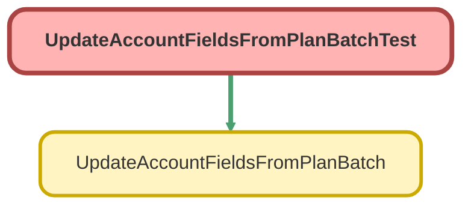

---
hide:
  - path
---

# UpdateAccountFieldsFromPlanBatchTest Class

`ISTEST`

## Class Diagram



<!-- Apex description -->

## Apex Code

```java
@isTest
public with sharing class UpdateAccountFieldsFromPlanBatchTest {
    @TestSetup
    static void makeData(){
        List<Account> accounts = new List<Account>();
        for(Integer i = 0; i < 20; i++){
            Account a = new Account(Name = 'Test Account Name ' + i);
            accounts.add(a);
        }
        insert accounts;

        List<Plan__c> plans = new List<Plan__c>();
        for(Integer i = 0; i < 20; i++){
            Plan__c p = new Plan__c(Name = 'Test Plan Name ' + i, Account__c = accounts[i].Id);
            if(i < 10){
                p.Status__c = 'Inactive';
                p.Custodian__c = 'Other';
                p.Fund_List__c = 'ESG';
                p.Service_Option__c = 'Builder';
            } else{
                p.Status__c = 'Active';
                p.Custodian__c = 'Schwab Trust';
                p.Fund_List__c = 'Prudent';
                p.Service_Option__c = 'Partner';
            }

            plans.add(p);
        }
        insert plans;
    }
    
    @isTest
    public static void testUpdateAccountFieldsFromPlanBatch(){
        Test.startTest();
        UpdateAccountFieldsFromPlanBatch batch = new UpdateAccountFieldsFromPlanBatch();
        Database.executeBatch(batch);
        Test.stopTest();
        List<Account> accounts = [SELECT Id, Name, Plan_Status__c, Custodian__c, Fund_List__c, Service_Option__c FROM Account];
        System.assertEquals(20, accounts.size(), 'There should be 20 accounts');
    }
}
```

## Methods
### `makeData()`

`TESTSETUP`

#### Signature
```apex
private static void makeData()
```

#### Return Type
**void**

---

### `testUpdateAccountFieldsFromPlanBatch()`

`ISTEST`

#### Signature
```apex
public static void testUpdateAccountFieldsFromPlanBatch()
```

#### Return Type
**void**