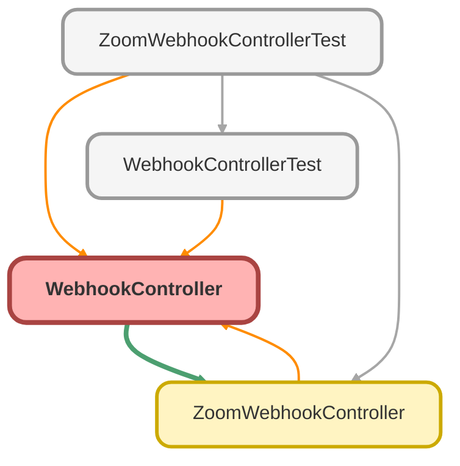

---
hide:
  - path
---

# WebhookController Class

`RESTRESOURCE`

## Class Diagram



<!-- Apex description -->

## Apex Code

```java
@RestResource(urlMapping='/zoomwebhooks/*')
global with sharing class WebhookController {
    @HttpPost
    global static void handleWebhook() {
        RestRequest req = RestContext.request;
        RestResponse res = RestContext.response;
        String requestBody = req.requestBody.toString();
        WebhookController.processZoomWebhook(req, res, requestBody);
    }

    private static void processZoomWebhook(RestRequest req, RestResponse res, String requestBody) {
        Zoom_Webhook_Secret_Token__mdt token = [SELECT Secret_Token__c FROM Zoom_Webhook_Secret_Token__mdt];
        String zoomSecretToken = token.Secret_Token__c;
        String message = generateMessage(req, requestBody);
        String signature = generateSignature(message, zoomSecretToken);
        ReqBody reqBody = (ReqBody) JSON.deserialize(requestBody, ReqBody.class);
        String event = reqBody.event;
        String plainToken = reqBody.payload.plainToken;

        if (req.headers.get('x-zm-signature') == signature) {
            if (event == 'endpoint.url_validation') {
                Map<String, Object> response = validateUrl(plainToken, zoomSecretToken);
                res.statusCode = (Integer) response.get('status');
                res.responseBody = Blob.valueOf(JSON.serialize(response.get('message')));
            } else {
                Map<String, Object> response = new Map<String, Object>{
                    'message' => 'Authorized request to Webhook.',
                    'status' => 200
                };
                res.statusCode = (Integer) response.get('status');
                res.responseBody = Blob.valueOf(JSON.serialize(response.get('message')));
                Map<String, Object> respMap = (Map<String, Object>) JSON.deserializeUntyped(requestBody);
                ZoomWebhookController.checkZoomEvent(respMap);
            }
        } else {
            Map<String, Object> response = new Map<String, Object>{
                'message' => 'Unauthorized request to Webhook.',
                'status' => 401
            };
            res.statusCode = (Integer) response.get('status');
            res.responseBody = Blob.valueOf(JSON.serialize(response.get('message')));
        }
    }

    private static String generateMessage(RestRequest req, String requestBody) {
        return 'v0:' + req.headers.get('x-zm-request-timestamp') + ':' + requestBody;
    }

    private static String generateSignature(String message, String zoomSecretToken) {
        Blob mac = Crypto.generateMac('HmacSHA256', Blob.valueOf(message), Blob.valueOf(zoomSecretToken));
        return 'v0=' + EncodingUtil.convertToHex(mac);
    }

    private static Map<String, Object> validateUrl(String plainToken, String zoomSecretToken) {
        Blob mac = Crypto.generateMac('HmacSHA256', Blob.valueOf(plainToken), Blob.valueOf(zoomSecretToken));
        String hashForValidate = EncodingUtil.convertToHex(mac);
        return new Map<String, Object>{
            'message' => new Map<String, String>{
                'plainToken' => plainToken,
                'encryptedToken' => hashForValidate
            },
            'status' => 200
        };
    }

    public class ReqBody {
        public String event;
        public Payload payload;
    }

    public class Payload {
        public String plainToken;
    }
}


//=======================================================
   // private static void generateSignature(RestRequest req, RestResponse res, String requestBody) {
    //     Zoom_Webhook_Secret_Token__mdt token = [SELECT Secret_Token__c FROM Zoom_Webhook_Secret_Token__mdt];
    //     String zoomSecretToken = token.Secret_Token__c;
    //     Map<String, Object> response;
    //     String message = 'v0:' + req.headers.get('x-zm-request-timestamp') + ':' + requestBody;
    //     Blob mac = Crypto.generateMac('HmacSHA256', Blob.valueOf(message), Blob.valueOf(zoomSecretToken));
    //     String hashForVerify = EncodingUtil.convertToHex(mac);
    //     String signature = 'v0=' + hashForVerify;
    //     ReqBody reqBody = (ReqBody) JSON.deserialize(requestBody, ReqBody.class);
    //     String event = (String) reqBody.event;
    //     String plainToken = (String) reqBody.payload.plainToken;
    //     if (req.headers.get('x-zm-signature') == signature) {
    //         if (event == 'endpoint.url_validation') {
    //             Blob mac1 = Crypto.generateMac('HmacSHA256', Blob.valueOf(plainToken), Blob.valueOf(zoomSecretToken));
    //             String hashForValidate = EncodingUtil.convertToHex(mac1);
    //             response = new Map<String, Object>{ 'message' => new Map<String, String>{ 'plainToken' => plainToken, 'encryptedToken' => hashForValidate }, 'status' => 200 };
    //             res.statusCode = (Integer) response.get('status');
    //             res.responseBody = Blob.valueOf(JSON.serialize(response.get('message')));
    //         } else {
    //             response = new Map<String, Object>{ 'message' => 'Authorized request to Webhook.', 'status' => 200 };
    //             res.statusCode = (Integer) response.get('status');
    //             res.responseBody = Blob.valueOf(JSON.serialize(response.get('response')));
    //             Map<String, Object> respMap = (Map<String, Object>) JSON.deserializeUntyped(requestBody);
    //             ZoomWebhookController.checkZoomEvent(respMap);
    //         }
    //     } else {
    //         response = new Map<String, Object>{ 'message' => 'Unauthorized request to Webhook.', 'status' => 401 };
    //         res.statusCode = (Integer) response.get('status');
    //         res.responseBody = Blob.valueOf(JSON.serialize(response.get('response')));
    //     }
    // }


    // public class ReqBody {
    //     public String event;
    //     public Payload payload;
    // }
    // public class Payload {
    //     public String plainToken;
    // }
```

## Methods
### `handleWebhook()`

`HTTPPOST`

#### Signature
```apex
global static void handleWebhook()
```

#### Return Type
**void**

---

### `processZoomWebhook(req, res, requestBody)`

#### Signature
```apex
private static void processZoomWebhook(RestRequest req, RestResponse res, String requestBody)
```

#### Parameters
| Name | Type | Description |
|------|------|-------------|
| req | RestRequest |  |
| res | RestResponse |  |
| requestBody | String |  |

#### Return Type
**void**

---

### `generateMessage(req, requestBody)`

#### Signature
```apex
private static String generateMessage(RestRequest req, String requestBody)
```

#### Parameters
| Name | Type | Description |
|------|------|-------------|
| req | RestRequest |  |
| requestBody | String |  |

#### Return Type
**String**

---

### `generateSignature(message, zoomSecretToken)`

#### Signature
```apex
private static String generateSignature(String message, String zoomSecretToken)
```

#### Parameters
| Name | Type | Description |
|------|------|-------------|
| message | String |  |
| zoomSecretToken | String |  |

#### Return Type
**String**

---

### `validateUrl(plainToken, zoomSecretToken)`

#### Signature
```apex
private static Map<String,Object> validateUrl(String plainToken, String zoomSecretToken)
```

#### Parameters
| Name | Type | Description |
|------|------|-------------|
| plainToken | String |  |
| zoomSecretToken | String |  |

#### Return Type
**Map&lt;String,Object&gt;**

## Classes
### ReqBody Class

#### Fields
##### `event`

###### Signature
```apex
public event
```

###### Type
String

---

##### `payload`

###### Signature
```apex
public payload
```

###### Type
Payload

### Payload Class

#### Fields
##### `plainToken`

###### Signature
```apex
public plainToken
```

###### Type
String