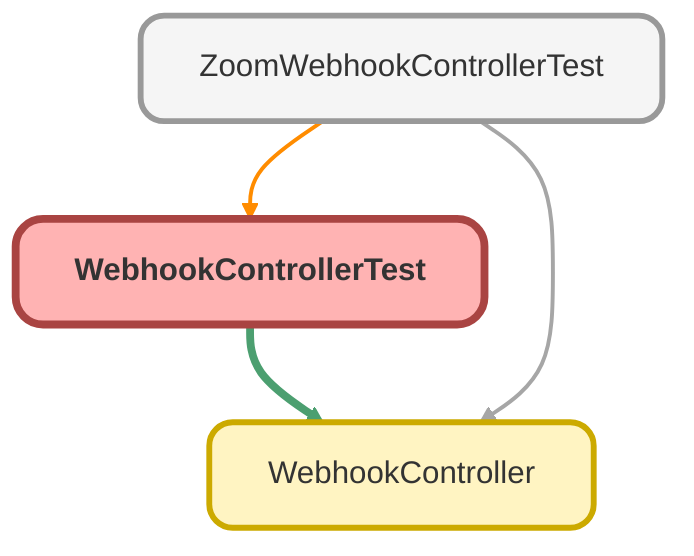

---
hide:
  - path
---

# WebhookControllerTest Class

`ISTEST`

## Class Diagram



<!-- Apex description -->

## Apex Code

```java
@isTest
private class WebhookControllerTest {
    @isTest
    private static void testHandleWebhookAthorization() {
        Zoom_Webhook_Secret_Token__mdt mdt = [SELECT Secret_Token__c FROM Zoom_Webhook_Secret_Token__mdt];
        String token = mdt.Secret_Token__c;
        RestResponse res = new RestResponse();
        RestRequest req = new RestRequest();
        req.headers.put('x-zm-request-timestamp', '219ec20c9a8cae428904199cfa21dd2524bd7cfdab5264605fc7d7d3e8a1ff38');
        req.addHeader('Content-Type', 'application/json');

        String requestBody = '{"payload":{"plainToken": "qgg8vlvZRS6UYooatFL8Aw"},"event_ts": 1654503849680,"event": "endpoint.url_validation"}';
        String message = 'v0:' + req.headers.get('x-zm-request-timestamp') + ':' + requestBody;
        Blob mac = Crypto.generateMac('HmacSHA256', Blob.valueOf(message), Blob.valueOf(token));
        String hashForVerify = EncodingUtil.convertToHex(mac);
        String signature = 'v0=' + hashForVerify;

        req.headers.put('x-zm-signature', signature);
        req.httpMethod = 'POST';
        req.requestURI = '/zoomwebhooks';
        req.requestBody = Blob.valueOf(requestBody);
        RestContext.request = req;
        RestContext.response = res;

        Test.startTest();
        WebhookController.handleWebhook();
        Test.stopTest();
    }

    @isTest
    private static void testHandleWebhookValidation() {
        Zoom_Webhook_Secret_Token__mdt mdt = [SELECT Secret_Token__c FROM Zoom_Webhook_Secret_Token__mdt];
        String token = mdt.Secret_Token__c;
        RestResponse res = new RestResponse();
        RestRequest req = new RestRequest();
        req.headers.put('x-zm-request-timestamp', 'e1d9577104ffd82d7a44abb0bdea4ed6041815f305449d6c77f7f1c13c9d423b');
        req.addHeader('Content-Type', 'application/json');

        String requestBody = '{"event":"user.presence_status_updated","payload":{"account_id":"kJdQOXj6TXeWcSfh_ysPVQ","object":{"date_time":"2023-01-24T14:47:36Z","email":"lstrollo@myubiquity.com","id":"p3x1bwrmsh6tnl_bxyrlca","presence_status":"On_Phone_Call"}},"event_ts":1674571656505}';
        String message = 'v0:' + req.headers.get('x-zm-request-timestamp') + ':' + requestBody;
        Blob mac = Crypto.generateMac('HmacSHA256', Blob.valueOf(message), Blob.valueOf(token));
        String hashForVerify = EncodingUtil.convertToHex(mac);
        String signature = 'v0=' + hashForVerify;

        req.headers.put('x-zm-signature', signature);
        req.httpMethod = 'POST';
        req.requestURI = '/zoomwebhooks';
        req.requestBody = Blob.valueOf(requestBody);
        RestContext.request = req;
        RestContext.response = res;

        Test.startTest();
        WebhookController.handleWebhook();
        Test.stopTest();
    }

    @isTest
    private static void testHandleWebhookUnauthorized() {
        RestResponse res = new RestResponse();
        RestRequest req = new RestRequest();
        String requestBody = '{"event":"user.presence_status_updated","payload":{"account_id":"kJdQOXj6TXeWcSfh_ysPVQ","object":{"date_time":"2023-01-24T14:47:36Z","email":"lstrollo@myubiquity.com","id":"p3x1bwrmsh6tnl_bxyrlca","presence_status":"On_Phone_Call"}},"event_ts":1674571656505}';
        String signature = 'v0=e1d9577104ffd82d7a44abb0bdea4ed6041815f305449d6c77f7f1c13c9d423b';
        req.headers.put('x-zm-signature', signature);
        req.headers.put('x-zm-request-timestamp', 'e1d9577104ffd82d7a44abb0bdea4ed6041815f305449d6c77f7f1c13c9d423b');
        req.addHeader('Content-Type', 'application/json');
        req.httpMethod = 'POST';
        req.requestBody = Blob.valueOf(requestBody);
        RestContext.request = req;
        RestContext.response = res;

        Test.startTest();
        WebhookController.handleWebhook();
        Test.stopTest();
    }
}
```

## Methods
### `testHandleWebhookAthorization()`

`ISTEST`

#### Signature
```apex
private static void testHandleWebhookAthorization()
```

#### Return Type
**void**

---

### `testHandleWebhookValidation()`

`ISTEST`

#### Signature
```apex
private static void testHandleWebhookValidation()
```

#### Return Type
**void**

---

### `testHandleWebhookUnauthorized()`

`ISTEST`

#### Signature
```apex
private static void testHandleWebhookUnauthorized()
```

#### Return Type
**void**