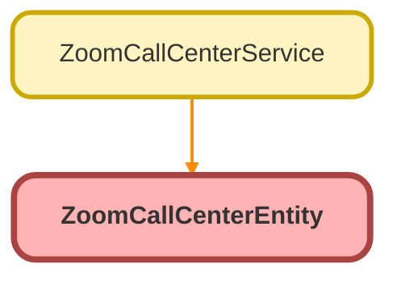

---
hide:
  - path
---

# ZoomCallCenterEntity Class

## Class Diagram



<!-- Apex description -->

## Apex Code

```java
public with sharing class ZoomCallCenterEntity {
    public static CallsDataWrapper parse(String json){
        return (CallsDataWrapper) System.JSON.deserialize(json, CallsDataWrapper.class);
    }
	// NOTE: add commented variables if needed
    public class CallsDataWrapper {
		public String next_page_token { get; set; }
		public Integer page_size { get; set; }
		public Integer total_records { get; set; }
		// public DateTime frm { get; set; }
		// public DateTime to { get; set; }
		public List<VoiceCall> voice_calls { get; set; }
	}
	public class VoiceCall {
		public String engagement_id { get; set; }
		public String direction { get; set; }

		public String caller_number { get; set; }
		public String callee_number { get; set; }
		public DateTime start_time { get; set; }
		public Integer total_duration { get; set; }
		public String consumer_display_name { get; set; }
		public String country_name { get; set; }
		public Boolean recorded { get; set; }
		public String result { get; set; }
		// public String caller_number_type { get; set; }
		// public String callee_number_type { get; set; }
		// public DateTime end_time { get; set; }
		// public String consumer_number { get; set; }
		// public Boolean monitored { get; set; }
		// public Boolean inbox { get; set; }
		// public List<String> call_legs { get; set; }
		// public List<String> distributions { get; set; }
		// public List<String> types { get; set; }
		// public String caller_id { get; set; }
		// public String calling_party { get; set; }
		// public String charge { get; set; }
		// public List<String> rates { get; set; }
		// public String charge_type { get; set; }
		public List<QueueInfo> queues { get; set; }
		public List<AgentInfo> agents { get; set; }
		// public List<FlowInfo> flows { get; set; }
	}

	public class QueueInfo {
		public String queue_id { get; set; }
		public String queue_name { get; set; }
	}

	public class AgentInfo {
		public String user_id { get; set; }
		public String display_name { get; set; }
	}

	// public class FlowInfo {
	// 	public String flow_id { get; set; }
	// 	public String flow_name { get; set; }
	// }
}
```

## Methods
### `parse(json)`

#### Signature
```apex
public static CallsDataWrapper parse(String json)
```

#### Parameters
| Name | Type | Description |
|------|------|-------------|
| json | String |  |

#### Return Type
**CallsDataWrapper**

## Classes
### CallsDataWrapper Class

#### Properties
##### `next_page_token`

###### Signature
```apex
public next_page_token
```

###### Type
String

---

##### `page_size`

###### Signature
```apex
public page_size
```

###### Type
Integer

---

##### `total_records`

###### Signature
```apex
public total_records
```

###### Type
Integer

---

##### `voice_calls`

###### Signature
```apex
public voice_calls
```

###### Type
List&lt;VoiceCall&gt;

### VoiceCall Class

#### Properties
##### `engagement_id`

###### Signature
```apex
public engagement_id
```

###### Type
String

---

##### `direction`

###### Signature
```apex
public direction
```

###### Type
String

---

##### `caller_number`

###### Signature
```apex
public caller_number
```

###### Type
String

---

##### `callee_number`

###### Signature
```apex
public callee_number
```

###### Type
String

---

##### `start_time`

###### Signature
```apex
public start_time
```

###### Type
DateTime

---

##### `total_duration`

###### Signature
```apex
public total_duration
```

###### Type
Integer

---

##### `consumer_display_name`

###### Signature
```apex
public consumer_display_name
```

###### Type
String

---

##### `country_name`

###### Signature
```apex
public country_name
```

###### Type
String

---

##### `recorded`

###### Signature
```apex
public recorded
```

###### Type
Boolean

---

##### `result`

###### Signature
```apex
public result
```

###### Type
String

---

##### `queues`

###### Signature
```apex
public queues
```

###### Type
List&lt;QueueInfo&gt;

---

##### `agents`

###### Signature
```apex
public agents
```

###### Type
List&lt;AgentInfo&gt;

### QueueInfo Class

#### Properties
##### `queue_id`

###### Signature
```apex
public queue_id
```

###### Type
String

---

##### `queue_name`

###### Signature
```apex
public queue_name
```

###### Type
String

### AgentInfo Class

#### Properties
##### `user_id`

###### Signature
```apex
public user_id
```

###### Type
String

---

##### `display_name`

###### Signature
```apex
public display_name
```

###### Type
String