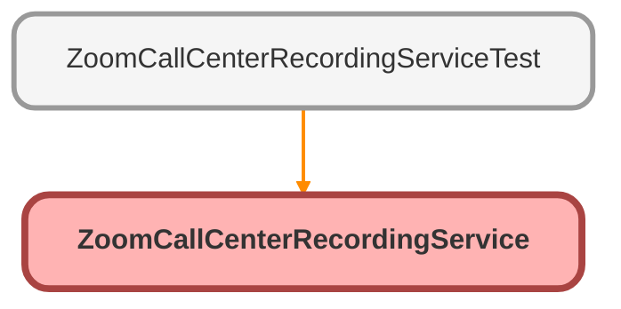

---
hide:
  - path
---

# ZoomCallCenterRecordingService Class

## Class Diagram



<!-- Apex description -->

## Apex Code

```java
public with sharing class ZoomCallCenterRecordingService {
	@AuraEnabled(cacheable=true)
	public static String getEngagementRecording(String callId, String recordId) {
		RecordingDataWrapper result;
		if (callId == null) {
			return null;
		} else {
			String address = 'callout:ZoomPhone/contact_center/engagements/' + callId + '/recordings';
			HttpRequest req = new HttpRequest();
			Http http = new Http();
			req.setEndpoint(address);
			req.setHeader('Content-type', 'application/json');
			req.setMethod('GET');
			HttpResponse res = http.send(req);
			String responseBody;
			if (res.getStatusCode() == 200) {
				responseBody = res.getBody();
			} else {
				System.debug('Error: ' + res.getBody());
				System.debug('Error: ' + res.getStatusCode() + ' ' + res.getStatus());
			}
			return parseData(responseBody, recordId);
		}
	}

	public static String parseData(String responseBody, String recordId) {
		RecordingDataWrapper wrapper = (RecordingDataWrapper) JSON.deserialize(responseBody, RecordingDataWrapper.class);
		List<Zoom_Phone_Calls_Info__c> usrList = [SELECT Id, Recording_Id__c, Call_Type__c FROM Zoom_Phone_Calls_Info__c WHERE Id = :recordId LIMIT 1];
		String result = null;
		String recordingId = null;
		String callType = null;
		// TODO: Need to insert the recordingId and callType into the Zoom_Phone_Calls_Info__c object
		for (RecordingData rec : wrapper.recordings) {
			recordingId = rec.recording_id;
			callType = rec.channel_type;
			break;
		}
		if (recordingId != null && callType != null) {
			result = getRecordingTranscript(recordingId, callType);
		}
		return result;
	}

	@AuraEnabled(cacheable=true)
	public static String getRecordingTranscript(String recordingId, String callType) {
		String address = 'callout:ZoomPhone/contact_center/recording/transcripts/download/' + recordingId + '?type=' + callType;
		HttpRequest req = new HttpRequest();
		Http http = new Http();
		req.setEndpoint(address);
		req.setHeader('Content-type', 'application/json');
		req.setMethod('GET');
		HttpResponse response = http.send(req);
		// Note: The response body is a string application/octet-stream  MIME Type , not a JSON object.
		System.debug('!!!!!!'+response.getBody());
		return response.getBody();
	}

	public class RecordingDataWrapper {
		public List<RecordingData> recordings;
	}

	public class RecordingData {
		@AuraEnabled
		public String recording_id { get; set; }
		@AuraEnabled
		public String channel_type { get; set; }
	}
}
```

## Methods
### `getEngagementRecording(callId, recordId)`

`AURAENABLED`

#### Signature
```apex
public static String getEngagementRecording(String callId, String recordId)
```

#### Parameters
| Name | Type | Description |
|------|------|-------------|
| callId | String |  |
| recordId | String |  |

#### Return Type
**String**

---

### `parseData(responseBody, recordId)`

#### Signature
```apex
public static String parseData(String responseBody, String recordId)
```

#### Parameters
| Name | Type | Description |
|------|------|-------------|
| responseBody | String |  |
| recordId | String |  |

#### Return Type
**String**

---

### `getRecordingTranscript(recordingId, callType)`

`AURAENABLED`

#### Signature
```apex
public static String getRecordingTranscript(String recordingId, String callType)
```

#### Parameters
| Name | Type | Description |
|------|------|-------------|
| recordingId | String |  |
| callType | String |  |

#### Return Type
**String**

## Classes
### RecordingDataWrapper Class

#### Fields
##### `recordings`

###### Signature
```apex
public recordings
```

###### Type
List&lt;RecordingData&gt;

### RecordingData Class

#### Properties
##### `recording_id`

`AURAENABLED`

###### Signature
```apex
public recording_id
```

###### Type
String

---

##### `channel_type`

`AURAENABLED`

###### Signature
```apex
public channel_type
```

###### Type
String