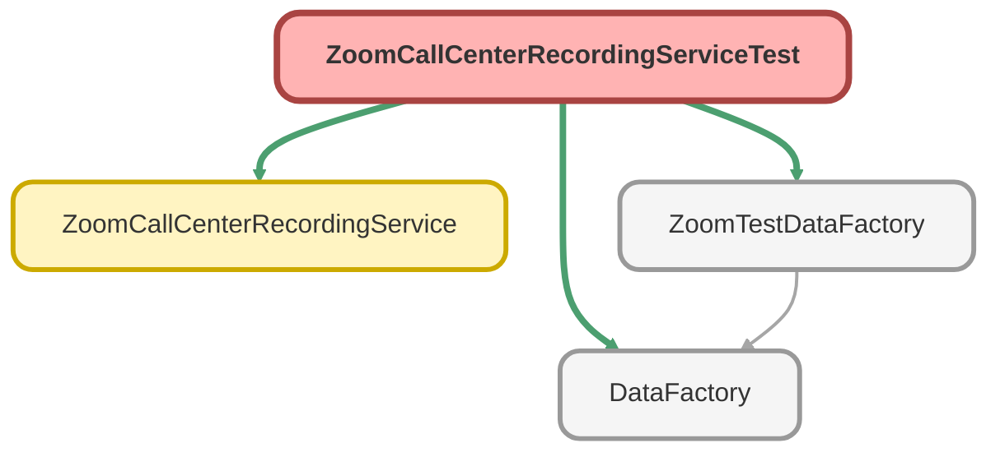

---
hide:
  - path
---

# ZoomCallCenterRecordingServiceTest Class

`ISTEST`

**Implements**

HttpCalloutMock

## Class Diagram



<!-- Apex description -->

## Apex Code

```java
@isTest
public with sharing class ZoomCallCenterRecordingServiceTest implements HttpCalloutMock {
	@TestSetup
	static void makeData() {
		ZoomTestDataFactory.createZoomCall();
	}

	public HTTPResponse respond(HTTPRequest request) {
		HttpResponse response = new HttpResponse();
		response.setHeader('Content-Type', 'application/json');
		response.setBody(
			'{"next_page_token": "R4aF9Oj0fVM2hhezJTEmSKaBSkfesDwGy42","page_size": 30,"from": "2023-01-01T00:00:00-08:00","to": "2023-01-01T01:00:00-08:00","recordings": [{"recording_id": "ghyetrjj_sdfsdgfkdjfl111","queue_id": "ghyetrjj_2342353rsgfkdjfl","queue_name": "voice","recording_duration": 150,"download_url": "https://api.zoom.us/v2/contact_center/recording/download/01bdb222-9984-4f41-8141-2f760cb398aa?type=voice","transcript_url": "https://api.zoom.us/v2/contact_center/recording/transcripts/download/4Q0ILNMfTA2nJolNxhg0Rw?type=voice","playback_url": "https://api.zoom.us/v2/contact_center/recording/playback/4Q0ILNMfTA2nJolNxhg0Rw?type=voice","recording_start_time": "2023-01-01T08:00:00Z","recording_end_time": "2023-01-01T09:00:00Z","user_id": "IGTRVt3gQ2i-WjoUIjeZxw","user_email": "xxxx@example.com","display_name": "Tom","recording_type": "automatic","channel_type": "voice","direction": "outbound","owner_id": "auiketrjj_2342353fsewkdjfl","owner_name": "voice","owner_type": "queue","engagement_id": "3XilEfOvQEKRIWMWhX1jDg","flow_name": "voice","flow_id": "fsdfsd4oippe0ffewcbhjk","consumers": [{"consumer_name": "Jill","consumer_number": "+12058945728"}]}]}'
		);
		response.setStatusCode(200);
		return response;
	}

	@isTest
	public static void zoomCallCenterRecordingTest() {
		Test.setMock(HttpCalloutMock.class, new ZoomCallCenterRecordingServiceTest());
		Zoom_Phone_Calls_Info__c call = [SELECT Id, Call_Id__c FROM Zoom_Phone_Calls_Info__c WHERE Name = 'Test Call' LIMIT 1];
		Test.startTest();
		ZoomCallCenterRecordingService.getEngagementRecording(call.Call_Id__c, call.Id);
		Test.stopTest();
	}
}
```

## Methods
### `makeData()`

`TESTSETUP`

#### Signature
```apex
private static void makeData()
```

#### Return Type
**void**

---

### `respond(request)`

#### Signature
```apex
public HTTPResponse respond(HTTPRequest request)
```

#### Parameters
| Name | Type | Description |
|------|------|-------------|
| request | HTTPRequest |  |

#### Return Type
**HTTPResponse**

---

### `zoomCallCenterRecordingTest()`

`ISTEST`

#### Signature
```apex
public static void zoomCallCenterRecordingTest()
```

#### Return Type
**void**