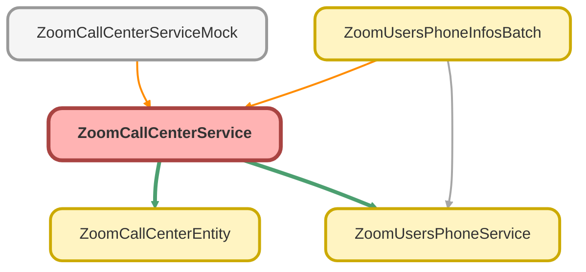

---
hide:
  - path
---

# ZoomCallCenterService Class

## Class Diagram



<!-- Apex description -->

## Apex Code

```java
public with sharing class ZoomCallCenterService {
    public static List<ZoomCallCenterEntity.VoiceCall> fetchVoiceCallLogs() {
        String baseUrl = 'callout:ZoomPhone/contact_center/voice_calls';
        Integer pageSize = 50;
        DateTime lastHour = DateTime.now().addHours(-1);
        String fromStr = lastHour.formatGMT('YYYY-MM-dd\'T\'HH:mm:ss\'Z\'');
        String toStr = DateTime.now().formatGMT('YYYY-MM-dd\'T\'HH:mm:ss\'Z\'');
        String fromTime = '&from=' + fromStr;
        String toTime = '&to=' + toStr;

        List<ZoomCallCenterEntity.VoiceCall> callsWrappersList = new List<ZoomCallCenterEntity.VoiceCall>();

        String nextPageToken = null;
        Integer totalRecords = 0;

        do {
            String url = baseUrl + '?page_size=' + pageSize + fromTime + toTime;
            if (nextPageToken != null) {
                url += '&next_page_token=' + nextPageToken;
            }

            HttpRequest req = new HttpRequest();
            req.setMethod('GET');
            req.setHeader('Content-Type', 'application/json');
            req.setEndpoint(url);

            Http http = new Http();
            HttpResponse response = http.send(req);

            if (response.getStatusCode() == 200) {
                String json = response.getBody();
                ZoomCallCenterEntity.CallsDataWrapper wrapper = ZoomCallCenterEntity.parse(json);
                // CHECK Null Pointer exeption!!!
                if (wrapper != null && wrapper.voice_calls != null) {
                    callsWrappersList.addAll(wrapper.voice_calls);
                    totalRecords = wrapper.total_records;
                    nextPageToken = wrapper.next_page_token;
                }
            } else {
                nextPageToken = null;
            }
        } while (nextPageToken != null && callsWrappersList.size() < totalRecords);
        return callsWrappersList;
    }

    public static Map<String, List<ZoomCallCenterEntity.VoiceCall>> getCallCenterIdsToLogsMap(){
        List<ZoomCallCenterEntity.VoiceCall> callsWrappersList = fetchVoiceCallLogs();
        Map<String, List<ZoomCallCenterEntity.VoiceCall>> callCenterIdsToLogsMap = new Map<String, List<ZoomCallCenterEntity.VoiceCall>>();

        for(ZoomCallCenterEntity.VoiceCall call : callsWrappersList){
            String userId = call.agents[0].user_id;

            if(userId != null){
                if (!callCenterIdsToLogsMap.containsKey(userId)) {
                    callCenterIdsToLogsMap.put(userId, new List<ZoomCallCenterEntity.VoiceCall>{call});
                } else {
                    callCenterIdsToLogsMap.get(userId).add(call);
                }
            }
        }
        return callCenterIdsToLogsMap;
    }

    public static List<Zoom_Phone_Calls_Info__c> createCallCenterCalls(List<Zoom_Users_Info__c> usrLst) {
        String recordTypeName = 'Contact Center';
        Id recordTypeId = Schema.SObjectType.Zoom_Phone_Calls_Info__c.getRecordTypeInfosByName().get(recordTypeName).getRecordTypeId();
        Map<String, List<ZoomCallCenterEntity.VoiceCall>> callCenterIdsToLogsMap = getCallCenterIdsToLogsMap();
        Map<String, Zoom_Phone_Calls_Info__c> callsIdZoomInfoMap = new Map<String, Zoom_Phone_Calls_Info__c>();

        for (Zoom_Users_Info__c u : usrLst) {
            List<ZoomCallCenterEntity.VoiceCall> callLogs = callCenterIdsToLogsMap.get(u.Zoom_User_Id__c);

            if (callLogs != null && !callLogs.isEmpty()) {
                for (ZoomCallCenterEntity.VoiceCall callLog : callLogs) {
                    Zoom_Phone_Calls_Info__c call = new Zoom_Phone_Calls_Info__c();
                    call.Name                       = u.Name;
                    call.Zoom_Users_Info__c         = u.Id;
                    call.Email__c                   = u.Email__c;
                    call.RecordTypeId               = recordTypeId;
                    call.Call_Type__c               = recordTypeName;

                    call.Call_Date_Time__c          = callLog.start_time;
                    call.Caller_Number_Source__c    = callLog.caller_number;
                    call.Callee_Number_Source__c    = callLog.callee_number;
                    call.Callee_Name__c             = callLog.consumer_display_name;
                    call.Has_Recording__c           = callLog.recorded;
                    call.Callee_Location__c         = callLog.country_name;
                    call.Call_Result__c             = callLog.result;
                    call.Call_Direction__c          = callLog.direction;
                    call.Duration__c                = callLog.total_duration;
                    call.Call_Id__c                 = callLog.engagement_id;

                    callsIdZoomInfoMap.put(call.Call_Id__c, call);
                }
            }
        }
        List<Zoom_Phone_Calls_Info__c> resultCallsList = ZoomUsersPhoneService.checkDuplicatePhoneCalls(callsIdZoomInfoMap);
        return resultCallsList;
    }
}
```

## Methods
### `fetchVoiceCallLogs()`

#### Signature
```apex
public static List<ZoomCallCenterEntity.VoiceCall> fetchVoiceCallLogs()
```

#### Return Type
**List&lt;ZoomCallCenterEntity.VoiceCall&gt;**

---

### `getCallCenterIdsToLogsMap()`

#### Signature
```apex
public static Map<String,List<ZoomCallCenterEntity.VoiceCall>> getCallCenterIdsToLogsMap()
```

#### Return Type
**Map&lt;String,List&lt;ZoomCallCenterEntity.VoiceCall&gt;&gt;**

---

### `createCallCenterCalls(usrLst)`

#### Signature
```apex
public static List<Zoom_Phone_Calls_Info__c> createCallCenterCalls(List<Zoom_Users_Info__c> usrLst)
```

#### Parameters
| Name | Type | Description |
|------|------|-------------|
| usrLst | List&lt;Zoom_Users_Info__c&gt; |  |

#### Return Type
**List&lt;Zoom_Phone_Calls_Info__c&gt;**